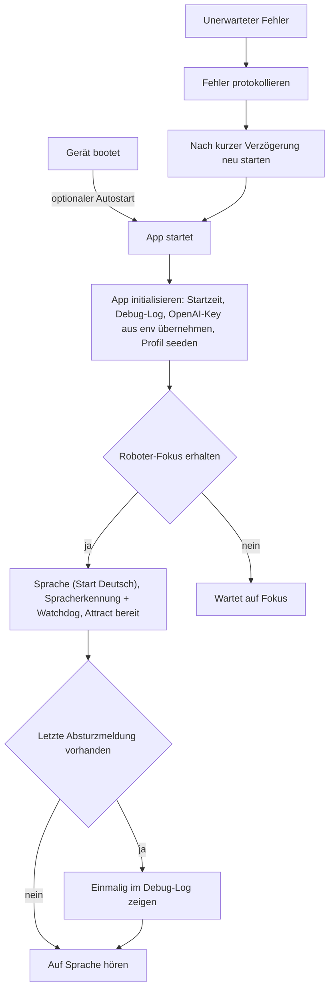
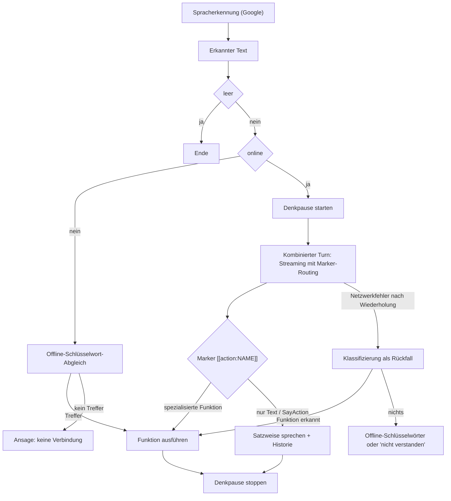
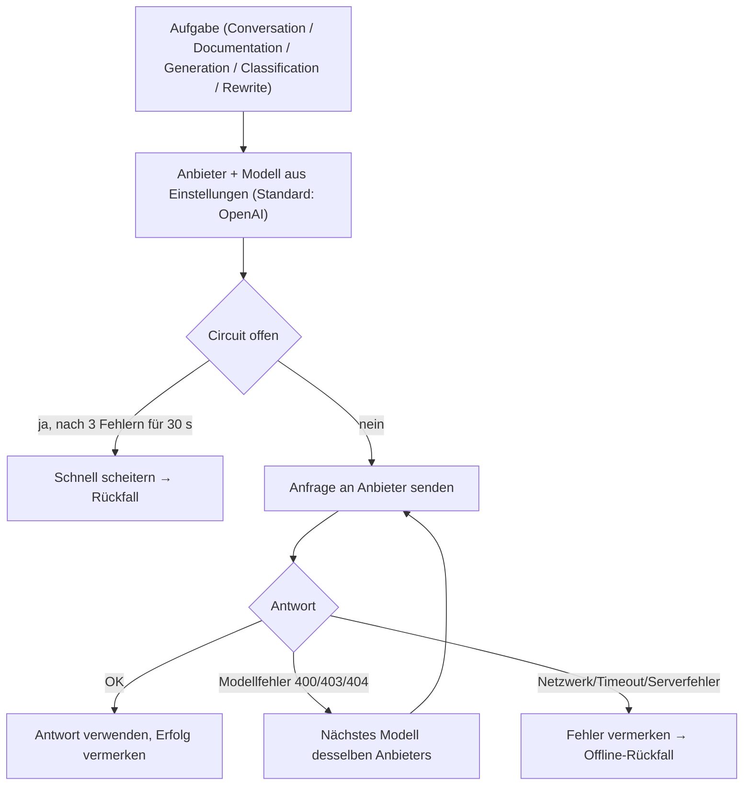
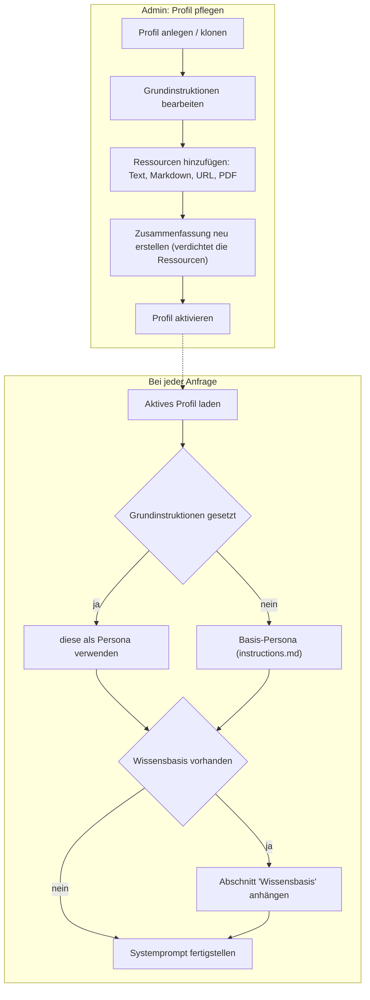
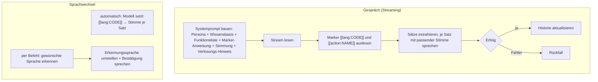
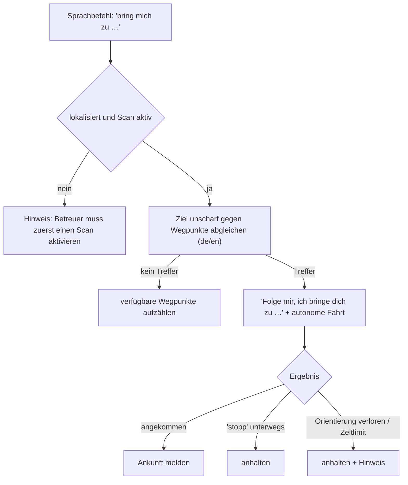
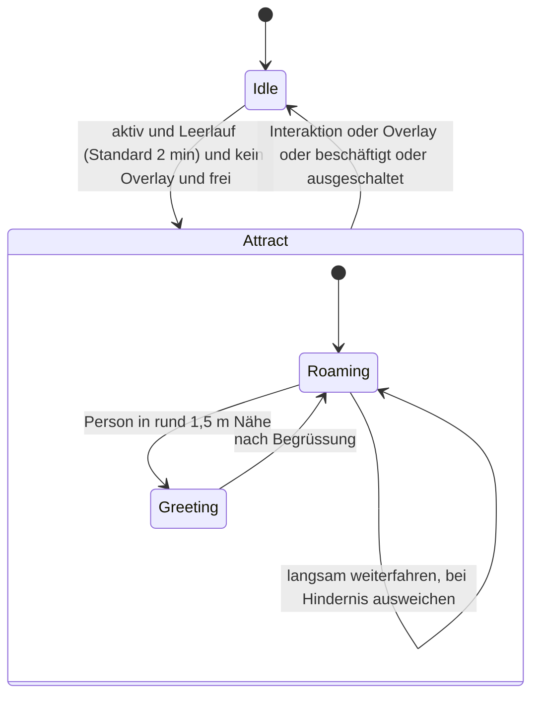
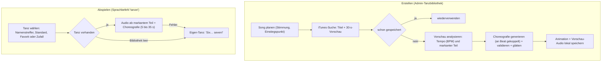
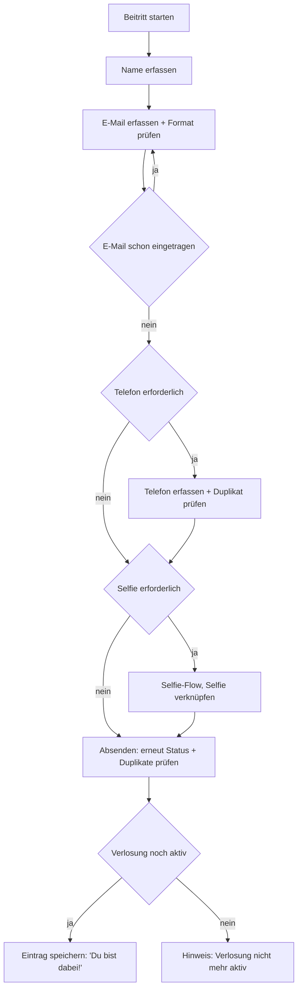
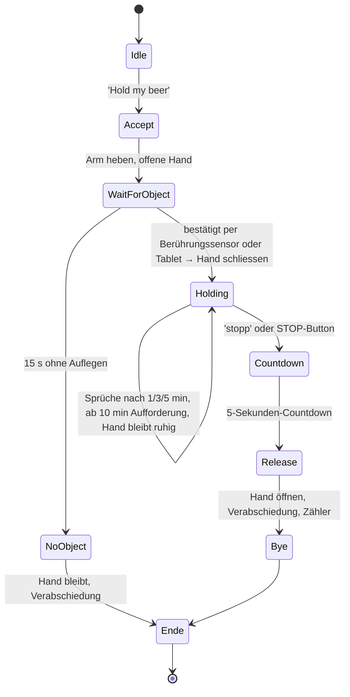

# Pepper – Kernabläufe

Visualisierung der zentralen Abläufe der App als Mermaid-Diagramme. Beschrieben wird
das **Verhalten** (was passiert), nicht der Code-Aufbau. Dieses Dokument gehört zur
Entwickler-/Bediener-Doku und wird von Pepper **nicht** vorgelesen.

## Inhalt

- [Start](#start)
- [Sprache → Aktions-Dispatch](#sprache--aktions-dispatch)
- [Modellauswahl & Anbieter-Rückfall](#modellauswahl--anbieter-rückfall)
- [Profil & Wissensbasis](#profil--wissensbasis)
- [Gespräch & Sprachwechsel](#gespräch--sprachwechsel)
- [Navigation / Raumscan](#navigation--raumscan)
- [Lotse-Modus](#lotse-modus)
- [Attract-Modus](#attract-modus)
- [Tanz-Ablauf](#tanz-ablauf)
- [Selfie](#selfie)
- [Verlosungs-Beitritt](#verlosungs-beitritt)
- [Hold my beer (Zustandsautomat)](#hold-my-beer-zustandsautomat)

## Start

Vom Geräte-Boot bis betriebsbereit, inklusive automatischem Neustart nach einem Absturz.



## Sprache → Aktions-Dispatch

Vom erkannten Sprachbefehl bis zur Ausführung, inklusive der mehrstufigen Rückfälle
(Klassifizierung, Offline-Schlüsselwörter).



## Modellauswahl & Anbieter-Rückfall

Wie pro Aufgabe Anbieter und Modell bestimmt werden und was bei Modell- oder
Netzwerkfehlern passiert. Anbieter, Modell und API-Keys sind je Aufgabe im
Admin-Bereich einstellbar.



## Profil & Wissensbasis

Wie das aktive Profil die Persona und eine optionale Wissensbasis in den Systemprompt
einspeist. Profile werden im Admin-Bereich gepflegt und aktiviert.



## Gespräch & Sprachwechsel

Freies Gespräch via Streaming und Sprachwechsel (automatisch über Marker oder per
Befehl). Die Historie umfasst die letzten 10 Gesprächseinträge.



## Navigation / Raumscan

Raum-Scan, Lokalisierung und Fahrt zu Wegpunkten. Pepper fährt beim Scannen nicht
autonom durch den Raum, sondern dreht sich nur an Ort; zwischen den Positionen wird er
von Hand geschoben.

```mermaid
flowchart TD
    subgraph Scan["Raum-Scan"]
        S1["Scan starten: Mapping beginnt, Live-Karte im Vollbild"] --> S2["Pepper dreht sich selbst 4× 90° (erste Position)"]
        S2 --> S3["Operator schiebt Pepper, dann 'Position erfassen' → erneut 4× 90°"]
        S3 --> S4["Stopp per STOP-Button oder Sprache ('stopp'/'fertig')"]
        S4 --> S5["Karte benennen und speichern"]
    end
    subgraph Loc["Lokalisierung"]
        L1["Scan aktivieren: Karte laden, Drehung 8× 45°"] --> L2{Status}
        L2 -->|lokalisiert| L3["bereit für Wegpunkte und Fahrten"]
        L2 -->|Zeitlimit (Standard 40 s)| L4["Abbruch + Hinweis"]
        L3 -->|Orientierung verloren| L5["anhalten + Hinweis"]
    end
    subgraph Drive["Wegpunkte"]
        D1["Wegpunkt speichern (nur wenn lokalisiert), optional Fotostand"]
        D2["Hinfahren: autonome Fahrt mit Hindernisvermeidung"]
    end
    S5 --> L1
    L3 --> D1
    L3 --> D2
```

## Lotse-Modus

Besucher lassen sich per Sprache zu einem Wegpunkt führen. Voraussetzung ist ein
aktiver, lokalisierter Scan.



## Attract-Modus

Leerlaufverhalten. Standardmässig aktiv, im Admin-Bereich umschaltbar.



## Tanz-Ablauf

Tänze werden in der Admin-Tanzbibliothek erzeugt (iTunes + Audio-Analyse + generierte
Choreografie) und beim Sprachbefehl nur abgespielt.



## Selfie

Aufnahme mit Vorschau, optionaler Wiederholung, lokalem Download per QR-Code und
optionaler Anbindung an eine laufende Verlosung.

```mermaid
flowchart TD
    F1["Sprachbefehl: 'Selfie'"] --> F2{externe Kamera aktiv und erreichbar}
    F2 -->|ja| F3["auf 'Start' warten, herunterzählen, externe Kamera auslösen"]
    F2 -->|nein| F4["herunterzählen, eigene Kamera auslösen"]
    F3 --> F5["Motiv einfügen, Vorschau zeigen"]
    F4 --> F5
    F5 --> F6{Entscheidung}
    F6 -->|Nochmal (max. 3 Aufnahmen)| F2
    F6 -->|Speichern / Zeitablauf| F7["lokal speichern"]
    F7 --> F8["token-geschützten Webserver starten, QR-Code(s) zeigen"]
    F8 --> F9{aktive Verlosung}
    F9 -->|ja| F10["Beitritt anbieten"]
    F9 -->|nein| F11[Ende]
```

## Verlosungs-Beitritt

Schritt-für-Schritt-Erfassung über das Tablet mit Validierung, Duplikat- und
Statusprüfung.



## Hold my beer (Zustandsautomat)

Zustandsautomat der Hold-Session: 15 s Wartezeit, ruhige Halte-Hand, Eskalationen,
5-Sekunden-Countdown vor der Rückgabe.


