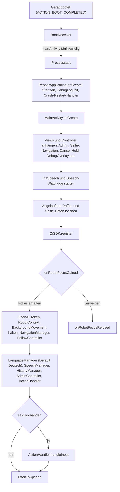
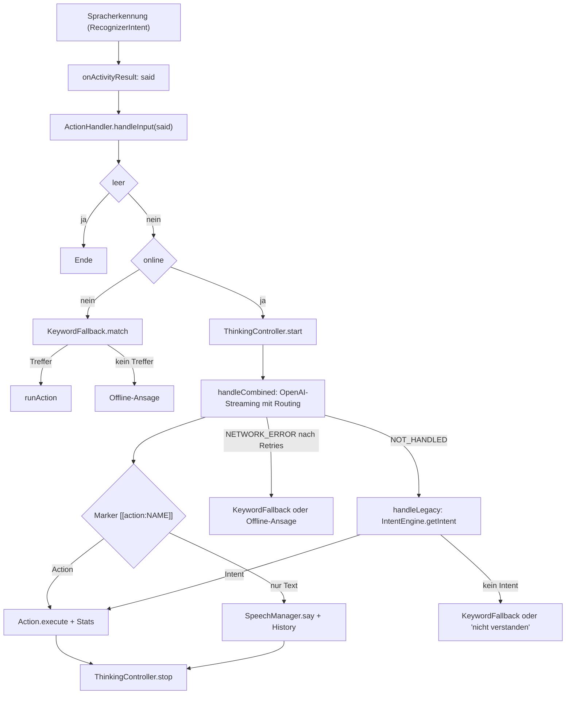
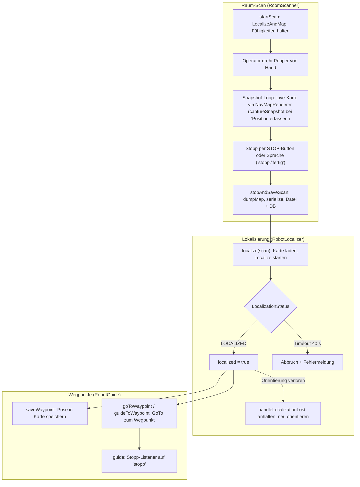
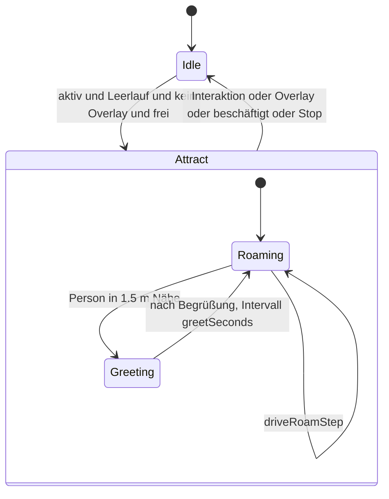
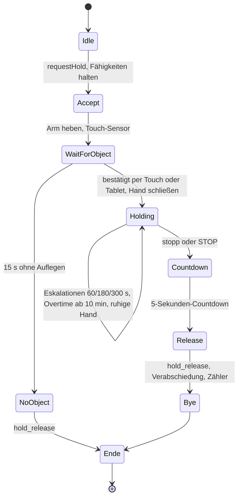
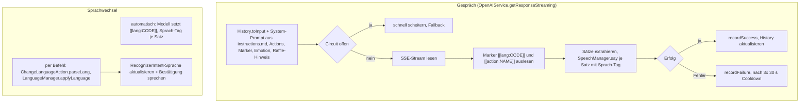

# Pepper – Kernabläufe

Visualisierung der zentralen Abläufe der App als Mermaid-Diagramme, ausgerichtet an
der Code-Struktur unter `app/src/main/java/com/buhlergroup/pepper/`. Dieses Dokument
gehört zur Entwickler-Dokumentation und wird von Pepper **nicht** vorgelesen.

## Inhalt

- [Boot / Startup](#boot--startup)
- [Sprache → Aktions-Dispatch](#sprache--aktions-dispatch)
- [Navigation / Raumscan](#navigation--raumscan)
- [Attract-Modus](#attract-modus)
- [Tanz-Ablauf](#tanz-ablauf)
- [Hold my beer (Zustandsautomat)](#hold-my-beer-zustandsautomat)
- [OpenAI-Gespräch & Sprachwechsel](#openai-gespräch--sprachwechsel)

## Boot / Startup

Vom Geräte-Boot bis betriebsbereit. Beteiligt: `boot/BootReceiver`,
`PepperApplication`, `MainActivity`.

## Sprache → Aktions-Dispatch

Vom erkannten Sprachbefehl bis zur Ausführung einer Action, inklusive Offline-
und Fallback-Pfaden. Beteiligt: `MainActivity`, `action/ActionHandler`,
`action/IntentEngine`, `action/KeywordFallback`, `openai/OpenAIService`.

## Navigation / Raumscan

Raum-Scan, Lokalisierung und Fahrt zu Wegpunkten. `NavigationManager` ist Fassade und
delegiert an die Kollaboratoren `RoomScanner` (Scan/Snapshot), `RobotLocalizer`
(Mapping/Localization) und `RobotGuide` (GoTo/Stopp-Listener); Karten-Rendering in
`NavMapRenderer`. Beteiligt: `action/navigation/NavigationManager` (+ `NavigationController`,
`NavigationView`, `data/`).

## Attract-Modus

Leerlaufverhalten. Der Watchdog in `MainActivity` ruft zyklisch
`AttractController.tick(...)`.

## Tanz-Ablauf

Tänze werden in der Admin-Bibliothek erzeugt (iTunes + LLM-Choreografie) und beim
Sprachbefehl nur abgespielt. Beteiligt: `action/dance/DanceRepository`,
`action/dance/itunes/ITunesSearch`, `action/dynamicanim/AnimationGenerator`
(Choreografie; Song-Research/Planning in `SongResearcher`/`SongPlan`/`SongResearch`,
gemeinsame Generator-Basis `GeneratorBase`), `action/dance/DanceAction`.

```mermaid
flowchart TD
    subgraph Create["Erstellen (Admin-Tanzbibliothek)"]
        C1["getOrCreate(query): planSong für Mood und Startzeit"] --> C2["ITunesSearch.search: Titel, Preview-URL, Dauer"]
        C2 --> C3{in DB vorhanden}
        C3 -->|ja, Datei existiert| C4[wiederverwenden]
        C3 -->|nein| C5["generateValidatedDance: LLM-Choreografie"]
        C5 --> C6["qianim speichern + Preview-Audio cachen (m4a) + DB-Eintrag"]
    end
    subgraph Seed["Built-in"]
        SB["ensureBuiltInDances: Hula, Six Seven"]
    end
    subgraph Play["Abspielen (Sprachbefehl 'tanze')"]
        P1[DanceAction.execute] --> P2["pickFromLibrary: Favoriten, Namenstreffer oder Zufall"]
        P2 --> P3{Tanz gefunden}
        P3 -->|ja| P4["preparePlayback: lokaler Cache oder iTunes-Preview"]
        P4 --> P5["playDance: qianim-Animation + Audio (5 bis 35 s)"]
        P5 -->|Fehler| P6
        P3 -->|Bibliothek leer| P6["playFallback: 'Six... seven!' + six_seven-Animation"]
    end
```

## Hold my beer (Zustandsautomat)

Zustandsautomat der Hold-Session. Beteiligt: `action/hold/HoldController`.
Aktueller Stand: 15 s Wartezeit, ruhige Halte-Hand (kein Pose-Loop), 5-Sekunden-
Countdown vor der Rückkehr.

## OpenAI-Gespräch & Sprachwechsel

Freies Gespräch via Streaming und Sprachwechsel (automatisch über Marker oder per
Befehl). `OpenAIService` ist Fassade über `OpenAiHttpClient` (Transport),
`OpenAiStreamParser`/`OpenAiResponse` (SSE), `OpenAiCircuitBreaker` und `OpenAiTokenProvider`.
Beteiligt: `openai/OpenAIService`, `openai/history/HistoryManager`
(max. 10 Gesprächseinträge), `lang/LanguageManager`, `action/lang/ChangeLanguageAction`.

