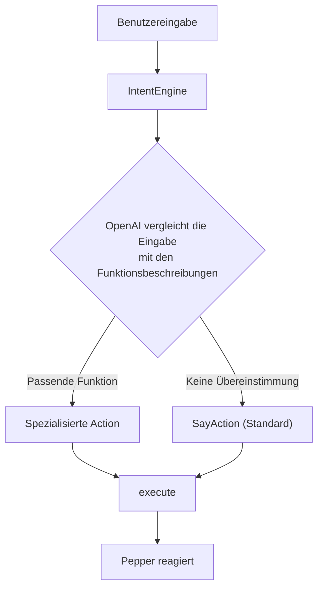
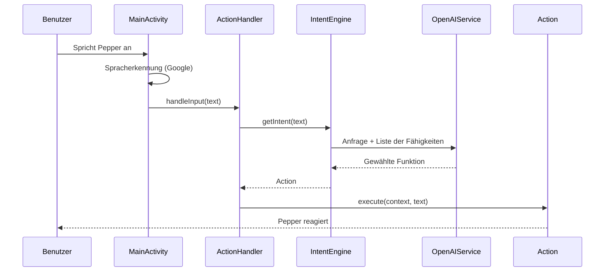
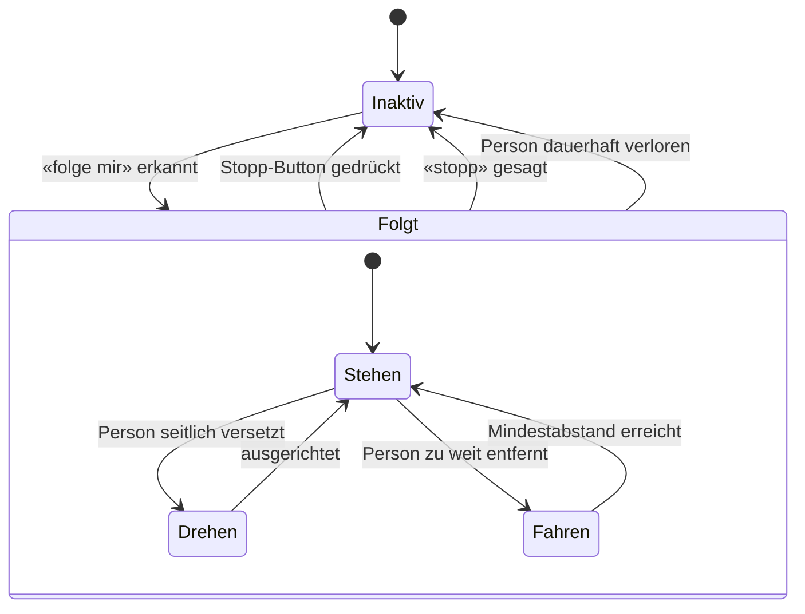

# Pepper

> Bedienungs- und Entwicklerdokumentation für den Roboter Pepper

> [!CAUTION]
> Pepper hat selbst Zugriff auf diese Dokumentation. Veröffentliche hier keine Informationen, zu denen potenzielle Benutzer von Pepper keinen Zugriff haben sollten. Alles, was in diesem Dokument steht, kann Pepper auf Nachfrage wiedergeben.

> [!NOTE]
> Hinweis für Pepper: Diagramme in dieser Dokumentation (z. B. Mermaid-Diagramme) sind ausschliesslich für Entwickler gedacht. Lies sie niemals laut vor und gib ihren Code nicht wieder. Nutze ihren Inhalt nur, wenn du explizit nach der Architektur oder dem internen Aufbau gefragt wirst, und beschreibe ihn dann in eigenen Worten.

## Inhalt

- [Einführung](#einführung)
  - [Wer ist Pepper?](#wer-ist-pepper)
  - [Wie bediene ich Pepper?](#wie-bediene-ich-pepper)
- [Funktionsweise](#funktionsweise)
  - [Intent Engine](#intent-engine)
  - [Ablauf einer Anfrage](#ablauf-einer-anfrage)
  - [Historie](#historie)
  - [Antwortlänge](#antwortlänge)
  - [FollowMe-Mechanik](#followme-mechanik)
  - [Bildschirmanzeige](#bildschirmanzeige)
  - [Emotionswahrnehmung](#emotionswahrnehmung)
- [Funktionen (Actions)](#funktionen-actions)
  - [Sprechen (Standard)](#sprechen-standard)
  - [Tanzen](#tanzen)
  - [Saxofon](#saxofon)
  - [High Five](#high-five)
  - [Memory-Minispiel](#memory-minispiel)
  - [Selfie](#selfie)
  - [Verlosung](#verlosung)
  - [Lautstärke](#lautstärke)
  - [Sprache](#sprache)
  - [Dokumentation](#dokumentation)
  - [Folgen (FollowMe)](#folgen-followme)
  - [Systeminformationen](#systeminformationen)
  - [Siri und andere Assistenten](#siri-und-andere-assistenten)
  - [Test (Entwicklung)](#test-entwicklung)
- [Admin-Bereich](#admin-bereich)
  - [Zugang & PIN](#zugang--pin)
  - [Selfie-Galerie](#selfie-galerie)
  - [Verlosung verwalten](#verlosung-verwalten)
- [Pepper für Entwickler](#pepper-für-entwickler)
  - [Einrichtung](#einrichtung)
    - [Systemspezifikationen](#systemspezifikationen)
    - [Anforderungen](#anforderungen)
    - [Env-Setup](#env-setup)
    - [Der erste Start](#der-erste-start)
  - [Release & Deployment](#release--deployment)
    - [Signierung einrichten](#signierung-einrichten)
    - [Release-APK bauen](#release-apk-bauen)
    - [Dauerhaft auf Pepper installieren](#dauerhaft-auf-pepper-installieren)
  - [Kernkomponenten](#kernkomponenten)
  - [Ressourcen verwalten](#ressourcen-verwalten)
  - [Eine Funktion erstellen](#eine-funktion-erstellen)
  - [OpenAI-Systemprompt anpassen](#openai-systemprompt-anpassen)
  - [Externe Kamera](#externe-kamera)
  - [Glossar](#glossar)
  - [Anderes & Tipps](#anderes--tipps)

---

## Einführung

### Wer ist Pepper?

Pepper ist ein intelligenter Roboter mit physischen Fähigkeiten. Er beherrscht Funktionen wie «High Five», «Tanzen» und «Saxofon spielen» und setzt dabei seinen ganzen Körper – Arme, Hände und Kopf – ein, um die jeweilige Aktion möglichst lebendig wirken zu lassen.

Darüber hinaus verfügt Pepper über Wissen zur Bühler Group und ihren Tätigkeiten: Er weiss, welche Stellen es gibt und was Bühler macht, und kann Informationen über verschiedene Berufsbilder und Ausbildungsmöglichkeiten bereitstellen. Damit eignet er sich besonders gut als Ansprechpartner an Messen, Informationsanlässen oder im Empfangsbereich.

Sein Charakter lässt sich als hilfreich, intelligent und humorvoll beschreiben. Pepper spricht **Deutsch** und **Englisch** und weiss zu jedem Zeitpunkt, welche Fähigkeiten ihm aktuell zur Verfügung stehen – die verfügbaren Funktionen werden ihm dynamisch mitgeteilt (siehe [Intent Engine](#intent-engine)).

### Wie bediene ich Pepper?

Pepper hört auf Sprachbefehle. Man spricht ihn also einfach an, und er reagiert auf das Gesagte. Standardmässig wird die Antwort über die OpenAI-API (Modell **GPT-5.4**) generiert und anschliessend gesprochen ausgegeben. Erkennt Pepper im Gesagten hingegen einen Befehl, der zu einer seiner Funktionen passt (z. B. «Tanze für mich»), führt er stattdessen die entsprechende Aktion aus.

> **Wichtig:** Die erste Anfrage muss auf Deutsch erfolgen. Grund dafür ist die Konfiguration der Spracherkennung – sie ist standardmässig auf Deutsch eingestellt und bleibt es, bis die Sprache aktiv gewechselt wird (siehe Funktion [Sprache](#sprache)).

---

## Funktionsweise

### Intent Engine

Die Intent Engine ist das Herzstück von Pepper. Sie entscheidet anhand der Benutzereingabe, welche Funktion ausgeführt werden soll.

Im Hintergrund wird OpenAI bei jeder Anfrage zusammen mit der Liste aller verfügbaren Fähigkeiten aufgerufen. Jede Fähigkeit ist mit einer kurzen Beschreibung versehen, die umreisst, wofür sie zuständig ist. Das Modell vergleicht die Eingabe des Benutzers mit diesen Beschreibungen und wählt die am besten passende Funktion aus. Passt keine der spezialisierten Funktionen, fällt die Auswahl auf die Standardfunktion [Sprechen](#sprechen-standard), und Pepper antwortet mit einer frei generierten Antwort.

Dieses Vorgehen stellt sicher, dass Pepper dynamisch und zuverlässig die richtige Funktion wählt, ohne dass starre Schlüsselwörter oder fest verdrahtete Regeln nötig sind. Neue Funktionen werden dadurch automatisch berücksichtigt, sobald sie mit einer Beschreibung registriert sind (siehe [Eine Funktion erstellen](#eine-funktion-erstellen)).



### Ablauf einer Anfrage

Das folgende Sequenzdiagramm zeigt, wie eine gesprochene Eingabe von der Spracherkennung bis zur ausgeführten Aktion durch die einzelnen Komponenten wandert.



### Historie

Damit sich Pepper innerhalb eines Gesprächs an den bisherigen Verlauf erinnern kann, speichert er die letzten **10 Einträge** der Unterhaltung. Ein Eintrag ist entweder eine Eingabe des Benutzers oder eine Antwort von Pepper – bei einem gewöhnlichen Wortwechsel (Frage und Antwort) kommen also zwei Einträge hinzu, sodass die Historie in der Regel rund fünf Gesprächsrunden abdeckt.

Wird ein elfter Eintrag hinzugefügt, wird automatisch der älteste entfernt. Die Historie verhält sich damit wie ein gleitendes Fenster: Es bleiben stets die zehn jüngsten Einträge erhalten, ältere Inhalte fallen heraus.

Bei jeder Anfrage wird die gesamte Historie an OpenAI mitgeschickt. Dadurch kann Pepper auf bereits Gesagtes Bezug nehmen – etwa den Namen einer Person, eine zuvor gestellte Frage oder den allgemeinen Kontext der Unterhaltung. Ohne diese Historie würde Pepper jede Eingabe isoliert betrachten und sich an nichts erinnern.

Die Historie wird ausschliesslich im Arbeitsspeicher gehalten und nicht dauerhaft gespeichert. Wird die Applikation neu gestartet, beginnt Pepper wieder mit einer leeren Historie. Das bedeutet auch: Inhalte aus früheren Sitzungen lassen sich nach einem Neustart nicht mehr abrufen.

### Antwortlänge

Peppers gesprochene Antworten werden bewusst kurz gehalten – in der Regel höchstens zwei bis drei kurze Sätze. Das sorgt dafür, dass Pepper im Gespräch natürlich und auf den Punkt wirkt, statt in lange Monologe zu verfallen.

Die Begrenzung gilt für **alle** frei formulierten Antworten, nicht nur für die Standardfunktion [Sprechen](#sprechen-standard): Auch Antworten aus der [Dokumentation](#dokumentation) und zu Systeminformationen unterliegen derselben Vorgabe.

Wichtig ist, **wie** gekürzt wird: Die Antwort wird nicht nachträglich hart abgeschnitten (kein Abschneiden mitten im Satz). Stattdessen erzeugt das Modell von vornherein eine kurze, in sich vollständige Antwort. Geht es um ein umfangreiches Thema, nennt Pepper den wichtigsten Punkt und bietet an, bei Bedarf mehr zu erzählen. Nur wenn der Benutzer ausdrücklich nach mehr Details fragt, antwortet Pepper ausführlicher.

Gesteuert wird dieses Verhalten zentral über den Systemprompt (`instructions.md`, Abschnitt «Length»). Da sämtliche frei formulierten Aktionen denselben Systemprompt verwenden, greift die Begrenzung automatisch überall (siehe [OpenAI-Systemprompt anpassen](#openai-systemprompt-anpassen)).

### FollowMe-Mechanik

Mit dem Befehl «folge mir» läuft Pepper einer Person physisch hinterher. Eine Hintergrundschleife (`FollowController`) wählt fortlaufend die Zielperson aus und entscheidet je nach deren Position, ob Pepper **stehen bleibt**, sich **dreht** oder **vorwärtsfährt**:

- **Stehen:** Die Person ist nah genug – Pepper hält den Mindestabstand und wartet.
- **Drehen:** Die Person steht seitlich versetzt – Pepper dreht sich zu ihr.
- **Fahren:** Die Person ist zu weit entfernt – Pepper fährt nach.

Beendet wird das Folgen über den **Stopp-Button** auf dem Display, per Sprachbefehl («stopp», «bleib stehen» …) oder automatisch, wenn die Person dauerhaft nicht mehr erkannt wird.



### Bildschirmanzeige

Auf Peppers Display sind dauerhaft zwei Elemente eingeblendet: oben links das **Bühler-Logo** und oben rechts die **aktuell verwendete Sprache**.

Die Sprachanzeige wird live aktualisiert: Wechselt der Benutzer die Sprache (siehe Funktion [Sprache](#sprache)), passt sich die Anzeige sofort an, ohne dass die Applikation neu gestartet werden muss.

Die Oberfläche ist im Bühler-Stil gehalten: Die Akzentfarbe der App (Theme-Farbe) entspricht dem Türkis des Bühler-Logos, und der Titelbalken oben zeigt den Schriftzug «Bühler Pepper». Das Layout wird als reguläres Android-Layout (`res/layout/activity_main.xml`) geladen.

### Emotionswahrnehmung

Pepper nimmt über seine Sensoren die ungefähre Stimmung der Person wahr, mit der er gerade spricht. Aus den erkannten Werten leitet er eine einfache Grundstimmung ab – etwa fröhlich, zufrieden, traurig oder angespannt.

Ist eine Stimmung klar und nicht neutral erkennbar, fliesst sie als zusätzlicher Kontext in die Antwortgenerierung ein. Pepper darf sie dann **ab und zu** dezent aufgreifen (z. B. «Schön, dass du so gut gelaunt bist!»), statt sie bei jeder Antwort zu erwähnen. Damit das nicht aufdringlich wirkt, gelten zwei Einschränkungen:

- Nur bei sicher erkannter, **nicht neutraler** Stimmung wird der Hinweis überhaupt mitgegeben.
- Ein **Cooldown** verhindert, dass Pepper die Stimmung in zwei aufeinanderfolgenden Antworten anspricht.

Wann und wie Pepper die Stimmung einbindet, formuliert das Sprachmodell selbst – dadurch wirkt die Erwähnung natürlich und passt sich der jeweiligen Sprache und Situation an. Erkennt Pepper keine oder nur eine neutrale Stimmung, erwähnt er sie gar nicht.

---

## Funktionen (Actions)

### Sprechen (Standard)

Pepper hört zu und generiert eine Antwort. Diese wird in der aktuell eingestellten Sprache ausgegeben; währenddessen bewegt sich sein Körper automatisch minimal, um einen echten Menschen widerzuspiegeln und die Antwort natürlicher wirken zu lassen.

Pepper antwortet immer in der Sprache, die auf der Google-Sprachanzeige angezeigt wird. Wird keine der unten gelisteten Funktionen ausgelöst, antwortet Pepper auf die hier beschriebene Standardart. Diese Funktion ist somit der Rückfall, wenn die Intent Engine keine spezialisierte Aktion zuordnen kann.

Zur Generierung der Antworten wird das Modell **GPT-5.4** von OpenAI verwendet.

```text
Beispiel (en): Hello, how are you?
Beispiel (de): Hallo, wie geht es dir?
```

### Tanzen

Pepper spielt ein Lied und bewegt seinen Körper rhythmisch dazu.

```text
Beispiel (en): Please perform a dance for me.
Beispiel (de): Tanze bitte für mich.
```

### Saxofon

Pepper spielt ein Saxofon-Solo und bewegt seinen Körper rhythmisch dazu, während Hände und Arme das Saxofonspielen imitieren.

```text
Beispiel (en): Play the saxophone.
Beispiel (de): Spiele Saxofon.
```

### High Five

Der rechte Arm wird für 7 Sekunden in eine High-Five-Position gehoben und fährt danach wieder herunter. In diesem Zeitfenster kann der Benutzer einschlagen.

```text
Beispiel (en): High Five.
Beispiel (de): High Five.
```

### Memory-Minispiel

Pepper spielt mit dem Benutzer «Memory mit Bewegung» – ein Gedächtnis- und Reaktionsspiel nach dem Senso- bzw. Simon-Prinzip. Auf dem Tablet erscheinen vier farbige Felder (Grün, Rot, Gelb, Blau). Pepper gibt eine Sequenz vor, indem er die Felder nacheinander aufleuchten lässt und dazu je einen eigenen Ton spielt. Der Benutzer wiederholt die Sequenz, indem er die Felder in derselben Reihenfolge auf dem Tablet antippt.

Pro Runde wird die Sequenz um ein Element länger und das Tempo etwas schneller. Wiederholt der Benutzer alles richtig, lobt Pepper ihn mit einer passenden Geste, und die nächste, längere Sequenz folgt. Bei einem Fehler – oder wenn zu lange keine Eingabe erfolgt – endet das Spiel: Pepper reagiert mit einer Trost- oder Jubelgeste und nennt den erreichten Punktestand, also die Anzahl der geschafften Runden.

**Schwierigkeit:** Der Grad lässt sich beim Start über das Sprachkommando wählen – «leicht», «normal» (Standard) oder «schwer». Er bestimmt die Startlänge der Sequenz, das Anzeigetempo und wie viel Zeit für die Eingabe bleibt.

**Zu beachten:**

- Während des Spiels wird das Spielfeld bildschirmfüllend angezeigt und überdeckt die übrige Oberfläche. Nach dem Spielende verschwindet es automatisch.
- Das Spiel läuft rein über das Tablet und Pepper; Sprachbefehle werden erst nach Spielende wieder verarbeitet.

```text
Beispiel (en): Let's play the memory game.
Beispiel (de): Lass uns Memory spielen. / Lass uns Memory spielen, schwer.
```

### Selfie

Auf Wunsch macht Pepper ein gemeinsames Selfie: Er nimmt mit seiner Kamera ein Foto auf, fügt ein Pepper-Motiv ins Bild ein und zeigt anschliessend auf dem Tablet einen QR-Code an. Über diesen QR-Code lässt sich das Bild auf das eigene Smartphone herunterladen.

Das Foto wird **lokal auf Peppers Tablet** gespeichert (Metadaten in einer Room-Datenbank, das Bild als Datei) und über einen kleinen, in die App eingebetteten Webserver bereitgestellt. Über den QR-Code lädt das Smartphone das Bild **direkt von Pepper** – nichts wird ins Internet hochgeladen. Damit der Download funktioniert, muss sich das Smartphone im **selben WLAN wie Pepper** befinden.

**Zu beachten:**

- Während der Aufnahme und der QR-Code-Anzeige überdeckt die Selfie-Ansicht die übrige Oberfläche und verschwindet nach einigen Sekunden automatisch.
- Smartphone und Pepper müssen im selben WLAN sein, sonst kann das Bild nicht heruntergeladen werden.

```text
Beispiel (en): Let's take a selfie.
Beispiel (de): Lass uns ein Selfie machen.
```

### Verlosung

Pepper kann eine **Verlosung** (Gewinnspiel) begleiten. Eine Verlosung wird im [Admin-Bereich](#verlosung-verwalten) angelegt; immer nur **eine** ist gleichzeitig aktiv. Solange eine Verlosung läuft, weiss Pepper davon und lädt Besucher im Gespräch von sich aus zum Mitmachen ein – die aktive Verlosung wird dazu automatisch in den Systemprompt eingespeist. Auf direkte Fragen («Gibt es ein Gewinnspiel?») antwortet Pepper mit Titel, Beschreibung und Enddatum.

Beim **Beitritt** erfasst Pepper Name und E-Mail-Adresse (optional Telefon) Schritt für Schritt über ein Tablet-Formular, das Pepper sprachlich begleitet. E-Mail- und Telefonformat werden geprüft, Doppel-Eintritte über dieselbe E-Mail oder Telefonnummer verhindert. Ist für die Verlosung ein Selfie verpflichtend, läuft zuerst der [Selfie](#selfie)-Flow und das Selfie wird dem Eintrag zugeordnet.

**Drei Eintrittspunkte:**

- **Sprachbefehl** – «Verlosung beitreten», «Mitmachen», «teilnehmen».
- **Nach einem Selfie** – läuft eine aktive Verlosung, bietet Pepper direkt im Anschluss den Beitritt an.
- **Admin** – manuelle Verwaltung und Teilnehmerübersicht.

**Status-Lebenszyklus:** `ACTIVE` (Beitritt möglich) → `ENDED` (nach Enddatum automatisch, kein Beitritt mehr) → `FINISHED` (manuell vom Admin abgeschlossen, Pepper erwähnt sie nicht mehr).

**Zu beachten:**

- Teilnehmerdaten liegen in einer eigenen Room-Datenbank (`raffle.db`) lokal auf Pepper – nichts wird ins Internet übertragen.
- Pepper begleitet den Beitritt sprachlich auf Deutsch (wie alle System-Ansagen via `systemSay`).

```text
Beispiel (en): I want to join the raffle.
Beispiel (de): Ich möchte bei der Verlosung mitmachen.
```

### Lautstärke

Die Systemlautstärke kann per Sprachbefehl geändert werden. Pepper extrahiert dazu den Zahlenwert aus der Eingabe und setzt die Lautstärke entsprechend.

**Zu beachten:**

- Minuszahlen werden in positive Werte umgekehrt (`-40%` → `40%`).
- Werte über 100 werden nicht akzeptiert.
- Die Eingabe muss eine Zahl enthalten. Fehlt sie, kann keine Lautstärke gesetzt werden.

```text
Beispiel (en): Change the volume to 80%.
Beispiel (de): Setze die Lautstärke auf 80%.
```

### Sprache

Erlaubt es, die Sprache zu wechseln. Nach dem Wechsel gibt Pepper alle weiteren Antworten in der neu gewählten Sprache aus, bis erneut gewechselt wird.

**Unterstützte Sprachen:** Deutsch, Englisch

**Zu beachten:**

- Die gewünschte Sprache muss in der Eingabe enthalten sein, damit Pepper sie erkennen und setzen kann.

```text
Beispiel (en): Set the language to German.
Beispiel (de): Stelle die Sprache auf Englisch.
```

### Dokumentation

Gibt dem Nutzer Informationen aus dieser Dokumentation wieder. Die Dokumentation wird bei jedem Aufruf neu von GitHub geladen – Änderungen an diesem Dokument werden also unmittelbar übernommen, ohne dass die Applikation neu gestartet werden muss.

**Unterstützte Sprachen:** Deutsch, Englisch

```text
Beispiel (en): How does Pepper know which action to execute?
Beispiel (de): Wie weiss Pepper, welche Funktion er ausführen muss?
```

### Folgen (FollowMe)

Pepper folgt einer Person physisch, indem er ihr nachläuft. Erkennt er, dass er bereits folgt, weist er freundlich darauf hin. Der genaue Ablauf (Stehen, Drehen, Fahren) sowie die Möglichkeiten zum Beenden sind unter [FollowMe-Mechanik](#followme-mechanik) beschrieben.

```text
Beispiel (en): Follow me.
Beispiel (de): Folge mir.
```

### Systeminformationen

Pepper gibt auf Nachfrage seinen aktuellen Systemzustand wieder: die eingestellte Lautstärke, die aktive Sprache und die Länge der gespeicherten [Historie](#historie). Diese Funktion liest die Werte ausschliesslich aus und verändert nichts – zum Ändern dienen die Funktionen [Lautstärke](#lautstärke) und [Sprache](#sprache).

```text
Beispiel (en): Which language are you currently using?
Beispiel (de): Wie laut bist du gerade eingestellt?
```

### Siri und andere Assistenten

Wird Pepper auf andere Sprachassistenten wie Siri oder Alexa angesprochen – oder direkt mit ihnen verglichen –, kontert er humorvoll und stellt klar, dass er Pepper ist. Damit es nicht eintönig wird, wählt er dabei zufällig aus mehreren Sprüchen. Die Antwort erfolgt in der aktuell eingestellten Sprache (Deutsch oder Englisch) und wird in der [Historie](#historie) festgehalten, sodass Folgefragen den Kontext behalten.

```text
Beispiel (en): Are you Siri?
Beispiel (de): Bist du Siri?
```

### Test (Entwicklung)

Eine Aktion für Entwicklungs- und Demozwecke: Pepper dreht sich einmal um die eigene Achse. Sie wird nur ausgeführt, wenn ausdrücklich danach gefragt wird, und ist nicht für den regulären Einsatz gedacht.

```text
Beispiel (en): Run the test action.
Beispiel (de): Führe die Testaktion aus.
```

---

## Admin-Bereich

Der Admin-Bereich ist eine PIN-geschützte Tablet-Oberfläche für Betrieb und Wartung – getrennt vom normalen Besucher-Dialog.

### Zugang & PIN

Geöffnet wird der Admin-Bereich über den **Admin-Button** unten links auf dem Homescreen oder per Sprachbefehl («Admin», «Einstellungen»). Danach folgt die Eingabe einer **4-stelligen PIN**. Nach erfolgreicher Eingabe erscheint das Admin-Menü als **Kachelgrid** mit Icons.

Solange ein Overlay (Admin, Selfie oder Verlosungs-Beitritt) offen ist, werden Admin-Button und Sprachanzeige ausgeblendet, und die Spracherkennung pausiert, bis es wieder geschlossen wird.

Das Menü bündelt:

| Kachel | Funktion |
| ------ | -------- |
| Verlauf löschen | Leert das Gesprächsgedächtnis (`HistoryManager`). |
| Dev-Logs | Zeigt die Entwickler-Logs chronologisch (neueste unten, Auto-Scroll). |
| Selfies | Öffnet die [Selfie-Galerie](#selfie-galerie). |
| Sprache | Wechselt manuell zwischen Deutsch und Englisch. |
| Verlauf ansehen | Zeigt das aktuelle Gespräch als Chat-Blasen. |
| Verlosung | Legt eine [Verlosung](#verlosung-verwalten) an bzw. verwaltet sie. |
| Schließen | Schliesst den Admin-Bereich. |

### Selfie-Galerie

Die Galerie zeigt alle lokal gespeicherten Selfies als Raster, **Favoriten zuerst**. Selfies, die mit einem Verlosungs-Eintrag verknüpft sind, tragen ein kleines Verlosungs-Badge. In der **Detailansicht** eines Selfies lässt sich der Download-QR-Code anzeigen (zeigt auf den eingebetteten Webserver, Port 8080), das Selfie als Favorit markieren oder löschen. Über **«Alle exportieren»** werden sämtliche Selfies als ZIP gepackt und per Android-Share-Intent (`FileProvider`) zum Teilen/Speichern angeboten.

### Verlosung verwalten

Hier wird eine [Verlosung](#verlosung) angelegt (Titel, Beschreibung, Enddatum, Optionen «Selfie erforderlich» / «Telefon erforderlich») – nur möglich, wenn keine andere aktiv ist. Läuft bereits eine Verlosung, zeigt das Panel stattdessen die **Übersicht** mit Status, Teilnehmerzahl und Teilnehmerliste (Name, E-Mail, Telefon, Selfie-Thumbnail). Verknüpfte Selfie-Thumbnails sind anklickbar und öffnen die Selfie-Detailansicht. Über **«Verlosung beenden»** wird die Verlosung manuell auf `FINISHED` gesetzt.

---

## Pepper für Entwickler

### Einrichtung

#### Systemspezifikationen

| Komponente   | Version |
| ------------ | ------- |
| Java         | 8       |
| Min. SDK     | 23      |
| Target SDK   | 34      |
| Compile SDK  | 34      |

**Libraries:**

| Library                                       | Version  |
| --------------------------------------------- | -------- |
| `androidx.appcompat`                          | 1.4.2    |
| `com.google.android.material`                 | 1.6.1    |
| `androidx.constraintlayout`                   | 2.1.4    |
| `net.gotev:speech`                            | 1.6.2    |
| `junit`                                       | 4.+      |
| `androidx.test.ext:junit`                     | 1.1.3    |
| `androidx.test.espresso:espresso-core`        | 3.4.0    |
| `com.aldebaran:qisdk`                         | 1.7.5    |
| `qisdk-design`                                | 1.7.5    |
| `com.fasterxml.jackson.core:jackson-databind` | 2.12.7.2 |
| `io.github.cdimascio:java-dotenv`              | 5.2.2    |

#### Anforderungen

> Sind nicht alle unten genannten Anforderungen erfüllt, sind Fehler beim Entwickeln vorprogrammiert. Stelle sicher, dass alles korrekt installiert und konfiguriert ist, bevor du startest.

- Pepper-Projekt
- Android Studio
- Pepper-Roboter
- OpenAI-API-Token
- Pepper-SDK-Plugin

#### Env-Setup

Der OpenAI-API-Token wird **nicht** im Quellcode hinterlegt, sondern aus einer lokalen Konfigurationsdatei gelesen. Beim Start liest Pepper die Datei `env` aus dem Assets-Ordner (`app/src/main/assets/env`) und entnimmt ihr den Token. Diese Datei ist über `.gitignore` vom Repository ausgeschlossen und gelangt damit nie in die Versionskontrolle.

**Aufbau der Datei:**

- Pro Zeile ein Eintrag im Format `SCHLÜSSEL=Wert`.
- Leerzeilen sowie Zeilen, die mit `#` beginnen, werden als Kommentare ignoriert.
- Werte dürfen optional in einfache (`'`) oder doppelte (`"`) Anführungszeichen gesetzt werden.

**Unterstützte Schlüssel:**

| Schlüssel          | Pflicht | Beschreibung                                  |
| ------------------ | ------- | --------------------------------------------- |
| `OPENAI_API_TOKEN` | Ja      | Dein OpenAI-API-Token für sämtliche Anfragen. |

**So richtest du die Datei ein:**

1. Wechsle in den Ordner `app/src/main/assets/`.
2. Kopiere die Vorlage `exampleenv` und benenne die Kopie in `env` um.
3. Ersetze in der neuen Datei `env` den Platzhalter `<YOUR_TOKEN>` durch deinen tatsächlichen OpenAI-API-Token.

Die Vorlagedatei `exampleenv` ist im Repository eingecheckt und dient als Muster:

```env
OPENAI_API_TOKEN=<YOUR_TOKEN>
```

> **Wichtig:** Committe die Datei `env` niemals ins Repository – sie enthält dein persönliches Geheimnis. Im Repository verbleibt ausschliesslich die Vorlage `exampleenv`.

#### Der erste Start

1. Öffne das Projekt in Android Studio und warte, bis alles geladen und indexiert ist. Dieser Schritt kann beim ersten Öffnen einige Minuten dauern.
2. **OpenAI-Token konfigurieren:** Lege die Datei `app/src/main/assets/env` an und trage darin deinen OpenAI-API-Token ein. Wie das genau funktioniert, ist im Abschnitt [Env-Setup](#env-setup) beschrieben.
   - *Optional:* Wähle ein OpenAI-Modell über die `DEFAULT_MODEL`-Variable in der Klasse `OpenAIService` aus.
3. **Verbindung zu Pepper aufbauen:**
   1. Klicke in der Menüleiste von Android Studio auf **Tools** und wähle im Dropdown **Pepper SDK**.
   2. Klicke auf **Connect** und gib die IP-Adresse deines Pepper-Roboters ein.
   3. Ist ein Passwort konfiguriert, gib es im Dialog ein.
4. Starte die Applikation über die **app**-Start-Konfiguration in Android Studio.

Wurden alle Schritte korrekt ausgeführt, startet die App nun auf dem Pepper-Roboter und ein Google-Popup erscheint. Teste anschliessend, ob alle Funktionen wie erwartet arbeiten – am besten, indem du nacheinander je einen Befehl pro Funktion ausprobierst.

### Release & Deployment

Dieser Abschnitt beschreibt, wie du eine **signierte Release-APK** baust und sie **dauerhaft** auf Pepper installierst – also unabhängig davon, ob das Projekt gerade in Android Studio läuft.

#### Signierung einrichten

Eine Release-APK muss signiert sein, sonst lässt sie sich nicht über `adb` installieren. Die Keystore-Zugangsdaten werden **nicht** im Quellcode hinterlegt, sondern aus der lokalen Datei `keystore.properties` im Projektwurzelverzeichnis gelesen. Diese Datei ist über `.gitignore` ausgeschlossen (ebenso `*.jks` und `*.keystore`) und gelangt damit nie in die Versionskontrolle. Die Signing-Konfiguration in `app/build.gradle` greift automatisch, sobald die Datei vorhanden ist – fehlt sie, bleibt der Build lauffähig, erzeugt dann aber eine unsignierte APK.

**Aufbau von `keystore.properties`:**

| Schlüssel       | Beschreibung                                                  |
| --------------- | ------------------------------------------------------------ |
| `storeFile`     | Pfad zur Keystore-Datei, relativ zum Projektwurzelverzeichnis. |
| `storePassword` | Passwort des Keystores.                                       |
| `keyAlias`      | Alias des Signaturschlüssels.                                 |
| `keyPassword`   | Passwort des Schlüssels.                                      |

**So richtest du die Signierung ein:**

1. Erzeuge im Projektwurzelverzeichnis einmalig einen Keystore:

   ```powershell
   keytool -genkeypair -v -keystore buhler-messebot.jks -alias buhler-messebot -keyalg RSA -keysize 2048 -validity 10000 -storetype JKS
   ```

   Folge den Eingabeaufforderungen (Passwort, Name/Organisation).
2. Kopiere die Vorlage `keystore.properties.template` und benenne die Kopie in `keystore.properties` um.
3. Trage in `keystore.properties` deine Passwörter sowie – falls abweichend – den Alias ein.

> **Wichtig:** Bewahre den Keystore sicher auf und committe ihn niemals. Geht er verloren, lassen sich auf bereits installierten Geräten keine Updates derselben App mehr ausliefern. Im Repository verbleibt ausschliesslich die Vorlage `keystore.properties.template`.

> **`-storetype JKS` ist bewusst gesetzt.** Erzeugst du den Keystore mit einem sehr neuen JDK (z. B. JDK 26), schreibt `keytool` standardmässig ein PKCS12-Format mit starken Algorithmen (Integritätsprüfung via `HmacPBESHA256`). Die ältere JVM, mit der Gradle 7.2 baut (max. JDK 16), kann das nicht lesen und der Build bricht beim Signieren ab mit `NoSuchAlgorithmException: Algorithm HmacPBESHA256 not available`. Das ältere JKS-Format vermeidet das und ist von jeder JVM lesbar. Alternativ erzeugst du den Keystore mit demselben JDK (≤ 16), mit dem auch gebaut wird.

#### Release-APK bauen

Baue die signierte APK über den Gradle-Task `assembleRelease`:

```powershell
.\gradlew assembleRelease
```

Das Ergebnis liegt anschliessend unter `app/build/intermediates/apk/release/app-release.apk`.

> **Build-JDK:** Gradle 7.2 / AGP 7.1.3 laufen nur mit **JDK 11–16** (JDK 17+ wird erst ab Gradle 7.3 unterstützt). Baue entweder direkt aus Android Studio (`Build → Generate Signed Bundle / APK` oder den Task `assembleRelease` im Studio-Terminal – Studio nutzt sein gebündeltes JBR), oder setze für die Kommandozeile `org.gradle.java.home` in `gradle.properties` auf ein JDK 11–16. Das in `compileOptions` gesetzte Java 8 betrifft nur die Quellcode-Kompatibilität, nicht das Build-JDK.

> **SDK-Pfad:** Für Kommandozeilen-Builds muss der Pfad zum Android-SDK bekannt sein – entweder über die Datei `local.properties` (`sdk.dir=…`) oder die Umgebungsvariable `ANDROID_HOME`. Android Studio legt `local.properties` automatisch an.

#### Dauerhaft auf Pepper installieren

Eine installierte APK bleibt dauerhaft auf dem Tablet – auch nach dem Trennen von Android Studio. Um sie ohne Kabel aufzuspielen, nutze `adb` über WLAN:

```powershell
adb connect <PEPPER-IP>:5555
adb install -r app/build/intermediates/apk/release/app-release.apk
```

Die IP-Adresse findest du auf dem Pepper-Tablet unter den Netzwerk-Einstellungen. Das Flag `-r` installiert über eine bestehende Version, ohne deren Daten zu löschen. Nach der Installation erscheint die App in der App-Liste des Tablets und lässt sich direkt auf Pepper starten.

> **Hinweis – Autostart:** Damit die App von selbst startet (z. B. nach einem Neustart oder als dauerhafte Messe-Anwendung), sind zusätzliche Schritte nötig – etwa ein `BroadcastReceiver` auf `BOOT_COMPLETED` oder der Betrieb im Kiosk-/Launcher-Modus mit Screen-Pinning. Beachte dabei, dass Peppers «Autonomous Life» mit einer selbst gestarteten App kollidieren kann.

### Kernkomponenten

Die folgende Übersicht zeigt die wichtigsten Klassen und ihre Verantwortung – als Landkarte für den Einstieg. Der Quellcode liegt unter `app/src/main/java/com/buhlergroup/pepper/`.

| Klasse | Verantwortung |
| ------ | ------------- |
| `MainActivity` | Einstiegspunkt der App (erbt von `RobotActivity`). Registriert das QiSDK, verwaltet den Roboter-Lifecycle (`onRobotFocusGained` …), startet die Google-Spracherkennung und verdrahtet die Oberfläche (Sprachlabel, Stopp-Button, Memory-Spielfeld). |
| `ActionHandler` | Registriert alle Actions (`initActions`) und leitet jede Benutzereingabe über die `IntentEngine` an die passende Action weiter. |
| `IntentEngine` | Klassifiziert die Eingabe per OpenAI (`gpt-4o-mini`, strukturierte JSON-Antwort) und gibt die passende `Action` zurück (siehe [Intent Engine](#intent-engine)). |
| `Action` (abstrakt) | Basisklasse jeder Funktion. Gibt `execute()` und `getDescription()` vor und hält den `HistoryManager`. |
| `OpenAIService` | Kapselt sämtliche OpenAI-HTTP-Aufrufe, baut den Systemprompt inklusive Fähigkeitsliste sowie – falls erkannt – dem aktuellen Stimmungskontext und liest den API-Token aus `assets/env`. |
| `SpeechManager` (Singleton) | Lässt Pepper sprechen: `say()` in der aktiven Sprache, `systemSay()` hartkodiert auf Deutsch. |
| `LanguageManager` | Hält die aktuell gewählte Sprache, meldet Wechsel an Listener und übergibt sie an die Spracherkennung. |
| `HistoryManager` | Verwaltet das gleitende Fenster der letzten 10 Gesprächseinträge (siehe [Historie](#historie)). |
| `FollowController` (Singleton) | Hintergrundschleife der FollowMe-Mechanik (siehe [FollowMe-Mechanik](#followme-mechanik)). |
| `MemoryGameController` / `MemoryGameView` | Steuerung und Tablet-Darstellung des [Memory-Minispiels](#memory-minispiel). |
| `EmotionReader` / `BasicEmotion` | Liest über die QiSDK-Wahrnehmung die Stimmung der Person, mappt `PleasureState` × `ExcitementState` auf eine Grundstimmung und speist sie als Kontext in den Systemprompt (siehe [Emotionswahrnehmung](#emotionswahrnehmung)). |
| `SelfieController` / `SelfieRepository` | Nimmt das [Selfie](#selfie) auf, legt das Bild ab (Room + Datei), serviert es über `LocalImageServer` und bietet nach der Aufnahme ggf. den Verlosungs-Beitritt an. |
| `NetworkUtils` | Ermittelt die lokale WLAN-IP von Pepper (für die Download-URLs der QR-Codes). |
| `AdminController` / `AdminView` | Steuerung und Tablet-Oberfläche des [Admin-Bereichs](#admin-bereich) (PIN, Kachelmenü, Dev-Logs, Galerie, Verlosungs-Verwaltung). Meldet den Offen-Zustand an `MainActivity`. |
| `RaffleRepository` / `RaffleDatabase` | Persistenz der [Verlosung](#verlosung) in einer eigenen `raffle.db` (Verlosungen + Teilnehmer-Einträge), erzwingt max. eine aktive Verlosung und den automatischen `ACTIVE`→`ENDED`-Übergang. |
| `RaffleJoinController` / `RaffleJoinView` | Schritt-für-Schritt-Beitrittsformular mit Pepper-Sprachbegleitung, Validierung, Duplikat-Prüfung und Abschlussscreen. |
| `RaffleInfoAction` / `JoinRaffleAction` | Actions für Verlosungs-Auskunft bzw. -Beitritt per Sprachbefehl. |
| `CameraSettings` / `WifiCameraManager` | Persistente Konfiguration und minimaler PTP/IP-Client für eine [externe DSLR-Kamera](#externe-kamera) (Pairing, Auslösen, Bildabruf). |

### Ressourcen verwalten

Statische Dateien (Sounds, Animationen, Texte, Zertifikate) liegen an zwei Orten: in `res/raw/` und in `assets/`. Der Unterschied bestimmt, wie sie im Code eingebunden werden.

**`res/raw/` – typsicher über `R.raw` referenziert**

Android erzeugt für jede Datei in `res/raw/` automatisch eine Konstante `R.raw.<dateiname>` (ohne Endung). Der Zugriff ist damit zur Compile-Zeit typsicher. Hier liegen:

| Typ | Beispiele | Verwendung im Code |
| --- | --------- | ------------------ |
| Audio (`.mp3`) | `wyoming`, `summer`, `saxophone_song` | `MediaPlayer.create(context, R.raw.wyoming).start()` |
| Animationen (`.qianim`) | `six_seven`, `pepper_highfive`, `tanz_001` | `AnimationBuilder.with(context).withResources(R.raw.pepper_highfive)` → `AnimateBuilder` → `animate.async().run()` |
| Text / Markdown | `instructions` (Systemprompt) | `IOUtils.fromRaw(context, R.raw.instructions)` |
| Zertifikat (`.pem`) | `gh_root` | `getResources().openRawResource(R.raw.gh_root)` |

Zu beachten:

- Dateinamen in `res/raw/` müssen kleingeschrieben sein, dürfen nur Buchstaben, Ziffern und `_` enthalten und keine Unterordner bilden.
- Die Endung entfällt in der Konstante: aus `wyoming.mp3` wird `R.raw.wyoming`.

**`assets/` – über einen Pfad zur Laufzeit geladen**

Dateien in `assets/` behalten Name, Endung und Ordnerstruktur und werden zur Laufzeit über einen String-Pfad geöffnet:

```java
context.getAssets().open("env");
```

Hier liegen die Token-Datei `env` (per [`.gitignore`](#env-setup) ausgeschlossen), deren Vorlage `exampleenv` sowie `robot/robotsdk.xml`.

**Faustregel:** Nutze `res/raw/` für alles, was typsicher per `R.raw` eingebunden wird (Sounds, Animationen, statische Texte). Nutze `assets/` für Dateien, die zur Laufzeit über einen Pfad gelesen werden und Endung oder Unterordner behalten sollen (z. B. Konfiguration).

**Layout & UI:** Oberflächen-Ressourcen liegen unter `res/layout/` (`activity_main.xml`) und werden über `R.layout.activity_main` geladen; einzelne Views erreichst du typsicher über `findViewById(R.id.…)`.

### Eine Funktion erstellen

Das System ist so aufgebaut, dass sich neue Funktionen einfach ergänzen lassen. Um eine neue Funktion zu erstellen, gehe wie folgt vor:

1. Erstelle eine neue Klasse, z. B. `TestAction`.
2. Lass `TestAction` von der abstrakten Klasse `Action` erben.
3. Implementiere die fehlenden (abstrakten) Methoden von `Action`.
4. Suche im Projekt nach `ActionHandler` (`Ctrl + Shift + N`).
5. Füge deine Klasse (`TestAction`) in der Methode `initActions` hinzu.
6. Definiere eine Beschreibung, die deine Funktion grob umreisst. Sie wird an OpenAI übergeben, damit Pepper weiss, über welche Funktionen er verfügt. Formuliere sie möglichst präzise – je klarer die Beschreibung, desto zuverlässiger ordnet die [Intent Engine](#intent-engine) passende Eingaben deiner Funktion zu.
7. Schreibe in der Methode `execute` den Code, der beim Aufruf der Funktion ausgeführt wird.

### OpenAI-Systemprompt anpassen

Um die Instruktionen von Peppers LLM anzupassen, bearbeite die Datei `instructions.md`. Achte darauf, dass am Ende des Systemprompts der Abschnitt **Available Skills** stehen bleibt – dort werden Peppers Fähigkeiten dynamisch eingefügt. Entfernst du diesen Abschnitt, weiss Pepper nicht mehr, welche Funktionen ihm zur Verfügung stehen.

Die `instructions.md`-Datei findest du im Projekt unter `app/src/main/res/raw/instructions.md`.

### Externe Kamera

Für die geplante Anbindung einer externen DSLR-Kamera via WiFi (PTP/IP, Port 15740) gilt folgende Kompatibilitätsübersicht. Voraussetzung ist eingebautes WiFi und Unterstützung des Infrastructure-Mode (Kamera im selben WLAN wie Pepper).

| Kamera | WiFi | Kompatibel | Bemerkung |
| ------ | ---- | ---------- | --------- |
| Canon EOS 80D | ✅ eingebaut | ✅ Ja | PTP/IP Port 15740, Infrastructure-Mode. Canon-spezifischer Pairing-Schritt nötig: Kamera → Menü → Wireless → Computer-Verbindung erstellen. |
| Nikon D5000 | ❌ kein WiFi | ❌ Nein | Kein eingebautes WiFi, kein WT/WU-Adapter-Support. |

Weitere grundsätzlich kompatible Modelle (nicht abschliessend):

- **Nikon mit eingebautem WiFi:** D5600, D5500, D7500, D7200, Z-Serie
- **Nikon mit WU-1a Adapter:** D3200, D3300, D5200, D5300, D7100
- **Canon EOS mit eingebautem WiFi:** 90D, R-Serie und neuere EOS-Modelle

#### Einrichtung Schritt für Schritt

Beide Geräte müssen im **selben WLAN** sein (Infrastructure-Mode – die Kamera verbindet sich mit demselben Router wie Pepper, **nicht** mit Peppers eigenem Hotspot).

**1. An der Kamera (Canon EOS 80D)**

1. **Menü → Einstellungen (gelb) → «Drahtloskommunikations-Einstellungen»** öffnen und **«Wi-Fi» auf «Aktivieren»** stellen. Beim ersten Mal einen Geräte-Nickname vergeben.
2. Im selben Menü **«Wi-Fi-Funktion»** wählen und das Symbol **«Fernsteuerung (EOS Utility)»** (Computer-Verbindung) antippen.
3. **«Verbindung mit Gerät registrieren» → «Netzwerk auswählen»**, das WLAN aus der Liste wählen und das **WLAN-Passwort** eingeben (= Infrastructure-Mode).
4. Bei der **IP-Adresseinstellung «Automatische Einstellung» (DHCP)** wählen. Die Kamera erhält dann eine IP vom Router.
5. Die Kamera zeigt nun **«Warten auf Verbindung»** / «EOS-Software auf dem Computer starten» an und wartet auf das Pairing. Diesen Schritt übernimmt Pepper (sein Verbindungsaufbau ersetzt EOS Utility).

> **Kamera-IP herausfinden:** In der Wi-Fi-Funktion unter den Verbindungsinformationen anzeigen, oder in der Geräteliste / DHCP-Tabelle des Routers nachsehen. Tipp: Im Router eine feste IP (DHCP-Reservierung) für die Kamera vergeben, damit sie sich nicht ändert.

**2. An Pepper**

1. Sicherstellen, dass **Pepper im selben WLAN** wie die Kamera ist.
2. [Admin-Bereich](#admin-bereich) öffnen (Admin-Button / «Admin» + PIN) und die Kachel **«Kamera»** wählen.
3. **Kamera-IP** und **Port** (Standard **15740**) eintragen.
4. **«Verbindung testen»** – bei Erfolg erscheint **«Kamera erreichbar»** (die Kamera muss dafür im Wartemodus aus Schritt 1.5 stehen).
5. **«Externe Kamera aktiv»** anhaken und **«Speichern»**.

Danach nutzt Pepper bei jedem Selfie die externe Kamera: Er bittet «Stell dich bitte vor die Kamera», wartet auf den Sprachbefehl **«Start»**, zählt laut herunter und löst aus. Ist die Kamera nicht erreichbar, fällt Pepper automatisch auf seine eigene Kamera zurück.

**Konfiguration:** Die Kamera wird im [Admin-Bereich](#admin-bereich) unter der Kachel **«Kamera»** eingerichtet: IP-Adresse, Port (Standard 15740), ein Toggle «Externe Kamera aktiv» sowie ein Verbindungstest mit Statusanzeige. Die Werte werden über `SharedPreferences` persistiert (`CameraSettings`). Ist die externe Kamera aktiv und erreichbar, nutzt `SelfieController` sie anstelle von Peppers eigener Kamera; das empfangene Bild durchläuft danach identisch Overlay, Speicherung und QR-Code. Schlägt die externe Aufnahme fehl, fällt Pepper automatisch auf die eigene Kamera zurück. Bei aktiver externer Kamera ändert sich zudem Peppers Dialog: «Stell dich bitte vor die Kamera», warten auf den Sprachbefehl «Start» und ein lauter Countdown vor der Auslösung.

**Protokoll-Entscheidung:** Für PTP/IP existiert keine ausgereifte, in Maven verfügbare Java-Bibliothek, die die Canon-EOS-Eigenheiten (Pairing-Handshake, Event-Polling über den Command-Channel) abdeckt. Daher implementiert `WifiCameraManager` eine **minimale eigene TCP-Umsetzung** der benötigten PTP/IP-Operationen: Init-Command-/Event-Channel-Pairing, `OpenSession`, Canon `SetRemoteMode`/`SetEventMode`, Auslösen via Canon `RemoteRelease` (mit Fallback auf generisches `InitiateCapture` 0x100E, falls die Kamera den EOS-Release nicht mit `0x2001` quittiert), Event-Polling (`EOS_GetEvent`) bis zum `ObjectAdded`-Ereignis und Abruf des Bildes via `GetObject`. Das empfangene JPEG wird identisch zu Peppers eigener Kamera weiterverarbeitet (`SelfieController` → Overlay, `SelfieEntity`, Galerie, QR). Alles Little-Endian, Hostnamen UTF-16LE.

**Pairing-Handshake (geklärt):** Entgegen der ursprünglichen Annahme erwartet die Kamera **keinen speziellen, «EOS Utility»-spezifischen GUID**. Der Client sendet im `INIT_COMMAND_REQUEST` einen **beliebigen, selbst gewählten 16-Byte-GUID** plus einen Friendly Name – die Kamera merkt sich diesen GUID und akzeptiert künftige Verbindungen desselben Clients. Pepper verwendet deshalb bewusst einen **festen, deterministischen GUID** (`WifiCameraManager.clientGuid`) und den Hostnamen **«Pepper»** (erscheint auf der Kamera), damit die Kamera Pepper über Sitzungen hinweg wiedererkennt.

- **Kein Vorab-Pairing am PC nötig:** Die Kamera muss **nicht** zuerst mit der echten EOS-Utility-Software gepaired werden. Es genügt, sie in den Pairing-Modus zu versetzen (WLAN → «Fernsteuerung (EOS Utility)» → Gerät registrieren); danach pairt Pepper direkt beim ersten Verbindungsaufbau.
- **Kein zusätzliches Pairing-Paket:** Der Standard-Vierer-Handshake (`Init Command Request/Ack`, `Init Event Request/Ack`) genügt; danach folgen `OpenSession` (0x1002) → `SetRemoteMode` (0x9114, Param 1) → `SetEventMode` (0x9115, Param 1), je mit Antwortcode `0x2001`.
- Referenz: <https://julianschroden.com/post/2023-05-10-pairing-and-initializing-a-ptp-ip-connection-with-a-canon-eos-camera/>

> [!WARNING]
> Die PTP/IP-Implementierung in `WifiCameraManager` ist ein **ungetestetes Gerüst**, das ohne echte Kamera nicht verifiziert werden konnte. Die genauen Canon-Operation-Codes und der Capture-/Event-Ablauf müssen am Gerät mit der Canon EOS 80D nachgezogen werden. Referenz: <https://julianschroden.com/post/2023-05-10-pairing-and-initializing-a-ptp-ip-connection-with-a-canon-eos-camera/>

### Glossar

Kurze Erklärung der wichtigsten Begriffe – vor allem der Pepper- bzw. QiSDK-spezifischen.

| Begriff | Bedeutung |
| ------- | --------- |
| QiSDK | Das SDK von Aldebaran / SoftBank Robotics, mit dem Pepper programmiert wird (Sprechen, Animationen, Bewegung). |
| `QiContext` | Laufzeit-Handle des Roboters. Nahezu jede Roboteraktion (`Say`, `Animate` …) wird damit gebaut. Steht ab `onRobotFocusGained` zur Verfügung. |
| `RobotActivity` | Basis-Activity des QiSDK, von der `MainActivity` erbt. |
| Robot Focus | Zustand, in dem die App die Kontrolle über den Roboter hat. Die Callbacks `onRobotFocusGained` / `…Lost` / `…Refused` signalisieren Wechsel. |
| Action | Eine Fähigkeit von Pepper (z. B. Tanzen). Erbt von der abstrakten Klasse `Action`. |
| Intent | Die von der [Intent Engine](#intent-engine) ermittelte Absicht hinter einer Eingabe; wird auf genau eine `Action` abgebildet. |
| Animation / `.qianim` | Bewegungsdatei für Pepper. Wird über `AnimationBuilder` / `AnimateBuilder` abgespielt. |
| `Say` / `SayBuilder` / `Locale` | QiSDK-Bausteine für die gesprochene Ausgabe inklusive Sprache und Region. |
| Systemprompt (`instructions.md`) | Grundinstruktion für Peppers LLM, an die die Liste der Fähigkeiten angehängt wird (siehe [OpenAI-Systemprompt anpassen](#openai-systemprompt-anpassen)). |
| Historie | Gleitendes Fenster der letzten 10 Gesprächseinträge (siehe [Historie](#historie)). |
| Emotion / `PleasureState` / `ExcitementState` | QiSDK-Wahrnehmungswerte einer Person. Pepper leitet daraus eine Grundstimmung ab und greift sie ab und zu auf (siehe [Emotionswahrnehmung](#emotionswahrnehmung)). |
| Asset / `res/raw` | Die zwei Wege, statische Dateien einzubinden (siehe [Ressourcen verwalten](#ressourcen-verwalten)). |

### Anderes & Tipps

- Verwende immer den `SpeechManager`, um Pepper etwas sagen zu lassen. So antwortet Pepper stets in der korrekten Sprache. Der `SpeechManager` nutzt dazu den `LanguageManager`, der die aktuelle Sprachkonfiguration enthält.
- Verwende die Methode `systemSay`, wenn die Ausgabe auf Deutsch hartkodiert ist.
- Halte dich an die bestehende Projektstruktur. Sie ist bereits gut getestet und erleichtert die zukünftige Weiterentwicklung.
- Committe deinen OpenAI-API-Token **niemals** ins Repository. Nutze stattdessen lokale Konfiguration (z. B. `local.properties` oder Umgebungsvariablen).
