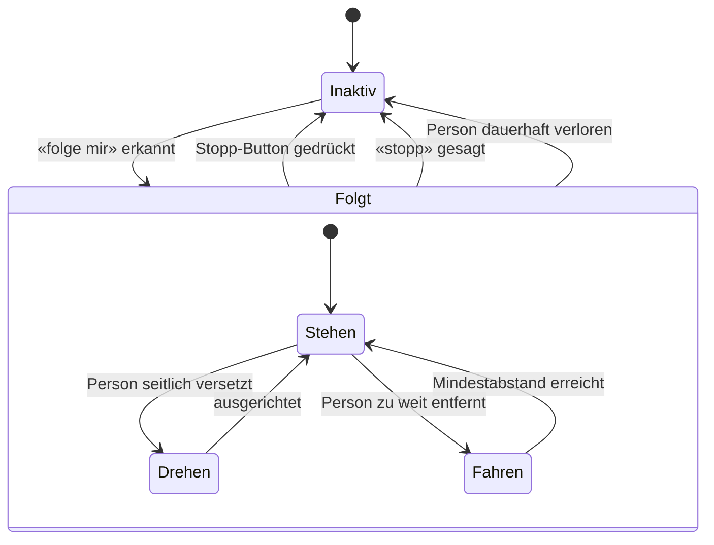

# Pepper

> Entwickler- und Benutzerdokumentation für den Roboter Pepper

> [!NOTE]
> Diese `README.md` beschreibt das **Verhalten** der App (Funktionen, Bedienung, Einrichtung, Konfiguration). Peppers eigene, besuchertaugliche Wissensbasis – die er selbst vorliest – steht getrennt in [`PEPPER.md`](PEPPER.md). Besucherrelevante Funktions- und Bühler-Infos gehören dorthin; sie wird von der [Dokumentation](#dokumentation)-Funktion zur Laufzeit von GitHub geladen. Die zentralen Programmabläufe sind als Diagramme in [`FLOWS.md`](FLOWS.md) dokumentiert.

## Inhalt

- [Einführung](#einführung)
  - [Wer ist Pepper?](#wer-ist-pepper)
  - [Wie bediene ich Pepper?](#wie-bediene-ich-pepper)
- [Funktionsweise](#funktionsweise)
  - [Intent Engine](#intent-engine)
  - [Sprachmodelle & Anbieter](#sprachmodelle--anbieter)
  - [Profile (Persona & Wissensbasis)](#profile-persona--wissensbasis)
  - [Denkpause](#denkpause)
  - [Historie](#historie)
  - [Antwortlänge](#antwortlänge)
  - [FollowMe-Mechanik](#followme-mechanik)
  - [Bildschirmanzeige](#bildschirmanzeige)
  - [Emotionswahrnehmung](#emotionswahrnehmung)
  - [Attract-Modus](#attract-modus)
  - [Offline-Verhalten](#offline-verhalten)
  - [Start & Absturz-Wiederherstellung](#start--absturz-wiederherstellung)
- [Programmabläufe](#programmabläufe)
- [Funktionen (Actions)](#funktionen-actions)
  - [Sprechen (Standard)](#sprechen-standard)
  - [Tanzen](#tanzen)
  - [Bewegung & Gesten](#bewegung--gesten)
  - [Saxofon](#saxofon)
  - [High Five](#high-five)
  - [Hold my beer](#hold-my-beer)
  - [Memory-Minispiel](#memory-minispiel)
  - [Bühler-Quiz](#bühler-quiz)
  - [Selfie](#selfie)
  - [Karriere](#karriere)
  - [Verlosung](#verlosung)
  - [Lautstärke](#lautstärke)
  - [Sprache](#sprache)
  - [Dokumentation](#dokumentation)
  - [Folgen (FollowMe)](#folgen-followme)
  - [Lotse-Modus](#lotse-modus)
  - [Systeminformationen](#systeminformationen)
  - [Siri und andere Assistenten](#siri-und-andere-assistenten)
  - [Test (Entwicklung)](#test-entwicklung)
- [Admin-Bereich](#admin-bereich)
  - [Zugang & PIN](#zugang--pin)
  - [Dashboard, Status & Statistik](#dashboard-status--statistik)
  - [Profile verwalten](#profile-verwalten)
  - [KI-Modelle verwalten](#ki-modelle-verwalten)
  - [Selfie-Galerie](#selfie-galerie)
  - [Verlosung verwalten](#verlosung-verwalten)
  - [Tanz-Bibliothek](#tanz-bibliothek)
  - [Navigation & Wegpunkte](#navigation--wegpunkte)
  - [Externe Kamera](#externe-kamera)
  - [Attract-Modus-Einstellungen](#attract-modus-einstellungen)
  - [Diagnose & Debug-Modus](#diagnose--debug-modus)
- [Tutorial: Raum einrichten](#tutorial-raum-einrichten)
- [Einrichtung für Entwickler](#einrichtung-für-entwickler)
  - [Systemspezifikationen](#systemspezifikationen)
  - [Anforderungen](#anforderungen)
  - [Konfiguration (env)](#konfiguration-env)
  - [Der erste Start](#der-erste-start)
- [Release & Deployment](#release--deployment)
  - [Signierung einrichten](#signierung-einrichten)
  - [Release-APK bauen](#release-apk-bauen)
  - [Dauerhaft auf Pepper installieren](#dauerhaft-auf-pepper-installieren)
- [Glossar](#glossar)

---

## Einführung

### Wer ist Pepper?

Pepper ist ein Roboter mit physischen Fähigkeiten, der die Bühler Group an Messen, Informationsanlässen und im Empfangsbereich vertritt. Er beherrscht Funktionen wie «High Five», «Tanzen» und «Saxofon spielen» und setzt dabei seinen ganzen Körper – Arme, Hände und Kopf – ein, damit die jeweilige Aktion lebendig wirkt.

Pepper kennt die Bühler Group und ihre Tätigkeiten: Er kann erzählen, was Bühler macht, welche Berufsbilder und Ausbildungen es gibt und wie man sich bewirbt. Sein Charakter ist hilfsbereit, intelligent und humorvoll. Pepper **versteht** Sprachbefehle in fünf Erkennungssprachen – **Deutsch**, **Englisch**, **Italienisch**, **Spanisch** und **Französisch** (umschaltbar, Start auf Deutsch) – und **antwortet automatisch in der Sprache der Person** (siehe [Sprache](#sprache)). Er weiss zu jedem Zeitpunkt, welche Fähigkeiten ihm zur Verfügung stehen, da ihm die verfügbaren Funktionen bei jeder Anfrage mitgeteilt werden (siehe [Intent Engine](#intent-engine)).

### Wie bediene ich Pepper?

Pepper hört auf Sprachbefehle. Man spricht ihn einfach an, und er reagiert auf das Gesagte. Im Hintergrund entscheidet derselbe Modellaufruf in einem Zug, **ob** eine spezialisierte Funktion gemeint ist und **was** Pepper sagt: Erkennt Pepper einen Befehl, der zu einer seiner Funktionen passt (z. B. «Tanze für mich»), führt er die Aktion aus; andernfalls antwortet er frei im Gespräch (siehe [Intent Engine](#intent-engine)). Die Antwort wird **satzweise gestreamt** und gesprochen, sodass Pepper früh zu reden beginnt, statt die ganze Antwort abzuwarten. Antworten sind bewusst kurz gehalten.

> **Wichtig:** Die **Spracherkennung** startet standardmässig auf Deutsch; die erste Anfrage erfolgt daher am besten auf Deutsch. Danach lässt sich die Erkennungssprache per Sprachbefehl oder im Admin-Bereich umstellen. Die *gesprochene Antwort* passt sich ohnehin automatisch der erkannten Sprache an.

---

## Funktionsweise

### Intent Engine

Die Intent Engine entscheidet anhand der Benutzereingabe, welche Funktion ausgeführt wird – und zwar im selben Modellaufruf, der auch die gesprochene Antwort erzeugt («kombinierter Turn»).

Bei jeder Anfrage wird das Sprachmodell im **Streaming-Modus** zusammen mit der Liste aller verfügbaren Fähigkeiten aufgerufen. Jede Fähigkeit ist mit einer kurzen Beschreibung versehen. Das Modell schreibt zu Beginn seiner Antwort zwei maschinenlesbare **Marker**:

- `[[lang:CODE]]` – die ISO-639-1-Sprache, in der Pepper antwortet (z. B. `[[lang:de]]`, `[[lang:en]]`, `[[lang:fr]]`). Daraus wird die Stimme/Locale für die Sprachausgabe bestimmt.
- `[[action:NAME]]` – die gewählte Funktion. Wählt das Modell `SayAction`, folgt direkt der frei formulierte Antworttext, der **satzweise** gesprochen wird. Für jede andere Funktion gibt das Modell **nur** die Marker aus, und Pepper führt die entsprechende Action aus.

Die Marker werden automatisch aus der Antwort entfernt und nie mitgesprochen. Passt keine spezialisierte Funktion, fällt die Auswahl auf die Standardfunktion [Sprechen](#sprechen-standard).

Dieses Vorgehen wählt dynamisch und zuverlässig die richtige Funktion, ohne starre Schlüsselwörter. Neue Funktionen werden automatisch berücksichtigt, sobald sie mit einer Beschreibung registriert sind.

> **Mehrstufiger Rückfall:** Scheitert der kombinierte Turn (z. B. Netzwerkfehler beim Streaming), greifen zwei Rückfälle: zuerst eine separate, günstigere Klassifizierung (`IntentEngine`, Aufgabe `CLASSIFICATION`), die die Eingabe einer Funktion zuordnet; schlägt auch diese fehl oder ist Pepper offline, greift ein lokaler Schlüsselwort-Abgleich (siehe [Offline-Verhalten](#offline-verhalten)). Bleibt alles erfolglos, sagt Pepper, dass er die Eingabe nicht verstanden hat.

### Sprachmodelle & Anbieter

Welches Modell verwendet wird, hängt von der **Aufgabenart** ab. Es gibt fünf Aufgaben, und für jede lassen sich **Anbieter und Modell** im Admin-Bereich frei wählen (siehe [KI-Modelle verwalten](#ki-modelle-verwalten)). Drei Anbieter sind fest hinterlegt:

| Anbieter | Basis-Endpunkt |
| -------- | -------------- |
| OpenAI | `https://api.openai.com/v1` |
| Grok (xAI) | `https://api.x.ai/v1` |
| Gemini | `https://generativelanguage.googleapis.com/v1beta/openai` |

Alle drei werden über dieselbe OpenAI-kompatible Schnittstelle angesprochen. Die Auswahlmöglichkeiten pro Anbieter (hartcodierter Katalog):

| Anbieter | Modelle (Anzeigename) |
| -------- | --------------------- |
| OpenAI | GPT-5.5 (Flaggschiff), GPT-5.4 (Stark), GPT-5.4 mini (Schnell), GPT-4.1 mini (Günstig), GPT-4o mini (Sparsam) |
| Grok | Grok 4.3 (Flaggschiff), Grok 4.1 Fast (Schnell), Grok 4 (Stark) |
| Gemini | Gemini 3.5 Flash (Flaggschiff), Gemini 3.1 Pro (Stark), Gemini 3.1 Flash-Lite (Schnell), Gemini 2.5 Pro/Flash (Stabil) |

**Standardzuordnung** (gilt, solange im Admin-Bereich nichts geändert wurde – Anbieter OpenAI):

| Aufgabe | Verwendet für | Standardmodell |
| ------- | ------------- | -------------- |
| `CONVERSATION` | Kombinierter Turn, Standard-Antworten | `gpt-5.4` |
| `DOCUMENTATION` | Fragen aus der [Dokumentation](#dokumentation) | `gpt-5.4` |
| `GENERATION` | Generierte [Choreografien](#tanzen), [Bewegungen](#bewegung--gesten), [Quizfragen](#bühler-quiz) | `gpt-5.5` |
| `CLASSIFICATION` | Rückfall-Routing der `IntentEngine` | `gpt-4o-mini` |
| `REWRITE` | Natürlicheres Umformulieren der System-Ansagen | `gpt-4o-mini` |

**Token/API-Keys:** Beim ersten Start wird der OpenAI-Token aus der [`env`-Datei](#konfiguration-env) übernommen und in den App-Einstellungen hinterlegt. Keys für Grok und Gemini werden ausschliesslich im Admin-Bereich gesetzt. Änderungen an Anbieter, Modell oder Key wirken sofort, ohne App-Neustart.

**Fehler- und Ausweichverhalten:** Antwortet ein gewähltes Modell mit einem Modellfehler (HTTP 400/403/404), versucht Pepper automatisch die übrigen Modelle desselben Anbieters. Andere Fehler (Netzwerk, Timeout, Serverfehler) führen zum [Offline-Rückfall](#offline-verhalten). Ein **Circuit-Breaker** lässt das Streaming nach drei aufeinanderfolgenden Fehlern für 30 Sekunden sofort scheitern (schneller Rückfall), bevor er es erneut versucht.

### Profile (Persona & Wissensbasis)

Ein **Profil** bündelt Peppers Persona (Grundinstruktionen) und eine optionale **Wissensbasis** aus hochgeladenen Ressourcen. Es ist immer genau ein Profil aktiv. Profile werden im [Admin-Bereich](#profile-verwalten) angelegt und umgeschaltet, sodass sich Pepper pro Event/Kontext anders verhält, ohne die App neu zu bauen.

- **Grundinstruktionen:** Frei editierbarer Text, der den Systemprompt anführt. Ist er leer, greift die mitgelieferte Basis-Persona (`instructions.md`).
- **Wissensbasis:** Pro Profil lassen sich Ressourcen hinterlegen – als **Text**, **Markdown**, **URL** (HTML wird bereinigt) oder **PDF** (Text wird extrahiert, bis 200.000 Zeichen je Ressource). Aus den Ressourcen erzeugt Pepper auf Knopfdruck eine kompakte **Zusammenfassung**, die als Abschnitt «Wissensbasis» in den Systemprompt einfliesst. Der Status der Zusammenfassung wird angezeigt (Leer / Veraltet / Aktuell) und muss nach Änderungen neu erstellt werden.
- **Built-in-Profil «Pepper Generic»:** Immer vorhanden, nicht löschbar, dient als Rückfall. Wird das aktive Profil gelöscht, wechselt Pepper automatisch hierher.

Die Karriere-URL und die WLAN-Daten kommen weiterhin aus der [`env`-Datei](#konfiguration-env), nicht aus dem Profil.

### Denkpause

Sobald Pepper eine Eingabe verarbeitet (insbesondere bei langsameren Aufrufen wie Choreografie- oder Bewegungsgenerierung), überbrückt eine Denkpause die Wartezeit, damit Pepper nicht regungslos wirkt: Er nimmt eine «überlegende» Pose ein und gibt abwechselnd Füll-Laute («hmm», «mhm») bzw. kurze Sätze («Lass mich kurz überlegen», nach längerer Wartezeit «Gleich hab ich's») in der aktuellen Sprache von sich. Beginnt Pepper zu sprechen oder ist die Aktion fertig, endet die Denkpause automatisch.

### Historie

Pepper merkt sich die letzten **10 Gesprächseinträge** als gleitendes Fenster (ein Eintrag = eine Benutzereingabe oder eine Pepper-Antwort); ein elfter verdrängt den ältesten. Die Historie wird bei jeder Anfrage mitgeschickt, damit Pepper auf zuvor Gesagtes Bezug nehmen kann. Sie liegt nur im Arbeitsspeicher und ist nach einem Neustart leer.

Zusätzlich wird eine getrennte Liste technischer **Developer-Einträge** (bis zu 200) geführt, z. B. welche Eingabe erkannt oder welche Action gestartet wurde. Diese erscheinen im Admin-Bereich unter [Diagnose](#diagnose--debug-modus), fliessen aber nicht in die gesprochene Antwort ein.

### Antwortlänge

Peppers gesprochene Antworten bleiben bewusst kurz – höchstens zwei bis drei kurze Sätze. Die Begrenzung gilt für **alle** frei formulierten Antworten, auch für [Dokumentation](#dokumentation) und Systeminformationen. Statt nachträglich abzuschneiden, erzeugt das Modell von vornherein eine kurze, vollständige Antwort: Bei umfangreichen Themen nennt Pepper den wichtigsten Punkt und bietet an, mehr zu erzählen. Gesteuert wird das zentral über die Persona im Systemprompt.

### FollowMe-Mechanik

Mit «folge mir» läuft Pepper einer Person physisch hinterher. Eine Hintergrundschleife wählt fortlaufend die Zielperson aus und entscheidet je nach deren Position, ob Pepper **stehen bleibt**, sich **dreht** oder **vorwärtsfährt**:

- **Stehen:** Die Person ist nah genug (Idealabstand rund 0,7 m) – Pepper wartet.
- **Drehen:** Die Person steht seitlich versetzt (mehr als rund 25°) – Pepper dreht sich zu ihr.
- **Fahren:** Die Person ist weiter entfernt – Pepper fährt nach.

Pepper bestätigt das Folgen ab und zu sprachlich. Beendet wird es über den **Stopp-Button** auf dem Display, per Sprachbefehl («stopp», «bleib stehen» …) oder automatisch, wenn die Person dauerhaft nicht mehr erkannt wird.



### Bildschirmanzeige

Auf Peppers Display sind dauerhaft zwei Elemente eingeblendet: oben links das **Bühler-Logo** und oben rechts die **aktuell verwendete Sprache**. Die Sprachanzeige wird live aktualisiert und ist reine Information (nicht antippbar).

Während Pepper spricht, blendet er seine Antwort zusätzlich als **Untertitel** ein – Wort für Wort, synchron zum Sprechen. Nach dem Satz bleibt der Text kurz stehen und wird dann automatisch ausgeblendet. Solange ein Overlay (Admin, Selfie, Memory, Verlosung, Navigation, Tanz-Bibliothek, Hold, Quiz, Karriere, Gewinnerziehung) offen ist, werden Untertitel, Sprachanzeige und Admin-Button unterdrückt.

Die Oberfläche ist im Bühler-Stil gehalten (Akzentfarbe Türkis, Titel «Bühler Pepper»).

### Emotionswahrnehmung

Pepper nimmt über seine Sensoren die ungefähre Stimmung der Person wahr, mit der er gerade spricht, und leitet eine einfache Grundstimmung ab (z. B. fröhlich, zufrieden, traurig oder angespannt). Ist eine Stimmung klar und nicht neutral, fliesst sie als zusätzlicher Kontext in die Antwortgenerierung ein, und Pepper darf sie dezent aufgreifen. Zwei Einschränkungen verhindern Aufdringlichkeit:

- Nur bei sicher erkannter, **nicht neutraler** Stimmung wird der Hinweis mitgegeben.
- Ein **Cooldown** verhindert, dass Pepper die Stimmung in zwei aufeinanderfolgenden Antworten anspricht.

Erkennt Pepper keine oder nur eine neutrale Stimmung, erwähnt er sie gar nicht.

### Attract-Modus

Ist gerade niemand im Gespräch, lockt Pepper im **Attract-Modus** selbstständig Besucher an: Er fährt langsam im Raum umher und begrüsst kurz («Hallo»), sobald jemand nah genug (rund 1,5 m) herantritt; danach fährt er weiter. Auf dem Bildschirm erscheint dabei kein zusätzlicher Text.

Der Modus läuft vollautomatisch und wird über einen Ein-/Aus-Schalter im [Admin-Bereich](#attract-modus-einstellungen) gesteuert (standardmässig aktiv). Spricht ein Besucher Pepper an oder wird ein Overlay geöffnet, pausiert das Herumfahren; nach einer einstellbaren Leerlaufzeit (Standard 2 Minuten) nimmt Pepper es wieder auf. Stösst er beim Fahren wiederholt an, weicht er aus.

### Offline-Verhalten

Vor jeder Anfrage prüft Pepper, ob eine bestätigte Internetverbindung besteht. Ist er **offline** (oder fällt der Modellaufruf trotz Wiederholung aus), greift ein lokaler **Schlüsselwort-Abgleich** auf Deutsch und Englisch, der ein paar Kernfunktionen auch ohne Netz auslöst:

| Schlüsselwörter | Funktion |
| --------------- | -------- |
| high five, highfive, abklatsch | High Five |
| selfie, foto, photo | Selfie |
| memory, gedächtnis | Memory-Minispiel |
| lautstärke, lauter, leiser, volume | Lautstärke |
| tanz, dance | Tanzen |

Passt kein Schlüsselwort, sagt Pepper, dass er gerade keine Verbindung hat. [Tanzen](#tanzen) selbst funktioniert vollständig offline, weil Choreografie und Audio lokal gespeichert sind.

### Start & Absturz-Wiederherstellung

Die App ist auf Dauerbetrieb ausgelegt. Stürzt sie durch einen unerwarteten Fehler ab, wird der Fehler protokolliert und die App nach kurzer Zeit automatisch neu gestartet; beim Neustart wird die letzte Absturzmeldung einmalig im Debug-Log angezeigt. Ein «Zurück zum Startbildschirm» ohne erkennbaren Grund ist daher meist ein solcher Absturz-Neustart. Ein optionaler Autostart nach Geräte-Boot ist möglich (siehe [Dauerhaft auf Pepper installieren](#dauerhaft-auf-pepper-installieren)).

---

## Programmabläufe

Die zentralen Abläufe der App sind als Mermaid-Diagramme in [`FLOWS.md`](FLOWS.md) dokumentiert: Boot/Start, Sprache → Aktions-Dispatch, Modellauswahl & Anbieter-Rückfall, Profil/Wissensbasis, Navigation/Raumscan, Attract-Modus, Tanz-Ablauf, Selfie, Verlosungs-Beitritt, Hold-my-beer-Zustandsautomat sowie Gespräch und Sprachwechsel.

---

## Funktionen (Actions)

### Sprechen (Standard)

Pepper hört zu und generiert eine Antwort; währenddessen bewegt sich sein Körper minimal mit, damit die Antwort natürlich wirkt. Er antwortet in der **Sprache der Benutzereingabe** (automatisch erkannt). Wird keine spezialisierte Funktion ausgelöst, ist dies der Rückfall.

```text
Beispiel (de): Hallo, wie geht es dir?
Beispiel (en): Hello, how are you?
```

### Tanzen

Pepper tanzt auf Zuruf einen Tanz aus seiner **gespeicherten Sammlung**:

1. Nennt der Gast einen Song oder Künstler («Tanz zu Billie Jean»), sucht Pepper per Namensabgleich den passenden Tanz; sonst wählt er den im Admin gesetzten **Standard-Tanz**, einen **Favoriten** oder zufällig einen gespeicherten Tanz.
2. Er spielt das lokal zwischengespeicherte Vorschau-Audio ab dem markanten Teil ab und bewegt sich rhythmisch zur Choreografie (zwischen rund 5 und 35 Sekunden). Endet die Animation, wird die Musik gestoppt, damit beides synchron bleibt.

Die gesprochene Tanz-Funktion **erzeugt zur Laufzeit keine neuen Tänze** – neue Choreografien entstehen ausschliesslich in der [Tanz-Bibliothek](#tanz-bibliothek). Weil Tanz und Audio lokal gespeichert sind, läuft das Tanzen auch ohne WLAN. Ist die Sammlung leer oder schlägt das Abspielen fehl, legt Pepper einen vorbereiteten **Eigen-Tanz** hin («Six… seven!»).

```text
Beispiel (de): Tanze bitte für mich. / Tanz zu Billie Jean.
Beispiel (en): Dance to Uptown Funk.
```

### Bewegung & Gesten

Pepper führt auf Zuruf eine **einzelne, frei beschriebene Bewegung oder Geste** aus – etwa «heb den rechten Arm», «dreh den Kopf nach links», «nicke» oder «winke». Anders als beim [Tanzen](#tanzen) gehört keine Musik dazu.

Die Bewegung wird **zur Laufzeit generiert**: Ein Sprachmodell (Aufgabe `GENERATION`) erzeugt eine Animation, die anschliessend hart geprüft wird – jeder Gelenkname, jede Bildrate und jeder Winkel muss innerhalb sicherer Grenzen liegen, sonst wird bis zu dreimal neu generiert. Danach werden die Werte mit Sicherheitsmarge geklammert und für weiche Übergänge nachbearbeitet. Optional lässt sich eine Dauer nennen («heb den Arm für 5 Sekunden»); die ausgeführte Bewegung wird auf höchstens **30 Sekunden** begrenzt (längere Wünsche werden als Schleife bis zu dieser Grenze umgesetzt).

```text
Beispiel (de): Heb den rechten Arm. / Dreh den Kopf nach links.
Beispiel (en): Raise your right arm. / Nod your head for five seconds.
```

### Saxofon

Pepper spielt ein Saxofon-Solo und bewegt seinen Körper rhythmisch dazu, während Hände und Arme das Saxofonspielen imitieren (bis 35 Sekunden).

```text
Beispiel (de): Spiele Saxofon.
Beispiel (en): Play the saxophone.
```

### High Five

Der rechte Arm wird für rund 7 Sekunden in eine High-Five-Position gehoben und fährt danach wieder herunter. In diesem Zeitfenster kann der Gast einschlagen.

```text
Beispiel (de): High Five.
Beispiel (en): High Five.
```

### Hold my beer

Pepper hält auf Zuruf ein leichtes Objekt (Becher, PET-Flasche, max. ca. 300 g, der Arm trägt nur etwa 0,5 kg) in der rechten Hand. Ablauf: Pepper hebt den Arm mit offener Hand und wartet rund **15 Sekunden** auf das Auflegen, erkennt die Übergabe über den Berührungssensor am Handrücken (alternativ über den Bestätigungs-Button auf dem Tablet) und schliesst die Hand. Während des Haltens bleibt die Halte-Hand bewusst **ruhig**, damit nichts herunterfällt, und Pepper gibt mit zunehmender Wartezeit gelegentliche Sprüche von sich (nach 1, 3 und 5 Minuten; ab 10 Minuten fordert er aktiv zur Abnahme auf).

**Sicherheit:** Die Hand öffnet sich nie von selbst. Zurückgegeben wird nur über den grossen STOP-Button auf dem Tablet oder per Sprachbefehl («Stopp», «Danke», «Gib her»); danach zählt Pepper **fünf Sekunden** herunter, bevor er die Hand öffnet. Verliert die App den Roboter-Fokus (z. B. Absturz oder App-Wechsel), endet die Session ohne Öffnungs-Animation; das Objekt sollte vorher abgenommen werden.

```text
Beispiel (de): Halt mal mein Bier.
Beispiel (en): Hold my beer.
```

### Memory-Minispiel

Pepper spielt «Memory mit Bewegung» nach dem Senso-/Simon-Prinzip. Auf dem Tablet erscheinen vier farbige Felder. Pepper gibt eine Sequenz vor, indem er die Felder nacheinander aufleuchten lässt und dazu je einen eigenen Ton spielt; der Gast wiederholt sie durch Antippen. Pro Runde wird die Sequenz um ein Element länger und das Tempo etwas schneller. Bei einem Fehler oder bei Zeitüberschreitung endet das Spiel; Pepper reagiert mit einer Geste und nennt den Punktestand.

**Schwierigkeit:** Beim Start per Sprachbefehl wählbar – «leicht», «normal» (Standard) oder «schwer». Sie bestimmt Startlänge, Anzeigetempo und Eingabezeit. Der **Rekord** wird je Schwierigkeitsgrad lokal gespeichert. Während des Spiels ist das Spielfeld bildschirmfüllend; Sprachbefehle werden erst nach Spielende wieder verarbeitet.

```text
Beispiel (de): Lass uns Memory spielen. / Lass uns Memory spielen, schwer.
Beispiel (en): Let's play the memory game.
```

### Bühler-Quiz

Pepper stellt eine kurze Multiple-Choice-Quizrunde (vier Fragen) rund um Bühler, Industrie und Berufe. Die Fragen werden bei Verbindung vom Sprachmodell generiert (Aufgabe `GENERATION`, in der aktuellen Sprache); fällt das aus oder ist Pepper offline, greift ein lokaler, kuratierter Fragenkatalog (Deutsch/Englisch). Die Antwortoptionen erscheinen als Touch-Buttons auf dem Tablet (rund 25 Sekunden pro Frage).

Pro Frage gibt Pepper Rückmeldung (richtig/falsch inkl. korrekter Antwort) und hebt die Lösung hervor; am Ende nennt er den Punktestand. Erreicht der Gast mindestens die Hälfte der Punkte und läuft gerade eine [Verlosung](#verlosung), lädt Pepper im Anschluss zur Teilnahme ein.

```text
Beispiel (de): Quiz. / Frag mich was über Bühler.
Beispiel (en): Quiz me. / Ask me a question about Bühler.
```

### Selfie

Auf Wunsch macht Pepper ein gemeinsames Selfie: Er nimmt ein Foto auf, fügt ein Bühler-/Pepper-Motiv ins Bild ein und zeigt es zur **Vorschau**. Der Gast kann es **speichern** oder mit **«Nochmal»** (Touch oder Sprachbefehl «passt» / «nochmal») neu aufnehmen – insgesamt bis zu drei Aufnahmen. Erfolgt keine Eingabe, wird nach kurzer Zeit automatisch das aktuelle Bild gespeichert. Beim dritten Versuch wird direkt gespeichert.

Anschliessend erscheint ein **QR-Code**, über den sich das Bild auf das eigene Smartphone laden lässt. Das Foto wird **lokal auf Peppers Tablet** gespeichert (Metadaten in einer Datenbank, das Bild als Datei) und über einen kleinen, in die App eingebetteten, token-geschützten Webserver (Port 8080) bereitgestellt. Das Smartphone lädt das Bild **direkt von Pepper** – nichts wird ins Internet hochgeladen. Optional wird ein zweiter QR-Code zum WLAN-Beitritt angezeigt (aus den `env`-WLAN-Daten).

**Zu beachten:**

- Smartphone und Pepper müssen im **selben WLAN** sein, sonst kann das Bild nicht heruntergeladen werden.
- Ist eine [externe Kamera](#externe-kamera) aktiv und erreichbar, nutzt Pepper sie; sonst fällt er auf die eigene Kamera zurück.
- Gespeicherte Selfies werden nach einer einstellbaren Aufbewahrungszeit (Standard 14 Tage) automatisch aufgeräumt; mit einer [Verlosung](#verlosung) verknüpfte Selfies sind länger geschützt.

```text
Beispiel (de): Lass uns ein Selfie machen.
Beispiel (en): Let's take a selfie.
```

### Karriere

Fragt jemand nach Stellen, Ausbildungen, Praktika oder einer Bewerbung, gibt Pepper eine kurze Antwort (Deutsch/Englisch) und zeigt auf dem Tablet einen **QR-Code zur Karriereseite** (rund 30 Sekunden). Die Karriere-URL ist **konfigurierbar** über den Schlüssel `PEPPER_CAREER_URL` in der [`env`-Datei](#konfiguration-env). Ist keine oder eine ungültige URL gesetzt, gibt Pepper nur die Sprachantwort und zeigt keinen QR-Code.

```text
Beispiel (de): Welche Jobs gibt es bei Bühler? / Welche Ausbildungen bietet Bühler?
Beispiel (en): What jobs are there at Bühler? / How can I apply?
```

### Verlosung

Pepper kann eine **Verlosung** begleiten. Sie wird im [Admin-Bereich](#verlosung-verwalten) angelegt; immer nur **eine** ist gleichzeitig aktiv. Solange eine Verlosung läuft, weiss Pepper davon und lädt Besucher im Gespräch von sich aus zum Mitmachen ein (der Kontext wird in den Systemprompt eingespeist). Auf direkte Fragen antwortet Pepper mit Titel, Beschreibung und Enddatum.

Beim **Beitritt** erfasst Pepper Name und E-Mail-Adresse (optional Telefon) Schritt für Schritt über ein Tablet-Formular, das er sprachlich begleitet. E-Mail- und Telefonformat werden geprüft, Doppel-Eintritte über dieselbe E-Mail oder Telefonnummer verhindert. Ist für die Verlosung ein Selfie verpflichtend, läuft zuerst der [Selfie](#selfie)-Flow und das Selfie wird dem Eintrag zugeordnet.

**Drei Eintrittspunkte:** per Sprachbefehl («Verlosung beitreten», «mitmachen»), direkt nach einem Selfie oder über die Admin-Verwaltung.

**Status-Lebenszyklus:** `ACTIVE` (Beitritt möglich) → `ENDED` (nach Enddatum automatisch, kein Beitritt mehr) → `FINISHED` (manuell vom Admin abgeschlossen, Pepper erwähnt sie nicht mehr). Teilnehmerdaten liegen lokal auf Pepper, nichts wird ins Internet übertragen.

```text
Beispiel (de): Ich möchte bei der Verlosung mitmachen.
Beispiel (en): I want to join the raffle.
```

### Lautstärke

Die Systemlautstärke kann per Sprachbefehl geändert werden. Pepper extrahiert den Zahlenwert aus der Eingabe – als Ziffer oder als ausgeschriebenes Zahlwort (Deutsch und Englisch, inkl. «halb» = 50 % und «voll»/«maximal» = 100 %).

**Zu beachten:** Werte über 100 werden abgelehnt; ohne erkennbare Zahl kann keine Lautstärke gesetzt werden.

```text
Beispiel (de): Setze die Lautstärke auf 80 Prozent.
Beispiel (en): Change the volume to 80%.
```

### Sprache

Wechselt die Sprache der **Spracherkennung** sowie die Anzeige rechts oben. Damit bestimmt diese Funktion, welche Sprache Pepper *versteht*.

**Unterstützte Erkennungssprachen:** Deutsch (`de-CH`), Englisch (`en-US`), Italienisch (`it-IT`), Spanisch (`es-ES`), Französisch (`fr-FR`).

Davon zu unterscheiden ist die *gesprochene Antwort*: Diese richtet sich automatisch nach der Sprache der Benutzereingabe (über den `[[lang:…]]`-Marker, siehe [Intent Engine](#intent-engine)). Pepper kann eine ganze Reihe von Sprachcodes auf passende Stimmen abbilden; manuell lässt sich die Erkennungssprache auch im [Admin-Bereich](#admin-bereich) umschalten.

```text
Beispiel (de): Stelle die Sprache auf Englisch.
Beispiel (en): Set the language to German.
```

### Dokumentation

Gibt dem Nutzer Informationen aus Peppers Wissensbasis [`PEPPER.md`](PEPPER.md) wieder (nicht aus dieser README). Die Datei wird von GitHub geladen und rund 6 Stunden zwischengespeichert (mit Rückfall auf die zuletzt geladene Version bei Netzwerkfehlern); Änderungen werden so ohne App-Neustart übernommen. Antworten bleiben kurz und in der Sprache der Frage.

```text
Beispiel (de): Wie weiss Pepper, welche Funktion er ausführen muss?
Beispiel (en): How does Pepper know which action to execute?
```

### Folgen (FollowMe)

Pepper folgt einer Person physisch (siehe [FollowMe-Mechanik](#followme-mechanik)). Erkennt er, dass er bereits folgt, weist er freundlich darauf hin.

```text
Beispiel (de): Folge mir.
Beispiel (en): Follow me.
```

### Lotse-Modus

Pepper führt Besucher zu einem Ziel. Auf «bring mich zum Fotostand» oder «wo finde ich den Ausgang» gleicht er den genannten Ort unscharf gegen die gespeicherten [Wegpunkte](#navigation--wegpunkte) ab (Deutsch/Englisch), kündigt an «Folge mir, ich bringe dich zu …» und fährt autonom mit Hindernisvermeidung hin. Bei der Ankunft meldet er das Ziel; kennt er den Ort nicht, zählt er die verfügbaren Wegpunkte auf.

Voraussetzung ist ein aktiver, lokalisierter [Raum-Scan](#navigation--wegpunkte). Unterwegs lässt sich die Fahrt per Sprachbefehl («Stopp», «halt an», «bleib stehen») abbrechen; verliert Pepper die Orientierung, hält er an und sagt Bescheid.

```text
Beispiel (de): Bring mich zum Fotostand. / Wo finde ich den Ausgang?
Beispiel (en): Take me to the photo booth. / Where is the exit?
```

### Systeminformationen

Pepper gibt auf Nachfrage seinen aktuellen Zustand wieder: eingestellte Lautstärke, aktive Sprache und Länge der gespeicherten [Historie](#historie). Diese Funktion liest nur aus und verändert nichts.

```text
Beispiel (de): Wie laut bist du gerade eingestellt?
Beispiel (en): Which language are you currently using?
```

### Siri und andere Assistenten

Wird Pepper auf andere Sprachassistenten (Siri, Alexa, Google, Cortana, Bixby) angesprochen oder mit ihnen verglichen, kontert er humorvoll und wählt dabei zufällig aus mehreren Sprüchen. Die Antwort erfolgt in der aktuell eingestellten Sprache.

```text
Beispiel (de): Bist du Siri?
Beispiel (en): Are you Siri?
```

### Test (Entwicklung)

Eine Aktion für Entwicklungs- und Demozwecke: Pepper dreht sich einmal um die eigene Achse (4× 90°). Sie wird nur auf ausdrückliche Anforderung ausgeführt.

```text
Beispiel (de): Führe die Testaktion aus.
Beispiel (en): Run the test action.
```

---

## Admin-Bereich

Der Admin-Bereich ist eine PIN-geschützte Tablet-Oberfläche für Betrieb und Wartung, getrennt vom normalen Besucher-Dialog.

### Zugang & PIN

Geöffnet wird der Admin-Bereich über den **Admin-Button** unten links auf dem Homescreen oder per Sprachbefehl («Admin», «Einstellungen»). Danach folgt die Eingabe einer **4-stelligen PIN** (Standard `1019`, änderbar; gespeichert als Hash). Nach **fünf** Fehlversuchen ist die Eingabe für **60 Sekunden** gesperrt. Anschliessend erscheint das Menü als **Kachelgrid**.

Solange ein Overlay (Admin, Selfie, Verlosungs-Beitritt, Navigation, Tanz-Bibliothek, Hold, Gewinnerziehung, Follow) offen ist, pausiert die Spracherkennung und Admin-Button/Sprachanzeige werden ausgeblendet. Das Menü bündelt:

| Kachel | Funktion |
| ------ | -------- |
| Status | Detaillierter Systemzustand (WLAN inkl. IP, Batterie, Uptime, Erreichbarkeit des KI-Anbieters). |
| Statistik | Tagesreport (Interaktionen, Selfies, Verlosungs-Beitritte, Fehler, Aktionen je Typ), exportierbar. |
| Profile | Verwaltet [Profile](#profile-verwalten) (Persona & Wissensbasis), aktiviert ein Profil. |
| KI-Modelle | Setzt [Anbieter, Modell und API-Keys](#ki-modelle-verwalten) je Aufgabe. |
| Verlauf ansehen | Zeigt das aktuelle Gespräch als Chat-Blasen. |
| Verlauf löschen | Leert das Gesprächsgedächtnis. |
| Dev-Logs / Debug | [Diagnose & Debug-Modus](#diagnose--debug-modus). |
| Selfies | Öffnet die [Selfie-Galerie](#selfie-galerie). |
| Sprache | Wechselt die Erkennungssprache manuell (Deutsch, Englisch, Italienisch, Spanisch, Französisch). |
| Verlosung | Legt eine [Verlosung](#verlosung-verwalten) an bzw. verwaltet sie inkl. Gewinnerziehung. |
| Tänze | Öffnet die [Tanz-Bibliothek](#tanz-bibliothek) und die Tanz-Einstellungen. |
| Navigation | Öffnet die [Raumkartierung & Wegpunkte](#navigation--wegpunkte) und deren Einstellungen. |
| Kamera | Konfiguriert die [externe Kamera](#externe-kamera). |
| Attract-Modus | Schaltet den [Attract-Modus](#attract-modus-einstellungen) ein/aus und stellt Parameter ein. |

### Dashboard, Status & Statistik

Das Hauptmenü aktualisiert alle 15 Sekunden eine Statuszeile (WLAN, Batterie mit Farbcodierung, Uptime, Erreichbarkeit des KI-Anbieters). Das **Status**-Panel zeigt dieselben Werte ausführlicher inkl. lokaler IP. Das **Statistik**-Panel fasst den Tag zusammen (Datum, Interaktionen, Selfies, Verlosungs-Beitritte, Fehler, Aufschlüsselung nach ausgeführten Funktionen) und lässt sich als Text teilen.

### Profile verwalten

Hier werden [Profile](#profile-persona--wissensbasis) angelegt, aktiviert, geklont und gelöscht. Im Editor lassen sich Name und Grundinstruktionen bearbeiten sowie Ressourcen (Text, Markdown, URL, PDF) hinzufügen und entfernen. Über «Aktivieren» wird ein Profil scharf geschaltet, über «Zusammenfassung neu erstellen» die Wissensbasis aus den Ressourcen verdichtet. Das Built-in-Profil «Pepper Generic» ist nicht löschbar.

### KI-Modelle verwalten

Pro Anbieter (OpenAI, Grok, Gemini) wird ein **API-Key** eingegeben und über «Validieren» live geprüft (Abfrage der Modellliste). Für jede der fünf [Aufgaben](#sprachmodelle--anbieter) lassen sich **Anbieter und Modell** wählen; ein Hinweistext beschreibt das gewählte Modell. «Speichern» übernimmt alle Keys und Zuordnungen sofort, ohne Neustart.

### Selfie-Galerie

Die Galerie zeigt alle lokal gespeicherten Selfies als Raster, **Favoriten zuerst**; mit einer Verlosung verknüpfte Selfies tragen ein Badge. In der **Detailansicht** lässt sich der Download-QR-Code anzeigen, das Selfie als Favorit markieren oder löschen. Über **«Alle exportieren»** werden sämtliche Selfies als ZIP zum Teilen angeboten. Die **Aufbewahrungszeit** (Standard 14 Tage) ist hier einstellbar.

### Verlosung verwalten

Hier wird eine [Verlosung](#verlosung) angelegt (Titel, Beschreibung, Enddatum, Optionen «Selfie erforderlich» / «Telefon erforderlich», Aufbewahrungstage) – nur möglich, wenn keine andere aktiv ist. Läuft bereits eine, zeigt das Panel die **Übersicht** mit Status, Teilnehmerzahl und Teilnehmerliste (Name, E-Mail, Telefon, Selfie-Thumbnail). Über **«Verlosung beenden»** wird sie auf `FINISHED` gesetzt.

**Gewinner ziehen:** Sobald eine Verlosung abgelaufen ist (`ENDED`), lässt sich ein Teilnehmer zufällig als Gewinner ziehen (mit Roboter-Animation), **neu auslosen** oder per **«E-Mail»** benachrichtigen (vorausgefüllte E-Mail, ggf. mit dem Selfie des Gewinners als Anhang).

### Tanz-Bibliothek

Die Tanz-Bibliothek verwaltet alle gespeicherten [Tänze](#tanzen) und ist der Ort, an dem **neue Tänze entstehen**:

- **Erstellen:** Zu einem genannten Song sucht Pepper das Lied über die **iTunes-Search-API** (30-Sekunden-Vorschau), analysiert die Vorschau auf **Tempo (BPM)** und den markanten Einstiegspunkt, lässt eine passende Choreografie von einem Sprachmodell (Aufgabe `GENERATION`) generieren und wandelt sie in eine validierte, geglättete Animation um. Das gemessene Tempo wird genutzt, um die Bewegungen an den Beat zu koppeln, und die Musik startet ab dem markanten Teil. Tanz und Vorschau-Audio werden lokal gespeichert; bereits vorhandene Songs werden wiederverwendet.
- **KI-Edit:** Eine gespeicherte Choreografie oder ihr Startzeitpunkt lässt sich per natürlichsprachiger Anweisung anpassen.
- **Verwalten:** Pro Eintrag kann der Tanz als **Favorit** markiert, **umbenannt** oder **gelöscht** werden. Eingebaute Tänze (Hula, Six Seven) sind ab Werk vorhanden.
- **Einstellungen:** Ein **Standard-Tanz** und eine **Standard-Dauer** (Sekunden, mindestens 8) lassen sich festlegen.

### Navigation & Wegpunkte

Über die Kachel **«Navigation»** kann Pepper einen Raum **kartieren** und benannte **Wegpunkte** speichern, die er später autonom anfährt. Wichtig: **Pepper fährt beim Scannen nicht autonom durch den Raum** – er dreht sich nur an Ort.

Typischer Ablauf (Details siehe [Tutorial](#tutorial-raum-einrichten)):

1. **Scan starten:** Pepper baut eine Karte auf und **dreht sich automatisch einmal um die eigene Achse** (4× 90°), um die erste Position zu erfassen. Die Live-Karte wird im Vollbild gezeigt.
2. **Weitere Positionen:** Pepper von Hand an weitere Stellen schieben und dort «Aktuelle Position erfassen» tippen; er dreht erneut 4× 90°. Beliebig oft wiederholbar.
3. **Stoppen & speichern:** Über den STOP-Button oder per Sprachbefehl («stopp», «halt», «fertig»). Der Scan wird benannt und gespeichert.
4. **Aktivieren (lokalisieren):** Pepper bestimmt seine Position in der Karte (Drehung 8× 45°). Schlägt das innerhalb des Zeitlimits (Standard 40 s, einstellbar) fehl, meldet er es.
5. **Wegpunkte setzen:** An der aktuellen Position einen benannten Wegpunkt ablegen, optional vom Typ **«Fotostand»** (nur möglich, wenn lokalisiert).
6. **Hinfahren:** Pepper navigiert auf Wunsch autonom zum Wegpunkt (mit Hindernisvermeidung).

Eine **Live-Karte** zeigt Start-Punkt, Wegpunkte (Fotostand hervorgehoben) und Peppers Position samt Blickrichtung. Scans und Wegpunkte werden lokal gespeichert. In den **Einstellungen** lassen sich ein Standard-Scan, automatisches Lokalisieren beim Start und das Lokalisierungs-Zeitlimit festlegen.

> **Hinweis:** Die Navigation ist ein Operator-Werkzeug und ausschliesslich über den Admin-Bereich erreichbar. Besucher lösen nur den [Lotse-Modus](#lotse-modus) per Sprache aus.

### Externe Kamera

Optional kann für das [Selfie](#selfie) eine externe Kamera per WLAN angebunden werden (PTP/IP, Standard-Port 15740). Im Panel werden **IP-Adresse**, **Port** und ein **Aktiv-Schalter** gesetzt; ein **Verbindungstest** prüft die Erreichbarkeit. Ist die externe Kamera aktiv und erreichbar, nutzt Pepper sie und ändert den Selfie-Dialog (er bittet, sich vor die Kamera zu stellen, wartet auf «Start» und zählt herunter); andernfalls fällt er auf die eigene Kamera zurück.

> [!WARNING]
> Die PTP/IP-Anbindung ist ein **noch nicht am Gerät verifiziertes Gerüst**. Die genauen Canon-Operation-Codes und der Capture-/Event-Ablauf müssen mit einer realen Kamera (getestet gegen Canon EOS 80D) nachgezogen werden. Kompatibel sind grundsätzlich Kameras mit eingebautem WLAN im Infrastructure-Modus.

### Attract-Modus-Einstellungen

Schaltet den [Attract-Modus](#attract-modus) ein/aus und stellt die **Leerlaufzeit** (Standard 2 Minuten, bis das Herumfahren beginnt) sowie die **Begrüssungsdauer** (Standard 45 Sekunden) ein.

### Diagnose & Debug-Modus

- **Dev-Logs:** Zeigt die technischen Developer-Einträge chronologisch (Auto-Scroll).
- **Debug:** Schaltet den **Debug-Modus** ein/aus (persistiert). Ist er aktiv, blendet Pepper auf dem Homescreen und während der Aktionen ein **On-Screen-Overlay** ein: eine **Status-Box** mit dem aktuellen Zustand (z. B. «Raum-Scan – Drehung 2/4» oder «OpenAI – Anfrage läuft …») und ein mitlaufendes **Live-Log** (Ringpuffer, zusätzlich nach Logcat). Das Log lässt sich aktualisieren, leeren und als Textdatei exportieren. Während der Admin-Bereich offen ist, wird das Overlay unterdrückt.

---

## Tutorial: Raum einrichten

So bringst du Pepper bei, sich in einem Raum zu orientieren und gespeicherte **Wegpunkte** selbstständig anzufahren. Der Ablauf ist bewusst einfach: wenig Bewegung, schneller Scan, Wegpunkte werden per Tablet eingelernt.

> **Wichtig:** Pepper **bewegt sich beim Scan nicht autonom durch den Raum**. Während des Mappings kann die Fahr-Basis nicht autonom fahren; Animationen steuern nur die Gelenke, nicht die Räder. Deshalb **schiebst du Pepper beim Scannen von Hand** zu weiteren Positionen. Erst wenn die Karte gespeichert und aktiviert ist, fährt Pepper über die Navigation zuverlässig zu Wegpunkten.

1. **Navigation öffnen:** Unten links auf **Admin** tippen (oder «Admin» sagen), PIN eingeben, im Kachelmenü **Navigation** wählen.
2. **Raum scannen:** Oben einen **Namen** eingeben und **«Scan starten»** tippen. Pepper mappt, zeigt die **Live-Karte im Vollbild** und **dreht sich automatisch 4× 90°**, um die erste Position zu erfassen. Bitte Platz lassen.
3. **Weitere Bereiche:** Pepper an die nächste Stelle **schieben** und **«Aktuelle Position erfassen»** tippen – er dreht erneut 4× 90°. Beliebig oft wiederholen. Möglichst freie Fläche, keine Personen im Sichtfeld (sonst «Geister-Hindernisse»). Laufend an der Live-Karte kontrollieren.
4. **Beenden:** Den grossen **STOP-Button** drücken oder «**Stopp**» (bzw. «Halt», «Fertig») sagen. Die Karte wird gespeichert.
5. **Karte aktivieren:** In der Liste **Raum-Scans** den Scan auf **«Aktivieren»** tippen. Pepper lokalisiert sich; der Status wechselt auf «Lokalisiert in …». (Am Scan-Startpunkt klappt das am schnellsten.)
6. **Wegpunkte einlernen:** Pepper **von Hand** zur gewünschten Stelle schieben, einen **Namen** eingeben (für einen Foto-Standort zusätzlich **«Fotostand»** ankreuzen) und **«Aktuelle Position speichern»** tippen. Für jede wichtige Stelle wiederholen.
7. **Wegpunkt anfahren:** Im Bereich **Wegpunkte** beim Eintrag **«Hierhin fahren»** tippen – Pepper navigiert autonom dorthin. Im Betrieb löst ein Besucher das per Sprache aus («Bring mich zum Fotostand», siehe [Lotse-Modus](#lotse-modus)).

**Tipps:** Je sauberer die Umgebung erfasst ist, desto zuverlässiger die spätere Lokalisierung. Verliert Pepper die Orientierung, stell ihn näher an einen bekannten Bereich und aktiviere den Scan erneut. Pro Raum einen eigenen Scan anlegen.

---

## Einrichtung für Entwickler

### Systemspezifikationen

| Komponente   | Version |
| ------------ | ------- |
| Java (Quellkompatibilität) | 8 |
| Min. SDK     | 23 |
| Target SDK   | 34 |
| Compile SDK  | 34 |

**Wichtige Bibliotheken:** QiSDK / QiSDK-Design 1.7.5 (Aldebaran/SoftBank), AndroidX (AppCompat, ConstraintLayout, RecyclerView, Room 2.5.2), Material 1.6.1, `net.gotev:speech`, Jackson `jackson-databind`, `java-dotenv`, ZXing `core` (QR-Codes), JUnit/Espresso für Tests.

### Anforderungen

> Sind nicht alle Anforderungen erfüllt, sind Fehler beim Entwickeln vorprogrammiert.

- Android Studio mit dem **Pepper-SDK-Plugin**
- Pepper-Roboter (für Tests am Gerät)
- Mindestens ein API-Key eines unterstützten Anbieters (OpenAI, Grok oder Gemini)
- **Build-JDK 17** – das in Android Studio gebündelte JBR. Neuere System-JDKs (21, 26 …) sind für die hier verwendete Gradle-/AGP-Version zu neu und lassen den Build scheitern. Baust du über die Kommandozeile, setze `JAVA_HOME` auf das Studio-JBR (z. B. `…/Android Studio/jbr`).
- **Android-SDK-Pakete** – Plattform `android-34` und `build-tools;30.0.3`. Fehlen sie, über den SDK-Manager oder `sdkmanager "platforms;android-34" "build-tools;30.0.3"` installieren.

### Konfiguration (env)

API-Keys und einige optionale Werte werden **nicht** im Quellcode hinterlegt, sondern aus einer lokalen Datei `app/src/main/assets/env` gelesen. Diese Datei ist über `.gitignore` ausgeschlossen. Der OpenAI-Key wird beim ersten Start daraus in die App-Einstellungen übernommen; Keys für Grok/Gemini werden im [Admin-Bereich](#ki-modelle-verwalten) gesetzt.

**Aufbau:** Pro Zeile ein Eintrag `SCHLÜSSEL=Wert`. Leerzeilen und Zeilen mit `#` werden ignoriert. Werte dürfen in `'` oder `"` stehen.

| Schlüssel | Pflicht | Beschreibung |
| --------- | ------- | ------------ |
| `OPENAI_API_TOKEN` | empfohlen | OpenAI-Token; wird beim ersten Start übernommen. Andere Anbieter-Keys über den Admin-Bereich. |
| `PEPPER_CAREER_URL` | Nein | URL der Karriereseite für die [Karriere](#karriere)-Funktion (QR-Code). |
| `PEPPER_WIFI_SSID` | Nein | WLAN-Name für den optionalen WLAN-Beitritts-QR-Code beim [Selfie](#selfie). |
| `PEPPER_WIFI_PASSWORD` | Nein | WLAN-Passwort für den WLAN-QR-Code (leer = offenes Netz). |

**Einrichten:** Im Ordner `app/src/main/assets/` die Vorlage `exampleenv` nach `env` kopieren und den Platzhalter durch den echten Token ersetzen. Die Datei `env` niemals committen.

### Der erste Start

1. Projekt in Android Studio öffnen und vollständig laden lassen.
2. `app/src/main/assets/env` anlegen und Token eintragen (siehe oben). Optional Modelle/Anbieter im Admin-Bereich anpassen.
3. **Verbindung zu Pepper:** In Android Studio **Tools → Pepper SDK → Connect**, IP-Adresse (und ggf. Passwort) des Roboters eingeben.
4. App über die **app**-Start-Konfiguration starten.

Danach startet die App auf Pepper. Teste die Funktionen, am besten je einen Befehl pro Funktion.

---

## Release & Deployment

### Signierung einrichten

Eine Release-APK muss signiert sein. Die Keystore-Zugangsdaten werden aus der lokalen Datei `keystore.properties` im Projektwurzelverzeichnis gelesen (über `.gitignore` ausgeschlossen, ebenso `*.jks`/`*.keystore`). Die Signing-Konfiguration greift automatisch, sobald die Datei vorhanden ist; fehlt sie, entsteht eine unsignierte APK.

| Schlüssel | Beschreibung |
| --------- | ------------ |
| `storeFile` | Pfad zur Keystore-Datei, relativ zum Projektwurzelverzeichnis. |
| `storePassword` | Passwort des Keystores. |
| `keyAlias` | Alias des Signaturschlüssels. |
| `keyPassword` | Passwort des Schlüssels. |

**Einrichten:**

1. Einmalig einen Keystore erzeugen:

   ```powershell
   keytool -genkeypair -v -keystore buhler-messebot.jks -alias buhler-messebot -keyalg RSA -keysize 2048 -validity 10000 -storetype JKS
   ```

2. Vorlage `keystore.properties.template` nach `keystore.properties` kopieren und Passwörter/Alias eintragen.

> Den Keystore sicher aufbewahren und nie committen. Geht er verloren, lassen sich auf installierten Geräten keine Updates derselben App mehr ausliefern.

> **`-storetype JKS` ist bewusst gesetzt.** Sehr neue JDKs schreiben sonst ein PKCS12-Format mit Algorithmen, die eine ältere Build-JVM nicht lesen kann (Build bricht mit `NoSuchAlgorithmException: Algorithm HmacPBESHA256 not available` ab). Erzeuge den Keystore am besten mit demselben JDK (Studio-JBR), mit dem auch gebaut wird.

### Release-APK bauen

```powershell
.\gradlew assembleRelease
```

Ergebnis: `app/build/intermediates/apk/release/app-release.apk`.

> **Build-JDK:** Mit dem in Android Studio gebündelten **JBR (JDK 17)** bauen. Deutlich neuere System-JDKs lassen den Build scheitern. Entweder aus Android Studio bauen oder für die Kommandozeile `JAVA_HOME` bzw. `org.gradle.java.home` auf das Studio-JBR setzen. Das in `compileOptions` gesetzte Java 8 betrifft nur die Quellcode-Kompatibilität, nicht das Build-JDK.

> **SDK-Pfad:** Für Kommandozeilen-Builds muss der Android-SDK-Pfad bekannt sein – über `local.properties` (`sdk.dir=…`) oder `ANDROID_HOME`.

### Dauerhaft auf Pepper installieren

Eine installierte APK bleibt dauerhaft auf dem Tablet. Ohne Kabel via `adb` über WLAN:

```powershell
adb connect <PEPPER-IP>:5555
adb install -r app/build/intermediates/apk/release/app-release.apk
```

Die IP findest du auf dem Pepper-Tablet unter den Netzwerk-Einstellungen. `-r` installiert über eine bestehende Version, ohne deren Daten zu löschen.

> **Autostart:** Die App kann nach einem Geräte-Boot automatisch starten. Für eine dauerhafte Messe-Anwendung empfiehlt sich zusätzlich der Kiosk-/Launcher-Modus mit Screen-Pinning. Beachte, dass Peppers «Autonomous Life» mit einer selbst gestarteten App kollidieren kann.

---

## Glossar

| Begriff | Bedeutung |
| ------- | --------- |
| QiSDK | Das SDK von Aldebaran/SoftBank Robotics, mit dem Pepper gesteuert wird (Sprechen, Animationen, Bewegung, Wahrnehmung). |
| Robot Focus | Zustand, in dem die App die Kontrolle über den Roboter hat. Geht er verloren (Absturz, App-Wechsel), enden laufende Sessions. |
| Action | Eine Fähigkeit von Pepper (z. B. Tanzen), ausgelöst über die [Intent Engine](#intent-engine). |
| Kombinierter Turn | Ein einziger Streaming-Aufruf, der Routing (welche Funktion) und gesprochene Antwort zusammen erledigt. |
| Marker `[[lang:…]]` / `[[action:…]]` | Maschinenlesbare Markierungen am Anfang der Modellantwort für Antwortsprache bzw. gewählte Funktion. Werden vor dem Sprechen entfernt. |
| Aufgabe (ModelTask) | Eine von fünf Kategorien (Conversation, Documentation, Generation, Classification, Rewrite), denen je Anbieter und Modell zugeordnet sind (siehe [Sprachmodelle](#sprachmodelle--anbieter)). |
| Profil | Persona plus optionale Wissensbasis, die Peppers Verhalten pro Event bestimmt (siehe [Profile](#profile-persona--wissensbasis)). |
| Animation (`.qianim`) | Bewegungsdatei für Pepper. Generierte Animationen werden vor dem Abspielen auf sichere Gelenkwerte geprüft. |
| Wegpunkt | Benannte, gespeicherte Position in einer Raumkarte, die Pepper im [Lotse-Modus](#lotse-modus) anfährt. |
| Attract-Modus | Leerlaufverhalten: Pepper fährt umher und begrüsst Vorbeikommende. |
