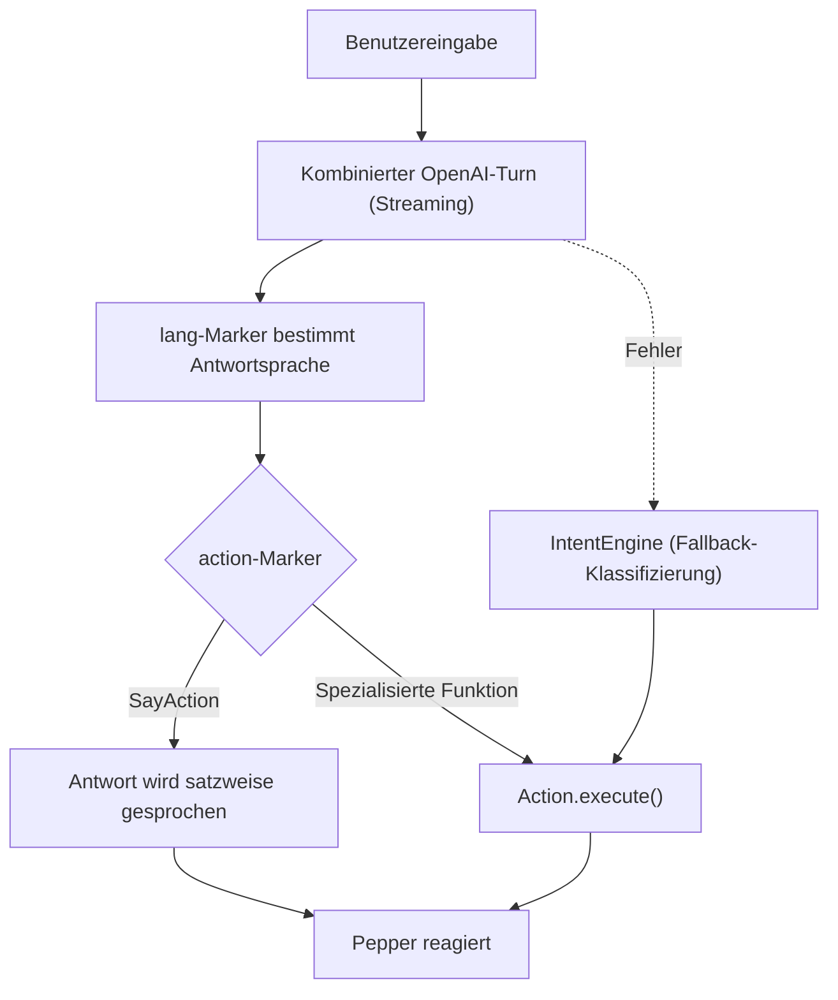
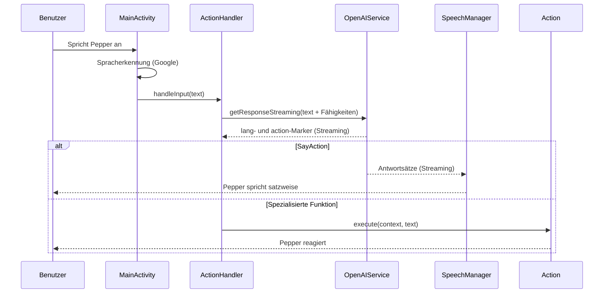
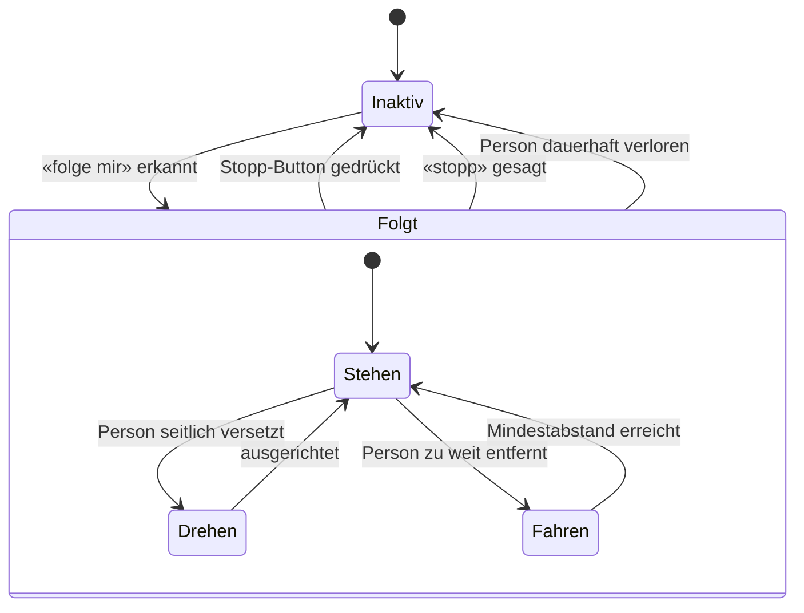

# Pepper

> Entwicklerdokumentation für den Roboter Pepper

> [!NOTE]
> Diese `README.md` ist die **Entwickler-Dokumentation** (Architektur, Einrichtung, Release, interne Details, Diagramme). Peppers eigene, besuchertaugliche Wissensbasis – die er selbst vorliest – steht getrennt in [`PEPPER.md`](PEPPER.md). Besucherrelevante Funktions- und Bühler-Infos gehören dorthin; interne Details, Geheimnisse und Diagramme bleiben hier und werden von Pepper **nicht** gelesen. Die [Dokumentation](#dokumentation)-Funktion lädt ausschliesslich `PEPPER.md`.

## Inhalt

- [Einführung](#einführung)
  - [Wer ist Pepper?](#wer-ist-pepper)
  - [Wie bediene ich Pepper?](#wie-bediene-ich-pepper)
- [Funktionsweise](#funktionsweise)
  - [Intent Engine](#intent-engine)
  - [Ablauf einer Anfrage](#ablauf-einer-anfrage)
  - [Sprachmodelle](#sprachmodelle)
  - [Denkpause](#denkpause)
  - [Historie](#historie)
  - [Antwortlänge](#antwortlänge)
  - [FollowMe-Mechanik](#followme-mechanik)
  - [Bildschirmanzeige](#bildschirmanzeige)
  - [Emotionswahrnehmung](#emotionswahrnehmung)
  - [Attract-Modus](#attract-modus)
- [Architektur-Diagramme](#architektur-diagramme)
- [Funktionen (Actions)](#funktionen-actions)
  - [Sprechen (Standard)](#sprechen-standard)
  - [Tanzen](#tanzen)
  - [Bewegung & Gesten](#bewegung--gesten)
  - [Saxofon](#saxofon)
  - [High Five](#high-five)
  - [Hold my beer](#hold-my-beer)
  - [Memory-Minispiel](#memory-minispiel)
  - [Bühler-Quiz](#bühler-quiz)
  - [Selfie](#selfie)
  - [Karriere](#karriere)
  - [Verlosung](#verlosung)
  - [Lautstärke](#lautstärke)
  - [Sprache](#sprache)
  - [Dokumentation](#dokumentation)
  - [Folgen (FollowMe)](#folgen-followme)
  - [Lotse-Modus](#lotse-modus)
  - [Systeminformationen](#systeminformationen)
  - [Siri und andere Assistenten](#siri-und-andere-assistenten)
  - [Test (Entwicklung)](#test-entwicklung)
- [Admin-Bereich](#admin-bereich)
  - [Zugang & PIN](#zugang--pin)
  - [Selfie-Galerie](#selfie-galerie)
  - [Verlosung verwalten](#verlosung-verwalten)
  - [Tanz-Bibliothek](#tanz-bibliothek)
  - [Navigation & Wegpunkte](#navigation--wegpunkte)
  - [Debug-Modus](#debug-modus)
- [Pepper für Entwickler](#pepper-für-entwickler)
  - [Einrichtung](#einrichtung)
    - [Systemspezifikationen](#systemspezifikationen)
    - [Anforderungen](#anforderungen)
    - [Env-Setup](#env-setup)
    - [Der erste Start](#der-erste-start)
  - [Release & Deployment](#release--deployment)
    - [Signierung einrichten](#signierung-einrichten)
    - [Release-APK bauen](#release-apk-bauen)
    - [Dauerhaft auf Pepper installieren](#dauerhaft-auf-pepper-installieren)
  - [Kernkomponenten](#kernkomponenten)
  - [Ressourcen verwalten](#ressourcen-verwalten)
  - [Eine Funktion erstellen](#eine-funktion-erstellen)
  - [OpenAI-Systemprompt anpassen](#openai-systemprompt-anpassen)
  - [Externe Kamera](#externe-kamera)
  - [Glossar](#glossar)
  - [Anderes & Tipps](#anderes--tipps)

---

## Einführung

### Wer ist Pepper?

Pepper ist ein intelligenter Roboter mit physischen Fähigkeiten. Er beherrscht Funktionen wie «High Five», «Tanzen» und «Saxofon spielen» und setzt dabei seinen ganzen Körper – Arme, Hände und Kopf – ein, um die jeweilige Aktion möglichst lebendig wirken zu lassen.

Darüber hinaus verfügt Pepper über Wissen zur Bühler Group und ihren Tätigkeiten: Er weiss, welche Stellen es gibt und was Bühler macht, und kann Informationen über verschiedene Berufsbilder und Ausbildungsmöglichkeiten bereitstellen. Damit eignet er sich besonders gut als Ansprechpartner an Messen, Informationsanlässen oder im Empfangsbereich.

Sein Charakter lässt sich als hilfreich, intelligent und humorvoll beschreiben. Pepper **versteht** Sprachbefehle in fünf Erkennungssprachen – **Deutsch**, **Englisch**, **Italienisch**, **Spanisch** und **Französisch** (umschaltbar, Start auf Deutsch) – und **antwortet automatisch in der Sprache des Benutzers** (siehe [Sprache](#sprache)). Er weiss zu jedem Zeitpunkt, welche Fähigkeiten ihm aktuell zur Verfügung stehen – die verfügbaren Funktionen werden ihm dynamisch mitgeteilt (siehe [Intent Engine](#intent-engine)).

### Wie bediene ich Pepper?

Pepper hört auf Sprachbefehle. Man spricht ihn also einfach an, und er reagiert auf das Gesagte. Im Hintergrund entscheidet derselbe OpenAI-Aufruf in einem Zug, **ob** eine spezialisierte Funktion gemeint ist und **was** Pepper sagt: Erkennt Pepper im Gesagten einen Befehl, der zu einer seiner Funktionen passt (z. B. «Tanze für mich»), führt er die entsprechende Aktion aus; andernfalls antwortet er frei (siehe [Intent Engine](#intent-engine)). Die Antwort wird **satzweise gestreamt** und gesprochen, sodass Pepper früh zu reden beginnt, statt die ganze Antwort abzuwarten.

> **Wichtig:** Die **Spracherkennung** startet standardmässig auf Deutsch; die erste Anfrage erfolgt daher am besten auf Deutsch. Danach lässt sich die Erkennungssprache per Sprachbefehl oder im Admin-Bereich auf Englisch, Italienisch, Spanisch oder Französisch umstellen (siehe Funktion [Sprache](#sprache)). Die *gesprochene Antwort* hingegen passt sich ohnehin automatisch der erkannten Sprache an.

---

## Architektur-Diagramme

Die zentralen Abläufe der App sind als Mermaid-Diagramme in [`FLOWS.md`](FLOWS.md)
dokumentiert: Boot/Startup, Sprache → Aktions-Dispatch, Navigation/Raumscan,
Attract-Modus, Tanz-Ablauf, Hold-my-beer-Zustandsautomat sowie OpenAI-Gespräch und
Sprachwechsel.

## Funktionsweise

### Intent Engine

Die Intent Engine ist das Herzstück von Pepper. Sie entscheidet anhand der Benutzereingabe, welche Funktion ausgeführt werden soll – und zwar im selben OpenAI-Aufruf, der auch die gesprochene Antwort erzeugt («kombinierter Turn»).

Bei jeder Anfrage wird OpenAI im **Streaming-Modus** zusammen mit der Liste aller verfügbaren Fähigkeiten aufgerufen. Jede Fähigkeit ist mit einer kurzen Beschreibung versehen, die umreisst, wofür sie zuständig ist. Das Modell schreibt zu Beginn seiner Antwort zwei maschinenlesbare **Marker**:

- `[[lang:CODE]]` – die ISO-639-1-Sprache, in der Pepper antwortet (z. B. `[[lang:de]]`, `[[lang:en]]`, `[[lang:fr]]`). Daraus wird die Stimme/Locale für die Sprachausgabe bestimmt.
- `[[action:NAME]]` – die gewählte Funktion (Klassenname der Action). Wählt das Modell `SayAction`, folgt direkt der frei formulierte Antworttext, der **satzweise** gesprochen wird. Für jede andere Funktion gibt das Modell **nur** die Marker aus, und Pepper führt die entsprechende Action aus.

Die Marker werden automatisch aus der Antwort entfernt und nie mitgesprochen. Passt keine spezialisierte Funktion, fällt die Auswahl auf die Standardfunktion [Sprechen](#sprechen-standard).

Dieses Vorgehen stellt sicher, dass Pepper dynamisch und zuverlässig die richtige Funktion wählt, ohne dass starre Schlüsselwörter oder fest verdrahtete Regeln nötig sind. Neue Funktionen werden automatisch berücksichtigt, sobald sie mit einer Beschreibung registriert sind (siehe [Eine Funktion erstellen](#eine-funktion-erstellen)).

> **Fallback:** Scheitert der kombinierte Turn (z. B. Netzwerkfehler beim Streaming), greift als Rückfall die klassische, eigenständige `IntentEngine` – ein separater, günstiger Klassifizierungs-Aufruf (siehe [Sprachmodelle](#sprachmodelle)), der die Eingabe einer Funktion zuordnet.



### Ablauf einer Anfrage

Das folgende Sequenzdiagramm zeigt, wie eine gesprochene Eingabe von der Spracherkennung bis zur ausgeführten Aktion durch die einzelnen Komponenten wandert.



### Sprachmodelle

Nicht jede Aufgabe braucht das stärkste Modell. Welches OpenAI-Modell verwendet wird, entscheidet zentral die Klasse `ModelSelector` anhand der Aufgabenart:

| Aufgabe (`ModelTask`) | Modell | Verwendet für |
| --------------------- | ------ | ------------- |
| `CONVERSATION` | `gpt-5.4` (STRONG) | Kombinierter Turn, Standard-Antworten |
| `DOCUMENTATION` | `gpt-5.4` (STRONG) | Fragen aus der [Dokumentation](#dokumentation) |
| `GENERATION` | `gpt-5.5` (STRONG_GENERATION) | Generierte [Choreografien](#tanzen) und [Bewegungen](#bewegung--gesten) |
| `CLASSIFICATION` | `gpt-4o-mini` (FAST) | Fallback-Routing der `IntentEngine` |
| `REWRITE` | `gpt-4o-mini` (FAST) | Natürlicheres Umformulieren der System-Ansagen |

Möchtest du ein Modell wechseln, passe die Konstanten `FAST` / `STRONG` / `STRONG_GENERATION` bzw. die Zuordnung in `ModelSelector` an – nicht die einzelnen Actions.

### Denkpause

Sobald Pepper eine Eingabe verarbeitet (insbesondere bei langsameren Aufrufen wie der Choreografie- oder Bewegungsgenerierung), überbrückt der `ThinkingController` die Wartezeit, damit Pepper nicht regungslos wirkt: Er nimmt eine «überlegende» Pose ein (`searching_a001`) und gibt ab und zu Füll-Laute («hmm», «mhm») bzw. kurze Sätze («Gleich hab' ich's …») in der aktuellen Sprache von sich. Beginnt Pepper zu sprechen oder ist die Aktion fertig, wird die Denkpause automatisch beendet.

### Historie

Pepper merkt sich die letzten **10 Gesprächseinträge** als gleitendes Fenster (ein Eintrag = eine Benutzereingabe oder eine Pepper-Antwort, also rund fünf Gesprächsrunden); ein elfter Eintrag verdrängt den ältesten. Die gesamte Historie wird bei jeder Anfrage an OpenAI mitgeschickt, damit Pepper auf zuvor Gesagtes (Namen, frühere Fragen, Kontext) Bezug nehmen kann. Sie liegt nur im Arbeitsspeicher und ist nach einem Neustart wieder leer.

Zusätzlich führt der `HistoryManager` eine getrennte Liste technischer **Developer-Einträge** (bis zu 200), z. B. welche Eingabe erkannt oder welche Action gestartet wurde. Diese erscheinen im Admin-Bereich unter [Dev-Logs](#admin-bereich), fliessen aber nicht in die gesprochene Antwort ein.

### Antwortlänge

Peppers gesprochene Antworten bleiben bewusst kurz – höchstens zwei bis drei kurze Sätze – damit er natürlich und auf den Punkt wirkt statt in Monologe zu verfallen. Die Begrenzung gilt für **alle** frei formulierten Antworten, auch für [Dokumentation](#dokumentation) und Systeminformationen. Statt nachträglich hart abzuschneiden, erzeugt das Modell von vornherein eine kurze, in sich vollständige Antwort: Bei umfangreichen Themen nennt Pepper den wichtigsten Punkt und bietet an, mehr zu erzählen; ausführlicher wird er nur auf ausdrückliche Nachfrage.

Gesteuert wird das zentral über den Systemprompt (`instructions.md`, Abschnitt «Response Style»); da alle frei formulierten Aktionen denselben Prompt nutzen, greift die Begrenzung überall (siehe [OpenAI-Systemprompt anpassen](#openai-systemprompt-anpassen)).

### FollowMe-Mechanik

Mit dem Befehl «folge mir» läuft Pepper einer Person physisch hinterher. Eine Hintergrundschleife (`FollowController`) wählt fortlaufend die Zielperson aus und entscheidet je nach deren Position, ob Pepper **stehen bleibt**, sich **dreht** oder **vorwärtsfährt**:

- **Stehen:** Die Person ist nah genug – Pepper hält den Mindestabstand und wartet.
- **Drehen:** Die Person steht seitlich versetzt – Pepper dreht sich zu ihr.
- **Fahren:** Die Person ist zu weit entfernt – Pepper fährt nach.

Beendet wird das Folgen über den **Stopp-Button** auf dem Display, per Sprachbefehl («stopp», «bleib stehen» …) oder automatisch, wenn die Person dauerhaft nicht mehr erkannt wird.



### Bildschirmanzeige

Auf Peppers Display sind dauerhaft zwei Elemente eingeblendet: oben links das **Bühler-Logo** und oben rechts die **aktuell verwendete Sprache**.

Die Sprachanzeige wird live aktualisiert: Wechselt der Benutzer die Sprache (siehe Funktion [Sprache](#sprache)), passt sich die Anzeige sofort an, ohne dass die Applikation neu gestartet werden muss.

Die Sprachanzeige ist reine Information und nicht antippbar. Die Erkennungssprache wird per Sprachbefehl (siehe Funktion [Sprache](#sprache)) oder im [Admin-Bereich](#admin-bereich) gewechselt. Wie der Admin-Button wird auch die Sprachanzeige ausgeblendet, solange ein Overlay offen ist.

Während Pepper spricht, blendet die `DialogueView` seine Antwort zusätzlich als **Untertitel** ein – Wort für Wort, synchron zum Sprechen. Nach dem Satz bleibt der Text kurz stehen und wird dann automatisch ausgeblendet. Solange ein Overlay (Admin, Selfie, Memory, Verlosung, Navigation, Tanz-Bibliothek, Hold) offen ist, wird der Untertitel unterdrückt.

Die Oberfläche ist im Bühler-Stil gehalten: Die Akzentfarbe der App (Theme-Farbe) entspricht dem Türkis des Bühler-Logos, und der Titelbalken oben zeigt den Schriftzug «Bühler Pepper». Das Layout wird als reguläres Android-Layout (`res/layout/activity_main.xml`) geladen.

### Emotionswahrnehmung

Pepper nimmt über seine Sensoren die ungefähre Stimmung der Person wahr, mit der er gerade spricht. Aus den erkannten Werten leitet er eine einfache Grundstimmung ab – etwa fröhlich, zufrieden, traurig oder angespannt.

Ist eine Stimmung klar und nicht neutral erkennbar, fliesst sie als zusätzlicher Kontext in die Antwortgenerierung ein. Pepper darf sie dann **ab und zu** dezent aufgreifen (z. B. «Schön, dass du so gut gelaunt bist!»), statt sie bei jeder Antwort zu erwähnen. Damit das nicht aufdringlich wirkt, gelten zwei Einschränkungen:

- Nur bei sicher erkannter, **nicht neutraler** Stimmung wird der Hinweis überhaupt mitgegeben.
- Ein **Cooldown** verhindert, dass Pepper die Stimmung in zwei aufeinanderfolgenden Antworten anspricht.

Wann und wie Pepper die Stimmung einbindet, formuliert das Sprachmodell selbst – dadurch wirkt die Erwähnung natürlich und passt sich der jeweiligen Sprache und Situation an. Erkennt Pepper keine oder nur eine neutrale Stimmung, erwähnt er sie gar nicht.

### Attract-Modus

Ist gerade niemand im Gespräch, lockt Pepper im **Attract-Modus** selbstständig Besucher an: Er fährt langsam im Raum umher und begrüsst kurz («Hallo»), sobald jemand nah genug (rund 1,5 m) an ihn herantritt; danach fährt er weiter. Auf dem Bildschirm erscheint dabei **kein** zusätzlicher Text.

Der Modus läuft **vollautomatisch** und wird ausschliesslich über einen **Ein-/Aus-Schalter** im [Admin-Bereich](#admin-bereich) (Kachel «Attract-Modus») gesteuert – standardmässig aktiv, ein manueller Start entfällt. Spricht ein Besucher Pepper an oder wird ein Overlay (Admin, Selfie …) geöffnet, pausiert das Herumfahren automatisch; nach einer kurzen Leerlaufzeit nimmt Pepper es wieder auf. Das Fahren läuft auch weiter, während das Google-Spracherkennungs-Overlay sichtbar ist.

---

## Funktionen (Actions)

### Sprechen (Standard)

Pepper hört zu und generiert eine Antwort; währenddessen bewegt sich sein Körper automatisch minimal, um einen echten Menschen widerzuspiegeln und die Antwort natürlicher wirken zu lassen.

Pepper antwortet in der **Sprache der Benutzereingabe** (automatisch erkannt, siehe [Sprache](#sprache) und [Intent Engine](#intent-engine)). Wird keine der unten gelisteten Funktionen ausgelöst, antwortet Pepper auf die hier beschriebene Standardart. Diese Funktion ist somit der Rückfall, wenn keine spezialisierte Aktion zugeordnet werden kann.

Zur Generierung der Antworten wird das Modell **GPT-5.4** von OpenAI verwendet (siehe [Sprachmodelle](#sprachmodelle)).

```text
Beispiel (en): Hello, how are you?
Beispiel (de): Hallo, wie geht es dir?
```

### Tanzen

Pepper tanzt auf Zuruf einen Tanz aus seiner **gespeicherten Sammlung** (`dances.db`):

1. Nennt der Gast einen Song oder Künstler («Tanz zu Billie Jean»), sucht Pepper in seiner Sammlung einen passenden Tanz (Namensabgleich); sonst wählt er einen seiner **Favoriten** bzw. zufällig einen gespeicherten Tanz.
2. Er spielt das lokal zwischengespeicherte Vorschau-Audio ab und bewegt sich rhythmisch zur Choreografie. Endet die Animation, wird die Musik gestoppt, damit beides synchron bleibt.

Wichtig: Die gesprochene Tanz-Funktion **erzeugt zur Laufzeit keine neuen Tänze** – neue Choreografien entstehen ausschliesslich in der [Tanz-Bibliothek](#tanz-bibliothek) im Admin-Bereich. Weil Tanz und Audio lokal gespeichert sind, läuft das Tanzen auch ohne WLAN. Ist die Sammlung leer oder schlägt das Abspielen fehl, legt Pepper einen vorbereiteten **Eigen-Tanz** hin («Six… seven!»).

```text
Beispiel (en): Dance to Uptown Funk.
Beispiel (de): Tanze bitte für mich. / Tanz zu Billie Jean.
```

### Bewegung & Gesten

Pepper führt auf Zuruf eine **einzelne, frei beschriebene Bewegung oder Geste** aus – etwa «heb den rechten Arm», «dreh den Kopf nach links», «nicke» oder «mach eine Geste». Anders als beim [Tanzen](#tanzen) gehört keine Musik dazu.

Die Bewegung wird **zur Laufzeit generiert**: Ein Sprachmodell (`ModelSelector`-Aufgabe `GENERATION`) erzeugt direkt eine `.qianim`-Animation, die anschliessend hart geprüft wird – jeder Gelenkname, jede Bildrate und jeder Winkel muss innerhalb der zulässigen, sicheren Grenzen liegen (`QianimValidator`), sonst wird die Generierung bis zu dreimal wiederholt. Danach werden die Werte zusätzlich mit Sicherheitsmarge geklammert und für weiche Übergänge nachbearbeitet (`QianimPostProcessor` / `QianimLooper`), bevor Pepper die Bewegung ausführt.

Optional kann eine **Dauer** genannt werden («heb den Arm für 5 Sekunden»); die Animation wird auf höchstens 30 Sekunden begrenzt.

```text
Beispiel (en): Raise your right arm. / Nod your head for five seconds.
Beispiel (de): Heb den rechten Arm. / Dreh den Kopf nach links.
```

### Saxofon

Pepper spielt ein Saxofon-Solo und bewegt seinen Körper rhythmisch dazu, während Hände und Arme das Saxofonspielen imitieren.

```text
Beispiel (en): Play the saxophone.
Beispiel (de): Spiele Saxofon.
```

### High Five

Der rechte Arm wird für 7 Sekunden in eine High-Five-Position gehoben und fährt danach wieder herunter. In diesem Zeitfenster kann der Benutzer einschlagen.

```text
Beispiel (en): High Five.
Beispiel (de): High Five.
```

### Hold my beer

Pepper hält auf Zuruf ein leichtes Objekt (Becher, PET-Flasche, max. ca. 300 g — keine schweren Gegenstände, der Arm trägt nur etwa 0,5 kg) in der rechten Hand. Ablauf: Pepper hebt den Arm mit offener Hand und wartet rund **15 Sekunden** auf das Auflegen, erkennt die Übergabe über den Berührungssensor am Handrücken (alternativ über den Bestätigungs-Button auf dem Tablet, falls ein leichtes Objekt den Sensor nicht auslöst), schließt die Hand und hält das Objekt mit Haltetimer auf dem Tablet und gelegentlichen Sprüchen. Während des Haltens bleibt die Halte-Hand bewusst **ruhig** (keine autonomen Bewegungen), damit nichts herunterfällt.

**Sicherheit:** Die Hand öffnet sich nie von selbst. Zurückgeben nur über den großen STOP-Button auf dem Tablet oder per Sprachbefehl («Stopp», «Danke», «Gib her»); danach zählt Pepper **fünf Sekunden** herunter, bevor er die Hand öffnet und zurück in die Normalposition geht. Nach 10 Minuten Maximalhaltezeit fordert Pepper aktiv zur Abnahme auf, lässt aber weiterhin nicht von selbst los. Verliert die App den Roboter-Fokus (z. B. Absturz oder App-Wechsel), endet die Session ohne Öffnungs-Animation und der Roboter fällt in den Autonomous Mode zurück — die Handmotoren können dann entspannen, das Objekt vorher abnehmen.

```text
Beispiel (en): Hold my beer.
Beispiel (de): Halt mal mein Bier.
```

### Memory-Minispiel

Pepper spielt mit dem Benutzer «Memory mit Bewegung» – ein Gedächtnis- und Reaktionsspiel nach dem Senso- bzw. Simon-Prinzip. Auf dem Tablet erscheinen vier farbige Felder (Grün, Rot, Gelb, Blau). Pepper gibt eine Sequenz vor, indem er die Felder nacheinander aufleuchten lässt und dazu je einen eigenen Ton spielt. Der Benutzer wiederholt die Sequenz, indem er die Felder in derselben Reihenfolge auf dem Tablet antippt.

Pro Runde wird die Sequenz um ein Element länger und das Tempo etwas schneller. Wiederholt der Benutzer alles richtig, lobt Pepper ihn mit einer passenden Geste, und die nächste, längere Sequenz folgt. Bei einem Fehler – oder wenn zu lange keine Eingabe erfolgt – endet das Spiel: Pepper reagiert mit einer Trost- oder Jubelgeste und nennt den erreichten Punktestand, also die Anzahl der geschafften Runden.

**Schwierigkeit:** Der Grad lässt sich beim Start über das Sprachkommando wählen – «leicht», «normal» (Standard) oder «schwer». Er bestimmt die Startlänge der Sequenz, das Anzeigetempo und wie viel Zeit für die Eingabe bleibt.

**Zu beachten:**

- Während des Spiels wird das Spielfeld bildschirmfüllend angezeigt und überdeckt die übrige Oberfläche. Nach dem Spielende verschwindet es automatisch.
- Das Spiel läuft rein über das Tablet und Pepper; Sprachbefehle werden erst nach Spielende wieder verarbeitet.

```text
Beispiel (en): Let's play the memory game.
Beispiel (de): Lass uns Memory spielen. / Lass uns Memory spielen, schwer.
```

### Bühler-Quiz

Pepper stellt eine kurze Multiple-Choice-Quizrunde (Standard vier Fragen) rund um Bühler, Industrie und Berufe. Die Fragen werden bei Verbindung vom Sprachmodell generiert (`ModelSelector`-Aufgabe `GENERATION`, in der aktuellen Sprache); fällt das LLM aus oder ist Pepper offline, greift ein lokaler, kuratierter Fragenkatalog (Deutsch/Englisch). Die Antwortoptionen erscheinen als Touch-Buttons auf dem Tablet.

Pro Frage gibt Pepper Rückmeldung (richtig/falsch inkl. korrekter Antwort) und hebt die Lösung visuell hervor; am Ende nennt er den Punktestand mit einem passenden Kommentar. Erreicht der Gast ein gutes Ergebnis und läuft gerade eine [Verlosung](#verlosung), lädt Pepper im Anschluss zur Teilnahme ein.

```text
Beispiel (en): Quiz me. / Ask me a question about Bühler.
Beispiel (de): Quiz. / Frag mich was über Bühler.
```

### Selfie

Auf Wunsch macht Pepper ein gemeinsames Selfie: Er nimmt mit seiner Kamera ein Foto auf, fügt ein Pepper-Motiv ins Bild ein und zeigt anschliessend auf dem Tablet einen QR-Code an. Über diesen QR-Code lässt sich das Bild auf das eigene Smartphone herunterladen.

Vor dem Speichern zeigt Pepper das Foto zur **Vorschau**: Der Gast kann es **speichern** oder mit **«Nochmal»** (Touch oder Sprachbefehl «passt» / «nochmal») bis zu zweimal neu aufnehmen. Erfolgt keine Eingabe, wird nach kurzer Zeit automatisch das aktuelle Bild gespeichert (kein hängendes Overlay). Nur das bestätigte Foto wird gespeichert und geteilt. Auch im finalen QR-Code-Bildschirm gibt es einen **«Nochmal»**-Knopf: Er verwirft das bereits gespeicherte Bild (Datei und Datenbankeintrag) und startet eine neue Aufnahme.

Das Foto wird **lokal auf Peppers Tablet** gespeichert (Metadaten in einer Room-Datenbank, das Bild als Datei) und über einen kleinen, in die App eingebetteten Webserver bereitgestellt. Über den QR-Code lädt das Smartphone das Bild **direkt von Pepper** – nichts wird ins Internet hochgeladen. Damit der Download funktioniert, muss sich das Smartphone im **selben WLAN wie Pepper** befinden.

**Zu beachten:**

- Während der Aufnahme und der QR-Code-Anzeige überdeckt die Selfie-Ansicht die übrige Oberfläche und verschwindet nach einigen Sekunden automatisch.
- Smartphone und Pepper müssen im selben WLAN sein, sonst kann das Bild nicht heruntergeladen werden.

```text
Beispiel (en): Let's take a selfie.
Beispiel (de): Lass uns ein Selfie machen.
```

### Karriere

Pepper tritt als Recruiting-Helfer auf: Fragt jemand nach Stellen, Ausbildungen, Praktika oder einer Bewerbung, gibt er eine kurze Antwort (Deutsch/Englisch) und zeigt auf dem Tablet einen **QR-Code zur Karriereseite**, damit Interessierte den nächsten Schritt direkt mitnehmen.

Die Karriere-URL ist **konfigurierbar** und nicht hartkodiert: Sie wird über den Schlüssel `PEPPER_CAREER_URL` aus der `env`-Datei gelesen (siehe [Env-Setup](#env-setup)). Ist keine oder eine ungültige URL gesetzt, gibt Pepper nur die Sprachantwort und zeigt keinen (toten) QR-Code.

```text
Beispiel (en): What jobs are there at Bühler? / How can I apply?
Beispiel (de): Welche Jobs gibt es bei Bühler? / Welche Ausbildungen bietet Bühler?
```

### Verlosung

Pepper kann eine **Verlosung** (Gewinnspiel) begleiten. Eine Verlosung wird im [Admin-Bereich](#verlosung-verwalten) angelegt; immer nur **eine** ist gleichzeitig aktiv. Solange eine Verlosung läuft, weiss Pepper davon und lädt Besucher im Gespräch von sich aus zum Mitmachen ein – die aktive Verlosung wird dazu automatisch in den Systemprompt eingespeist. Auf direkte Fragen («Gibt es ein Gewinnspiel?») antwortet Pepper mit Titel, Beschreibung und Enddatum.

Beim **Beitritt** erfasst Pepper Name und E-Mail-Adresse (optional Telefon) Schritt für Schritt über ein Tablet-Formular, das Pepper sprachlich begleitet. E-Mail- und Telefonformat werden geprüft, Doppel-Eintritte über dieselbe E-Mail oder Telefonnummer verhindert. Ist für die Verlosung ein Selfie verpflichtend, läuft zuerst der [Selfie](#selfie)-Flow und das Selfie wird dem Eintrag zugeordnet.

**Drei Eintrittspunkte:**

- **Sprachbefehl** – «Verlosung beitreten», «Mitmachen», «teilnehmen».
- **Nach einem Selfie** – läuft eine aktive Verlosung, bietet Pepper direkt im Anschluss den Beitritt an.
- **Admin** – manuelle Verwaltung und Teilnehmerübersicht.

**Status-Lebenszyklus:** `ACTIVE` (Beitritt möglich) → `ENDED` (nach Enddatum automatisch, kein Beitritt mehr) → `FINISHED` (manuell vom Admin abgeschlossen, Pepper erwähnt sie nicht mehr).

**Zu beachten:**

- Teilnehmerdaten liegen in einer eigenen Room-Datenbank (`raffle.db`) lokal auf Pepper – nichts wird ins Internet übertragen.
- Pepper begleitet den Beitritt sprachlich auf Deutsch (wie alle System-Ansagen via `systemSay`).

```text
Beispiel (en): I want to join the raffle.
Beispiel (de): Ich möchte bei der Verlosung mitmachen.
```

### Lautstärke

Die Systemlautstärke kann per Sprachbefehl geändert werden. Pepper extrahiert dazu den Zahlenwert aus der Eingabe und setzt die Lautstärke entsprechend.

**Zu beachten:**

- Minuszahlen werden in positive Werte umgekehrt (`-40%` → `40%`).
- Werte über 100 werden nicht akzeptiert.
- Die Eingabe muss eine Zahl enthalten. Fehlt sie, kann keine Lautstärke gesetzt werden.

```text
Beispiel (en): Change the volume to 80%.
Beispiel (de): Setze die Lautstärke auf 80%.
```

### Sprache

Wechselt die Sprache der **Spracherkennung** (Google) sowie die Anzeige rechts oben. Damit bestimmt diese Funktion, welche Sprache Pepper *versteht*.

**Unterstützte Erkennungssprachen:** Deutsch (`de-CH`), Englisch (`en-US`), Italienisch (`it-IT`), Spanisch (`es-ES`), Französisch (`fr-FR`)

Davon zu unterscheiden ist die *gesprochene Antwort*: Diese richtet sich automatisch nach der Sprache der Benutzereingabe (über den `[[lang:…]]`-Marker, siehe [Intent Engine](#intent-engine)). Erkennt Pepper z. B. eine englische Frage, antwortet er auf Englisch, ohne dass die Erkennungssprache umgestellt werden muss. Die App kann eine ganze Reihe von Sprachcodes auf passende Pepper-Stimmen abbilden (`LocaleResolver`).

**Zu beachten:**

- Die gewünschte Sprache muss in der Eingabe enthalten sein, damit Pepper sie erkennen und setzen kann.
- Manuell lässt sich die Erkennungssprache auch im [Admin-Bereich](#admin-bereich) (Kachel «Sprache») umschalten.

```text
Beispiel (en): Set the language to German.
Beispiel (de): Stelle die Sprache auf Englisch.
```

### Dokumentation

Gibt dem Nutzer Informationen aus Peppers Wissensbasis [`PEPPER.md`](PEPPER.md) wieder (nicht aus dieser README). Die Datei wird von GitHub geladen und einige Stunden zwischengespeichert (mit Rückfall auf die zuletzt geladene Version bei Netzwerkfehlern); Änderungen werden so ohne App-Neustart übernommen.

**Unterstützte Sprachen:** Deutsch, Englisch

```text
Beispiel (en): How does Pepper know which action to execute?
Beispiel (de): Wie weiss Pepper, welche Funktion er ausführen muss?
```

### Folgen (FollowMe)

Pepper folgt einer Person physisch, indem er ihr nachläuft. Erkennt er, dass er bereits folgt, weist er freundlich darauf hin. Der genaue Ablauf (Stehen, Drehen, Fahren) sowie die Möglichkeiten zum Beenden sind unter [FollowMe-Mechanik](#followme-mechanik) beschrieben.

```text
Beispiel (en): Follow me.
Beispiel (de): Folge mir.
```

### Lotse-Modus

Pepper führt Besucher aktiv zu einem Ziel. Auf «bring mich zum Fotostand» oder «wo finde ich den Ausgang» gleicht er den genannten Ort gegen die gespeicherten [Wegpunkte](#navigation--wegpunkte) ab (unscharfer Abgleich, Deutsch/Englisch), kündigt an «Folge mir, ich bringe dich zu …» und fährt per `goToWaypoint` hin (mit der vorhandenen Hindernisvermeidung). Bei der Ankunft meldet er das Ziel; kennt er den Ort nicht, zählt er die verfügbaren Wegpunkte auf.

Voraussetzung ist ein aktiver, lokalisierter [Raum-Scan](#navigation--wegpunkte). Unterwegs lässt sich die Fahrt per Sprachbefehl («Stopp», «halt an», «bleib stehen») sauber abbrechen; verliert Pepper die Orientierung, hält er an und sagt Bescheid.

```text
Beispiel (en): Take me to the photo booth. / Where is the exit?
Beispiel (de): Bring mich zum Fotostand. / Wo finde ich den Ausgang?
```

### Systeminformationen

Pepper gibt auf Nachfrage seinen aktuellen Systemzustand wieder: die eingestellte Lautstärke, die aktive Sprache und die Länge der gespeicherten [Historie](#historie). Diese Funktion liest die Werte ausschliesslich aus und verändert nichts – zum Ändern dienen die Funktionen [Lautstärke](#lautstärke) und [Sprache](#sprache).

```text
Beispiel (en): Which language are you currently using?
Beispiel (de): Wie laut bist du gerade eingestellt?
```

### Siri und andere Assistenten

Wird Pepper auf andere Sprachassistenten wie Siri oder Alexa angesprochen – oder direkt mit ihnen verglichen –, kontert er humorvoll und stellt klar, dass er Pepper ist. Damit es nicht eintönig wird, wählt er dabei zufällig aus mehreren Sprüchen. Die Antwort erfolgt in der aktuell eingestellten Sprache (Deutsch oder Englisch) und wird in der [Historie](#historie) festgehalten, sodass Folgefragen den Kontext behalten.

```text
Beispiel (en): Are you Siri?
Beispiel (de): Bist du Siri?
```

### Test (Entwicklung)

Eine Aktion für Entwicklungs- und Demozwecke: Pepper dreht sich einmal um die eigene Achse. Sie wird nur ausgeführt, wenn ausdrücklich danach gefragt wird, und ist nicht für den regulären Einsatz gedacht.

```text
Beispiel (en): Run the test action.
Beispiel (de): Führe die Testaktion aus.
```

---

## Admin-Bereich

Der Admin-Bereich ist eine PIN-geschützte Tablet-Oberfläche für Betrieb und Wartung – getrennt vom normalen Besucher-Dialog.

### Zugang & PIN

Geöffnet wird der Admin-Bereich über den **Admin-Button** unten links auf dem Homescreen oder per Sprachbefehl («Admin», «Einstellungen»). Danach folgt die Eingabe einer **4-stelligen PIN**. Nach erfolgreicher Eingabe erscheint das Admin-Menü als **Kachelgrid** mit Icons.

Solange ein Overlay (Admin, Selfie oder Verlosungs-Beitritt) offen ist, werden Admin-Button und Sprachanzeige ausgeblendet, und die Spracherkennung pausiert, bis es wieder geschlossen wird.

Das Menü bündelt:

| Kachel | Funktion |
| ------ | -------- |
| Verlauf löschen | Leert das Gesprächsgedächtnis (`HistoryManager`). |
| Dev-Logs | Zeigt die Entwickler-Logs chronologisch (neueste unten, Auto-Scroll). |
| Debug | Schaltet den [Debug-Modus](#debug-modus) ein/aus und zeigt das Live-Log. |
| Selfies | Öffnet die [Selfie-Galerie](#selfie-galerie). |
| Sprache | Wechselt die Erkennungssprache manuell (Deutsch, Englisch, Italienisch, Spanisch, Französisch). |
| Verlauf ansehen | Zeigt das aktuelle Gespräch als Chat-Blasen. |
| Verlosung | Legt eine [Verlosung](#verlosung-verwalten) an bzw. verwaltet sie. |
| Tänze | Öffnet die [Tanz-Bibliothek](#tanz-bibliothek). |
| Navigation | Öffnet die [Raumkartierung & Wegpunkte](#navigation--wegpunkte). |
| Kamera | Konfiguriert die [externe DSLR-Kamera](#externe-kamera) (IP, Port, Verbindungstest). |
| Schließen | Schliesst den Admin-Bereich. |

### Selfie-Galerie

Die Galerie zeigt alle lokal gespeicherten Selfies als Raster, **Favoriten zuerst**. Selfies, die mit einem Verlosungs-Eintrag verknüpft sind, tragen ein kleines Verlosungs-Badge. In der **Detailansicht** eines Selfies lässt sich der Download-QR-Code anzeigen (zeigt auf den eingebetteten Webserver, Port 8080), das Selfie als Favorit markieren oder löschen. Über **«Alle exportieren»** werden sämtliche Selfies als ZIP gepackt und per Android-Share-Intent (`FileProvider`) zum Teilen/Speichern angeboten.

### Verlosung verwalten

Hier wird eine [Verlosung](#verlosung) angelegt (Titel, Beschreibung, Enddatum, Optionen «Selfie erforderlich» / «Telefon erforderlich») – nur möglich, wenn keine andere aktiv ist. Läuft bereits eine Verlosung, zeigt das Panel stattdessen die **Übersicht** mit Status, Teilnehmerzahl und Teilnehmerliste (Name, E-Mail, Telefon, Selfie-Thumbnail). Verknüpfte Selfie-Thumbnails sind anklickbar und öffnen die Selfie-Detailansicht. Über **«Verlosung beenden»** wird die Verlosung manuell auf `FINISHED` gesetzt.

**Gewinner ziehen:** Sobald eine Verlosung abgelaufen ist (`ENDED`), erscheint **«Gewinner ziehen»** – Pepper zieht zufällig einen Teilnehmer und speichert ihn als Gewinner. Anschliessend lassen sich der Gewinner **neu auslosen** oder per **«E-Mail»** benachrichtigen: Dabei wird eine vorausgefüllte E-Mail (Betreff, Text, ggf. das Selfie des Gewinners als Anhang) geöffnet, die nur noch versendet werden muss.

### Tanz-Bibliothek

Die Tanz-Bibliothek verwaltet alle gespeicherten [Tänze](#tanzen) (aus `dances.db`) und ist der Ort, an dem **neue Tänze entstehen**:

- **Erstellen:** Zu einem genannten Song sucht Pepper das Lied über die **iTunes-Search-API** (30-sekündige Vorschau, gestreamt), lässt eine passende, **ruhig-fliessende Choreografie von einem Sprachmodell generieren** (`ModelSelector`-Aufgabe `GENERATION`, siehe [Sprachmodelle](#sprachmodelle)) und wandelt das gelieferte JSON in eine validierte, geglättete `.qianim`-Datei um. Tanz und zwischengespeichertes Vorschau-Audio werden lokal gespeichert (`dances.db` + Datei); bereits vorhandene Songs werden wiederverwendet. Das Tempo wird grob an die **Stimmung** des Songs angepasst.
- **KI-Edit:** Eine gespeicherte Choreografie oder ihr Startzeitpunkt lässt sich per natürlichsprachiger Anweisung anpassen.
- **Verwalten:** Pro Eintrag kann der Tanz als **Favorit** markiert (Favoriten zuoberst), **umbenannt** oder **gelöscht** werden (entfernt auch die `.qianim`-Datei). Eingebaute Tänze (z. B. Hula, Six Seven) sind ab Werk vorhanden. So lässt sich vorab eine kuratierte Auswahl für einen Messeauftritt zusammenstellen.

### Navigation & Wegpunkte

Über die Kachel **«Navigation»** kann Pepper einen Raum **kartieren** und benannte **Wegpunkte** speichern, die er später autonom anfährt. Die Funktion nutzt die QiSDK-Fähigkeiten zum Kartieren und Lokalisieren (`LocalizeAndMap`, `ExplorationMap`, `Localize`, `GoTo`).

Typischer Ablauf:

1. **Scan starten:** Pepper erkundet den Raum aktiv – er dreht sich zunächst für eine Rundumsicht und fährt dann ringförmig die Ecken an, bis die Raumgrenzen erreicht sind, und baut dabei fortlaufend eine Karte auf (der Scan endet also nicht schon nach einer einzelnen 360°-Drehung). Der Scan wird benannt und gespeichert.
2. **Lokalisieren:** Auf Basis eines gespeicherten Scans bestimmt Pepper seine Position in der Karte.
3. **Wegpunkte setzen:** An der aktuellen Position lässt sich ein benannter Wegpunkt ablegen, optional vom Typ **«Fotostand»**.
4. **Hinfahren:** Pepper navigiert auf Wunsch zu einem gespeicherten Wegpunkt.

Die `NavigationView` zeigt dazu eine **Live-Karte** (`WaypointMapView`) mit Start-Punkt, Wegpunkten (Fotostand-Punkte hervorgehoben) und Peppers aktueller Position samt Blickrichtung. Scans und Wegpunkte werden lokal in einer eigenen Room-Datenbank (`navigation.db`) gespeichert, die Karten als `.map`-Dateien im App-Verzeichnis.

> **Hinweis:** Die Navigation ist als Operator-Werkzeug ausschliesslich über den Admin-Bereich erreichbar und **nicht** per Sprachbefehl auslösbar.

### Debug-Modus

Über die Kachel **«Debug»** lässt sich ein **Debug-Modus** ein- und ausschalten (persistiert via `DebugSettings`). Ist er aktiv, blendet Pepper auf dem Homescreen und während der Aktionen ein **On-Screen-Overlay** ein: eine **Status-Box** mit dem aktuellen Zustand (z. B. «Raum-Scan – Drehung 2/4» oder «OpenAI – Anfrage läuft …») und ein mitlaufendes, scrollendes **Live-Log**.

Zentrale Stelle ist das Singleton `DebugLog` (`debug/DebugLog`), das aus dem ganzen Code mit `append()` (bzw. `d()/i()/w()/e()`) und `setStatus()` gespeist wird, einen Ringpuffer der jüngsten Einträge hält und zusätzlich nach Logcat schreibt. Im Debug-Panel lässt sich das gesammelte Log einsehen, **aktualisieren**, **leeren** und als Textdatei **exportieren** (Android-Share-Intent via `FileProvider`). Während der Admin-Bereich offen ist, wird das On-Screen-Overlay unterdrückt.

---

## Pepper für Entwickler

### Einrichtung

#### Systemspezifikationen

| Komponente   | Version |
| ------------ | ------- |
| Java         | 8       |
| Min. SDK     | 23      |
| Target SDK   | 34      |
| Compile SDK  | 34      |

**Libraries:**

| Library                                       | Version  |
| --------------------------------------------- | -------- |
| `androidx.appcompat`                          | 1.4.2    |
| `com.google.android.material`                 | 1.6.1    |
| `androidx.constraintlayout`                   | 2.1.4    |
| `net.gotev:speech`                            | 1.6.2    |
| `junit`                                       | 4.+      |
| `androidx.test.ext:junit`                     | 1.1.3    |
| `androidx.test.espresso:espresso-core`        | 3.4.0    |
| `com.aldebaran:qisdk`                         | 1.7.5    |
| `com.aldebaran:qisdk-design`                  | 1.7.5    |
| `com.fasterxml.jackson.core:jackson-databind` | 2.12.7.2 |
| `io.github.cdimascio:java-dotenv`              | 5.2.2    |
| `com.google.zxing:core`                       | 3.5.3    |
| `androidx.room:room-runtime` / `room-compiler` | 2.5.2    |
| `androidx.recyclerview`                       | 1.2.1    |

#### Anforderungen

> Sind nicht alle unten genannten Anforderungen erfüllt, sind Fehler beim Entwickeln vorprogrammiert. Stelle sicher, dass alles korrekt installiert und konfiguriert ist, bevor du startest.

- Pepper-Projekt
- Android Studio
- Pepper-Roboter
- OpenAI-API-Token
- Pepper-SDK-Plugin
- **Build-JDK 17** – das in Android Studio gebündelte JBR (JDK 17). Neuere System-JDKs (21, 26 …) sind für Gradle 7.2 / AGP 7.1.3 zu neu und lassen den Build scheitern. Baust du über die Kommandozeile, setze `JAVA_HOME` auf das Studio-JBR (z. B. `…/Android Studio/jbr`).
- **Android-SDK-Pakete** – Plattform `android-34` (Compile-/Target-SDK 34) und `build-tools;30.0.3`. Fehlen sie, installiere sie über den SDK-Manager (Android Studio) oder `sdkmanager "platforms;android-34" "build-tools;30.0.3"`.

#### Env-Setup

Der OpenAI-API-Token wird **nicht** im Quellcode hinterlegt, sondern aus einer lokalen Konfigurationsdatei gelesen. Beim Start liest Pepper die Datei `env` aus dem Assets-Ordner (`app/src/main/assets/env`) und entnimmt ihr den Token. Diese Datei ist über `.gitignore` vom Repository ausgeschlossen und gelangt damit nie in die Versionskontrolle.

**Aufbau der Datei:**

- Pro Zeile ein Eintrag im Format `SCHLÜSSEL=Wert`.
- Leerzeilen sowie Zeilen, die mit `#` beginnen, werden als Kommentare ignoriert.
- Werte dürfen optional in einfache (`'`) oder doppelte (`"`) Anführungszeichen gesetzt werden.

**Unterstützte Schlüssel:**

| Schlüssel             | Pflicht | Beschreibung                                                                 |
| --------------------- | ------- | --------------------------------------------------------------------------- |
| `OPENAI_API_TOKEN`    | Ja      | Dein OpenAI-API-Token für sämtliche Anfragen.                               |
| `PEPPER_CAREER_URL`   | Nein    | URL der Karriereseite für die [Karriere](#karriere)-Funktion (QR-Code). Ohne gültige `http(s)`-URL zeigt Pepper keinen QR. |
| `PEPPER_WIFI_SSID`    | Nein    | WLAN-Name für den optionalen WLAN-Beitritts-QR-Code beim [Selfie](#selfie). |
| `PEPPER_WIFI_PASSWORD`| Nein    | WLAN-Passwort für den WLAN-Beitritts-QR-Code (leer = offenes Netz).         |

**So richtest du die Datei ein:**

1. Wechsle in den Ordner `app/src/main/assets/`.
2. Kopiere die Vorlage `exampleenv` und benenne die Kopie in `env` um.
3. Ersetze in der neuen Datei `env` den Platzhalter `<YOUR_TOKEN>` durch deinen tatsächlichen OpenAI-API-Token.

Die Vorlagedatei `exampleenv` ist im Repository eingecheckt und dient als Muster:

```env
OPENAI_API_TOKEN=<YOUR_TOKEN>
```

> **Wichtig:** Committe die Datei `env` niemals ins Repository – sie enthält dein persönliches Geheimnis. Im Repository verbleibt ausschliesslich die Vorlage `exampleenv`.

#### Der erste Start

1. Öffne das Projekt in Android Studio und warte, bis alles geladen und indexiert ist. Dieser Schritt kann beim ersten Öffnen einige Minuten dauern.
2. **OpenAI-Token konfigurieren:** Lege die Datei `app/src/main/assets/env` an und trage darin deinen OpenAI-API-Token ein. Wie das genau funktioniert, ist im Abschnitt [Env-Setup](#env-setup) beschrieben.
   - *Optional:* Die verwendeten OpenAI-Modelle sind zentral in der Klasse `ModelSelector` (`FAST` / `STRONG` / `STRONG_GENERATION`) definiert und lassen sich dort anpassen (siehe [Sprachmodelle](#sprachmodelle)).
3. **Verbindung zu Pepper aufbauen:**
   1. Klicke in der Menüleiste von Android Studio auf **Tools** und wähle im Dropdown **Pepper SDK**.
   2. Klicke auf **Connect** und gib die IP-Adresse deines Pepper-Roboters ein.
   3. Ist ein Passwort konfiguriert, gib es im Dialog ein.
4. Starte die Applikation über die **app**-Start-Konfiguration in Android Studio.

Wurden alle Schritte korrekt ausgeführt, startet die App nun auf dem Pepper-Roboter und ein Google-Popup erscheint. Teste anschliessend, ob alle Funktionen wie erwartet arbeiten – am besten, indem du nacheinander je einen Befehl pro Funktion ausprobierst.

### Release & Deployment

Dieser Abschnitt beschreibt, wie du eine **signierte Release-APK** baust und sie **dauerhaft** auf Pepper installierst – also unabhängig davon, ob das Projekt gerade in Android Studio läuft.

#### Signierung einrichten

Eine Release-APK muss signiert sein, sonst lässt sie sich nicht über `adb` installieren. Die Keystore-Zugangsdaten werden **nicht** im Quellcode hinterlegt, sondern aus der lokalen Datei `keystore.properties` im Projektwurzelverzeichnis gelesen. Diese Datei ist über `.gitignore` ausgeschlossen (ebenso `*.jks` und `*.keystore`) und gelangt damit nie in die Versionskontrolle. Die Signing-Konfiguration in `app/build.gradle` greift automatisch, sobald die Datei vorhanden ist – fehlt sie, bleibt der Build lauffähig, erzeugt dann aber eine unsignierte APK.

**Aufbau von `keystore.properties`:**

| Schlüssel       | Beschreibung                                                  |
| --------------- | ------------------------------------------------------------ |
| `storeFile`     | Pfad zur Keystore-Datei, relativ zum Projektwurzelverzeichnis. |
| `storePassword` | Passwort des Keystores.                                       |
| `keyAlias`      | Alias des Signaturschlüssels.                                 |
| `keyPassword`   | Passwort des Schlüssels.                                      |

**So richtest du die Signierung ein:**

1. Erzeuge im Projektwurzelverzeichnis einmalig einen Keystore:

   ```powershell
   keytool -genkeypair -v -keystore buhler-messebot.jks -alias buhler-messebot -keyalg RSA -keysize 2048 -validity 10000 -storetype JKS
   ```

   Folge den Eingabeaufforderungen (Passwort, Name/Organisation).
2. Kopiere die Vorlage `keystore.properties.template` und benenne die Kopie in `keystore.properties` um.
3. Trage in `keystore.properties` deine Passwörter sowie – falls abweichend – den Alias ein.

> **Wichtig:** Bewahre den Keystore sicher auf und committe ihn niemals. Geht er verloren, lassen sich auf bereits installierten Geräten keine Updates derselben App mehr ausliefern. Im Repository verbleibt ausschliesslich die Vorlage `keystore.properties.template`.

> **`-storetype JKS` ist bewusst gesetzt.** Erzeugst du den Keystore mit einem sehr neuen JDK (z. B. JDK 26), schreibt `keytool` standardmässig ein PKCS12-Format mit starken Algorithmen (Integritätsprüfung via `HmacPBESHA256`), das eine ältere Build-JVM nicht lesen kann – der Build bricht dann beim Signieren ab mit `NoSuchAlgorithmException: Algorithm HmacPBESHA256 not available`. Das ältere JKS-Format vermeidet das und ist breit lesbar. Erzeuge den Keystore am besten mit demselben JDK (dem Android-Studio-JBR), mit dem auch gebaut wird.

#### Release-APK bauen

Baue die signierte APK über den Gradle-Task `assembleRelease`:

```powershell
.\gradlew assembleRelease
```

Das Ergebnis liegt anschliessend unter `app/build/intermediates/apk/release/app-release.apk`.

> **Build-JDK:** Baue mit dem in Android Studio gebündelten **JBR (JDK 17)** – damit laufen Gradle 7.2 / AGP 7.1.3 zuverlässig. Deutlich neuere System-JDKs (21, 26 …) sind zu neu und lassen den Build scheitern. Baue entweder direkt aus Android Studio (`Build → Generate Signed Bundle / APK` oder den Task `assembleRelease` im Studio-Terminal – Studio nutzt sein JBR), oder setze für die Kommandozeile `JAVA_HOME` bzw. `org.gradle.java.home` auf das Studio-JBR. Das in `compileOptions` gesetzte Java 8 betrifft nur die Quellcode-Kompatibilität, nicht das Build-JDK.

> **SDK-Pfad:** Für Kommandozeilen-Builds muss der Pfad zum Android-SDK bekannt sein – entweder über die Datei `local.properties` (`sdk.dir=…`) oder die Umgebungsvariable `ANDROID_HOME`. Android Studio legt `local.properties` automatisch an.

#### Dauerhaft auf Pepper installieren

Eine installierte APK bleibt dauerhaft auf dem Tablet – auch nach dem Trennen von Android Studio. Um sie ohne Kabel aufzuspielen, nutze `adb` über WLAN:

```powershell
adb connect <PEPPER-IP>:5555
adb install -r app/build/intermediates/apk/release/app-release.apk
```

Die IP-Adresse findest du auf dem Pepper-Tablet unter den Netzwerk-Einstellungen. Das Flag `-r` installiert über eine bestehende Version, ohne deren Daten zu löschen. Nach der Installation erscheint die App in der App-Liste des Tablets und lässt sich direkt auf Pepper starten.

> **Hinweis – Autostart:** Damit die App von selbst startet (z. B. nach einem Neustart oder als dauerhafte Messe-Anwendung), sind zusätzliche Schritte nötig – etwa ein `BroadcastReceiver` auf `BOOT_COMPLETED` oder der Betrieb im Kiosk-/Launcher-Modus mit Screen-Pinning. Beachte dabei, dass Peppers «Autonomous Life» mit einer selbst gestarteten App kollidieren kann.

### Kernkomponenten

Die folgende Übersicht zeigt die wichtigsten Klassen und ihre Verantwortung – als Landkarte für den Einstieg. Der Quellcode liegt unter `app/src/main/java/com/buhlergroup/pepper/`.

| Klasse | Verantwortung |
| ------ | ------------- |
| `MainActivity` | Einstiegspunkt der App (erbt von `RobotActivity`). Registriert das QiSDK, verwaltet den Roboter-Lifecycle (`onRobotFocusGained` …), startet die Google-Spracherkennung und verdrahtet die Oberfläche (Sprachlabel, Stopp-Button, Untertitel und die Overlays für Memory, Selfie, Admin, Verlosung, Navigation, Tanz-Bibliothek, Hold). |
| `ActionHandler` | Registriert alle Actions (`initActions`) und verarbeitet jede Eingabe als **kombinierten Turn** über den `OpenAIService` (Routing + Antwort in einem Streaming-Aufruf). Scheitert dieser, greift die `IntentEngine` als Fallback (siehe [Intent Engine](#intent-engine)). |
| `OpenAIService` | Kapselt sämtliche OpenAI-HTTP-Aufrufe. `getResponseStreaming()` fährt den kombinierten Turn (Marker `[[lang:…]]` / `[[action:…]]`, satzweises Streaming), baut den Systemprompt inkl. Fähigkeitsliste, Stimmungs- und Verlosungs-Kontext und liest den Token aus `assets/env`. |
| `IntentEngine` | **Fallback-Routing:** klassifiziert die Eingabe per OpenAI (`CLASSIFICATION` → `gpt-4o-mini`, strukturierte JSON-Antwort) und gibt die passende `Action` zurück. |
| `ModelSelector` | Zentrale Modellauswahl je Aufgabe (`FAST`/`STRONG`/`STRONG_GENERATION`, siehe [Sprachmodelle](#sprachmodelle)). |
| `Action` (abstrakt) | Basisklasse jeder Funktion. Gibt `execute()` und `getDescription()` vor und hält den `HistoryManager`. |
| `ThinkingController` (Singleton) | Überbrückt Wartezeiten mit «Denk»-Pose und Füll-Lauten (siehe [Denkpause](#denkpause)). |
| `SpeechManager` (Singleton) | Lässt Pepper sprechen: `say()` in der via `[[lang:…]]`-Marker erkannten Sprache (Locale über `LocaleResolver`), `systemSay()` auf Deutsch (vorab via `SystemSpeechRewriter` natürlicher umformuliert). Treibt zugleich den Untertitel (`DialogueController`). |
| `SystemSpeechRewriter` | Formuliert fixe System-Ansagen per OpenAI (`REWRITE` → `gpt-4o-mini`) natürlicher um (mit Cache und kurzem Timeout, sonst Originaltext). |
| `LocaleResolver` | Bildet einen Sprachcode (`de`, `en`, `fr`, …) auf eine QiSDK-`Locale` ab. |
| `DialogueController` / `DialogueView` | Blendet Peppers Antwort Wort für Wort als Untertitel ein (siehe [Bildschirmanzeige](#bildschirmanzeige)). |
| `LanguageManager` | Hält die aktuell gewählte Erkennungssprache (Standard Deutsch), meldet Wechsel an Listener und übergibt sie an die Spracherkennung. |
| `HistoryManager` | Verwaltet das gleitende Fenster der letzten 10 Gesprächseinträge plus eine getrennte Developer-Log-Liste (siehe [Historie](#historie)). |
| `DanceAction` / `DanceRepository` / `AnimationGenerator` | [Tanzen](#tanzen): iTunes-Suche (`ITunesSearch`), KI-Choreografie (`.qianim`), Persistenz in `dances.db`. |
| `DanceLibraryController` / `DanceLibraryView` | Verwaltung der gespeicherten Tänze (siehe [Tanz-Bibliothek](#tanz-bibliothek)). |
| `DynamicAnimationAction` / `AnimationGenerator` | [Bewegung & Gesten](#bewegung--gesten): generiert und prüft eine `.qianim`-Animation zur Laufzeit. |
| `QianimValidator` / `QianimPostProcessor` / `QianimLooper` | Validieren generierter Animationen (Gelenke, Winkel, Bildrate), Klammern mit Sicherheitsmarge, Tangenten und Schleifen-Expansion. |
| `FollowController` (Singleton) | Hintergrundschleife der FollowMe-Mechanik (siehe [FollowMe-Mechanik](#followme-mechanik)). |
| `MemoryGameController` / `MemoryGameView` | Steuerung und Tablet-Darstellung des [Memory-Minispiels](#memory-minispiel). |
| `EmotionReader` / `BasicEmotion` | Liest über die QiSDK-Wahrnehmung die Stimmung der Person, mappt `PleasureState` × `ExcitementState` auf eine Grundstimmung und speist sie als Kontext in den Systemprompt (siehe [Emotionswahrnehmung](#emotionswahrnehmung)). |
| `SelfieController` / `SelfieRepository` | Nimmt das [Selfie](#selfie) auf, legt das Bild ab (Room + Datei), serviert es über `LocalImageServer` und bietet nach der Aufnahme ggf. den Verlosungs-Beitritt an. |
| `NetworkUtils` | Ermittelt die lokale WLAN-IP von Pepper (für die Download-URLs der QR-Codes). |
| `NavigationManager` / `NavigationController` / `NavigationView` | Raumkartierung, Wegpunkte und Navigation (siehe [Navigation & Wegpunkte](#navigation--wegpunkte)); Persistenz in `navigation.db` plus `.map`-Dateien. |
| `AdminController` / `AdminView` | Steuerung und Tablet-Oberfläche des [Admin-Bereichs](#admin-bereich) (PIN, Kachelmenü, Dev-Logs, Debug-Modus, Galerie, Verlosung inkl. Gewinnerziehung, Kamera, Navigation, Tänze). Meldet den Offen-Zustand an `MainActivity`. |
| `DebugLog` / `DebugOverlayView` | Zentrales Debug-Logging (`append()` / `setStatus()`) mit On-Screen-Live-Log und Status-Box; Toggle, Viewer und Export im [Admin-Bereich](#debug-modus). |
| `RaffleRepository` / `RaffleDatabase` | Persistenz der [Verlosung](#verlosung) in einer eigenen `raffle.db` (Verlosungen + Teilnehmer-Einträge), erzwingt max. eine aktive Verlosung, den automatischen `ACTIVE`→`ENDED`-Übergang und die Gewinnerziehung. |
| `RaffleJoinController` / `RaffleJoinView` | Schritt-für-Schritt-Beitrittsformular mit Pepper-Sprachbegleitung, Validierung, Duplikat-Prüfung und Abschlussscreen. |
| `RaffleInfoAction` / `JoinRaffleAction` | Actions für Verlosungs-Auskunft bzw. -Beitritt per Sprachbefehl. |
| `CameraSettings` / `WifiCameraManager` | Persistente Konfiguration und minimaler PTP/IP-Client für eine [externe DSLR-Kamera](#externe-kamera) (Pairing, Auslösen, Bildabruf). |

### Ressourcen verwalten

Statische Dateien (Sounds, Animationen, Texte, Zertifikate) liegen an zwei Orten: in `res/raw/` und in `assets/`. Der Unterschied bestimmt, wie sie im Code eingebunden werden.

**`res/raw/` – typsicher über `R.raw` referenziert**

Android erzeugt für jede Datei in `res/raw/` automatisch eine Konstante `R.raw.<dateiname>` (ohne Endung). Der Zugriff ist damit zur Compile-Zeit typsicher. Hier liegen:

| Typ | Beispiele | Verwendung im Code |
| --- | --------- | ------------------ |
| Audio (`.mp3` / `.wav`) | `wyoming`, `summer`, `saxophone_song`, `hmm_1`–`hmm_3`, `mhm_1`/`mhm_2` (Füll-Laute) | `MediaPlayer.create(context, R.raw.wyoming).start()` |
| Animationen (`.qianim`) | `six_seven`, `pepper_highfive`, `searching_a001` (Denk-Pose), `hold_arm_raise`/`hold_hand_close`/`hold_pose_loop`/`hold_release` | `AnimationBuilder.with(context).withResources(R.raw.pepper_highfive)` → `AnimateBuilder` → `animate.async().run()` |
| Text / Markdown | `instructions` (Systemprompt) | `IOUtils.fromRaw(context, R.raw.instructions)` |
| Zertifikat (`.pem`) | `gh_root` | `getResources().openRawResource(R.raw.gh_root)` |

Zu beachten:

- Dateinamen in `res/raw/` müssen kleingeschrieben sein, dürfen nur Buchstaben, Ziffern und `_` enthalten und keine Unterordner bilden.
- Die Endung entfällt in der Konstante: aus `wyoming.mp3` wird `R.raw.wyoming`.

**`assets/` – über einen Pfad zur Laufzeit geladen**

Dateien in `assets/` behalten Name, Endung und Ordnerstruktur und werden zur Laufzeit über einen String-Pfad geöffnet:

```java
context.getAssets().open("env");
```

Hier liegen die Token-Datei `env` (per [`.gitignore`](#env-setup) ausgeschlossen), deren Vorlage `exampleenv` sowie `robot/robotsdk.xml`.

**Faustregel:** Nutze `res/raw/` für alles, was typsicher per `R.raw` eingebunden wird (Sounds, Animationen, statische Texte). Nutze `assets/` für Dateien, die zur Laufzeit über einen Pfad gelesen werden und Endung oder Unterordner behalten sollen (z. B. Konfiguration).

**Layout & UI:** Oberflächen-Ressourcen liegen unter `res/layout/` (`activity_main.xml`) und werden über `R.layout.activity_main` geladen; einzelne Views erreichst du typsicher über `findViewById(R.id.…)`.

### Eine Funktion erstellen

Das System ist so aufgebaut, dass sich neue Funktionen einfach ergänzen lassen. Um eine neue Funktion zu erstellen, gehe wie folgt vor:

1. Erstelle eine neue Klasse, z. B. `TestAction`.
2. Lass `TestAction` von der abstrakten Klasse `Action` erben.
3. Implementiere die fehlenden (abstrakten) Methoden von `Action`.
4. Suche im Projekt nach `ActionHandler` (`Ctrl + Shift + N`).
5. Füge deine Klasse (`TestAction`) in der Methode `initActions` hinzu.
6. Definiere eine Beschreibung, die deine Funktion grob umreisst. Sie wird an OpenAI übergeben, damit Pepper weiss, über welche Funktionen er verfügt. Formuliere sie möglichst präzise – je klarer die Beschreibung, desto zuverlässiger ordnet die [Intent Engine](#intent-engine) passende Eingaben deiner Funktion zu.
7. Schreibe in der Methode `execute` den Code, der beim Aufruf der Funktion ausgeführt wird.

### OpenAI-Systemprompt anpassen

Um die Instruktionen von Peppers LLM anzupassen, bearbeite die Datei `instructions.md`. Achte darauf, dass am Ende des Systemprompts der Abschnitt **Available Skills** stehen bleibt – dort werden Peppers Fähigkeiten dynamisch eingefügt. Entfernst du diesen Abschnitt, weiss Pepper nicht mehr, welche Funktionen ihm zur Verfügung stehen.

Die `instructions.md`-Datei findest du im Projekt unter `app/src/main/res/raw/instructions.md`.

Beim Aufbau des Systemprompts hängt der `OpenAIService` zur Laufzeit weitere Abschnitte **hinter** `instructions.md` an – diese stehen also nicht in der Datei selbst:

- die Liste der verfügbaren Fähigkeiten (eine Zeile je Action),
- die Anweisung zu den Markern `[[lang:…]]` und – beim kombinierten Turn – `[[action:…]]` (siehe [Intent Engine](#intent-engine)),
- bei erkannter Stimmung den Hinweis zur [Emotionswahrnehmung](#emotionswahrnehmung),
- bei laufender [Verlosung](#verlosung) den entsprechenden Kontext.

### Externe Kamera

Für die geplante Anbindung einer externen DSLR-Kamera via WiFi (PTP/IP, Port 15740) gilt folgende Kompatibilitätsübersicht. Voraussetzung ist eingebautes WiFi und Unterstützung des Infrastructure-Mode (Kamera im selben WLAN wie Pepper).

| Kamera | WiFi | Kompatibel | Bemerkung |
| ------ | ---- | ---------- | --------- |
| Canon EOS 80D | ✅ eingebaut | ✅ Ja | PTP/IP Port 15740, Infrastructure-Mode. Canon-spezifischer Pairing-Schritt nötig: Kamera → Menü → Wireless → Computer-Verbindung erstellen. |
| Nikon D5000 | ❌ kein WiFi | ❌ Nein | Kein eingebautes WiFi, kein WT/WU-Adapter-Support. |

Weitere grundsätzlich kompatible Modelle (nicht abschliessend):

- **Nikon mit eingebautem WiFi:** D5600, D5500, D7500, D7200, Z-Serie
- **Nikon mit WU-1a Adapter:** D3200, D3300, D5200, D5300, D7100
- **Canon EOS mit eingebautem WiFi:** 90D, R-Serie und neuere EOS-Modelle

#### Einrichtung Schritt für Schritt

Beide Geräte müssen im **selben WLAN** sein (Infrastructure-Mode – die Kamera verbindet sich mit demselben Router wie Pepper, **nicht** mit Peppers eigenem Hotspot).

**1. An der Kamera (Canon EOS 80D)**

1. **Menü → Einstellungen (gelb) → «Drahtloskommunikations-Einstellungen»** öffnen und **«Wi-Fi» auf «Aktivieren»** stellen. Beim ersten Mal einen Geräte-Nickname vergeben.
2. Im selben Menü **«Wi-Fi-Funktion»** wählen und das Symbol **«Fernsteuerung (EOS Utility)»** (Computer-Verbindung) antippen.
3. **«Verbindung mit Gerät registrieren» → «Netzwerk auswählen»**, das WLAN aus der Liste wählen und das **WLAN-Passwort** eingeben (= Infrastructure-Mode).
4. Bei der **IP-Adresseinstellung «Automatische Einstellung» (DHCP)** wählen. Die Kamera erhält dann eine IP vom Router.
5. Die Kamera zeigt nun **«Warten auf Verbindung»** / «EOS-Software auf dem Computer starten» an und wartet auf das Pairing. Diesen Schritt übernimmt Pepper (sein Verbindungsaufbau ersetzt EOS Utility).

> **Kamera-IP herausfinden:** In der Wi-Fi-Funktion unter den Verbindungsinformationen anzeigen, oder in der Geräteliste / DHCP-Tabelle des Routers nachsehen. Tipp: Im Router eine feste IP (DHCP-Reservierung) für die Kamera vergeben, damit sie sich nicht ändert.

**2. An Pepper**

1. Sicherstellen, dass **Pepper im selben WLAN** wie die Kamera ist.
2. [Admin-Bereich](#admin-bereich) öffnen (Admin-Button / «Admin» + PIN) und die Kachel **«Kamera»** wählen.
3. **Kamera-IP** und **Port** (Standard **15740**) eintragen.
4. **«Verbindung testen»** – bei Erfolg erscheint **«Kamera erreichbar»** (die Kamera muss dafür im Wartemodus aus Schritt 1.5 stehen).
5. **«Externe Kamera aktiv»** anhaken und **«Speichern»**.

Danach nutzt Pepper bei jedem Selfie die externe Kamera: Er bittet «Stell dich bitte vor die Kamera», wartet auf den Sprachbefehl **«Start»**, zählt laut herunter und löst aus. Ist die Kamera nicht erreichbar, fällt Pepper automatisch auf seine eigene Kamera zurück.

**Konfiguration:** Die Kamera wird im [Admin-Bereich](#admin-bereich) unter der Kachel **«Kamera»** eingerichtet: IP-Adresse, Port (Standard 15740), ein Toggle «Externe Kamera aktiv» sowie ein Verbindungstest mit Statusanzeige. Die Werte werden über `SharedPreferences` persistiert (`CameraSettings`). Ist die externe Kamera aktiv und erreichbar, nutzt `SelfieController` sie anstelle von Peppers eigener Kamera; das empfangene Bild durchläuft danach identisch Overlay, Speicherung und QR-Code. Schlägt die externe Aufnahme fehl, fällt Pepper automatisch auf die eigene Kamera zurück. Bei aktiver externer Kamera ändert sich zudem Peppers Dialog: «Stell dich bitte vor die Kamera», warten auf den Sprachbefehl «Start» und ein lauter Countdown vor der Auslösung.

**Protokoll-Entscheidung:** Für PTP/IP existiert keine ausgereifte, in Maven verfügbare Java-Bibliothek, die die Canon-EOS-Eigenheiten (Pairing-Handshake, Event-Polling über den Command-Channel) abdeckt. Daher implementiert `WifiCameraManager` eine **minimale eigene TCP-Umsetzung** der benötigten PTP/IP-Operationen: Init-Command-/Event-Channel-Pairing, `OpenSession`, Canon `SetRemoteMode`/`SetEventMode`, Auslösen via Canon `RemoteRelease` (mit Fallback auf generisches `InitiateCapture` 0x100E, falls die Kamera den EOS-Release nicht mit `0x2001` quittiert), Event-Polling (`EOS_GetEvent`) bis zum `ObjectAdded`-Ereignis und Abruf des Bildes via `GetObject`. Das empfangene JPEG wird identisch zu Peppers eigener Kamera weiterverarbeitet (`SelfieController` → Overlay, `SelfieEntity`, Galerie, QR). Alles Little-Endian, Hostnamen UTF-16LE.

**Pairing-Handshake (geklärt):** Entgegen der ursprünglichen Annahme erwartet die Kamera **keinen speziellen, «EOS Utility»-spezifischen GUID**. Der Client sendet im `INIT_COMMAND_REQUEST` einen **beliebigen, selbst gewählten 16-Byte-GUID** plus einen Friendly Name – die Kamera merkt sich diesen GUID und akzeptiert künftige Verbindungen desselben Clients. Pepper verwendet deshalb bewusst einen **festen, deterministischen GUID** (`WifiCameraManager.clientGuid`) und den Hostnamen **«Pepper»** (erscheint auf der Kamera), damit die Kamera Pepper über Sitzungen hinweg wiedererkennt.

- **Kein Vorab-Pairing am PC nötig:** Die Kamera muss **nicht** zuerst mit der echten EOS-Utility-Software gepaired werden. Es genügt, sie in den Pairing-Modus zu versetzen (WLAN → «Fernsteuerung (EOS Utility)» → Gerät registrieren); danach pairt Pepper direkt beim ersten Verbindungsaufbau.
- **Kein zusätzliches Pairing-Paket:** Der Standard-Vierer-Handshake (`Init Command Request/Ack`, `Init Event Request/Ack`) genügt; danach folgen `OpenSession` (0x1002) → `SetRemoteMode` (0x9114, Param 1) → `SetEventMode` (0x9115, Param 1), je mit Antwortcode `0x2001`.
- Referenz: <https://julianschroden.com/post/2023-05-10-pairing-and-initializing-a-ptp-ip-connection-with-a-canon-eos-camera/>

> [!WARNING]
> Die PTP/IP-Implementierung in `WifiCameraManager` ist ein **ungetestetes Gerüst**, das ohne echte Kamera nicht verifiziert werden konnte. Die genauen Canon-Operation-Codes und der Capture-/Event-Ablauf müssen am Gerät mit der Canon EOS 80D nachgezogen werden. Referenz: <https://julianschroden.com/post/2023-05-10-pairing-and-initializing-a-ptp-ip-connection-with-a-canon-eos-camera/>

### Glossar

Kurze Erklärung der wichtigsten Begriffe – vor allem der Pepper- bzw. QiSDK-spezifischen.

| Begriff | Bedeutung |
| ------- | --------- |
| QiSDK | Das SDK von Aldebaran / SoftBank Robotics, mit dem Pepper programmiert wird (Sprechen, Animationen, Bewegung). |
| `QiContext` | Laufzeit-Handle des Roboters. Nahezu jede Roboteraktion (`Say`, `Animate` …) wird damit gebaut. Steht ab `onRobotFocusGained` zur Verfügung. |
| `RobotActivity` | Basis-Activity des QiSDK, von der `MainActivity` erbt. |
| Robot Focus | Zustand, in dem die App die Kontrolle über den Roboter hat. Die Callbacks `onRobotFocusGained` / `…Lost` / `…Refused` signalisieren Wechsel. |
| Action | Eine Fähigkeit von Pepper (z. B. Tanzen). Erbt von der abstrakten Klasse `Action`. |
| Intent | Die ermittelte Absicht hinter einer Eingabe; wird auf genau eine `Action` abgebildet (siehe [Intent Engine](#intent-engine)). |
| Marker `[[lang:…]]` / `[[action:…]]` | Maschinenlesbare Markierungen am Anfang der Modellantwort für Antwortsprache bzw. gewählte Funktion. Werden vor dem Sprechen entfernt (siehe [Intent Engine](#intent-engine)). |
| Kombinierter Turn | Ein einziger OpenAI-Streaming-Aufruf, der Routing und gesprochene Antwort zusammen erledigt. |
| `ModelSelector` | Zentrale Zuordnung von Aufgabe zu OpenAI-Modell (siehe [Sprachmodelle](#sprachmodelle)). |
| Animation / `.qianim` | Bewegungsdatei für Pepper. Wird über `AnimationBuilder` / `AnimateBuilder` abgespielt. |
| `Say` / `SayBuilder` / `Locale` | QiSDK-Bausteine für die gesprochene Ausgabe inklusive Sprache und Region. |
| Systemprompt (`instructions.md`) | Grundinstruktion für Peppers LLM, an die die Liste der Fähigkeiten angehängt wird (siehe [OpenAI-Systemprompt anpassen](#openai-systemprompt-anpassen)). |
| Historie | Gleitendes Fenster der letzten 10 Gesprächseinträge (siehe [Historie](#historie)). |
| Emotion / `PleasureState` / `ExcitementState` | QiSDK-Wahrnehmungswerte einer Person. Pepper leitet daraus eine Grundstimmung ab und greift sie ab und zu auf (siehe [Emotionswahrnehmung](#emotionswahrnehmung)). |
| Asset / `res/raw` | Die zwei Wege, statische Dateien einzubinden (siehe [Ressourcen verwalten](#ressourcen-verwalten)). |

### Anderes & Tipps

- Verwende immer den `SpeechManager`, um Pepper etwas sagen zu lassen. So antwortet Pepper stets in der korrekten Sprache. Der `SpeechManager` nutzt dazu den `LanguageManager`, der die aktuelle Sprachkonfiguration enthält.
- Verwende die Methode `systemSay`, wenn die Ausgabe auf Deutsch hartkodiert ist.
- Halte dich an die bestehende Projektstruktur. Sie ist bereits gut getestet und erleichtert die zukünftige Weiterentwicklung.
- Committe deinen OpenAI-API-Token **niemals** ins Repository. Nutze stattdessen lokale Konfiguration (z. B. `local.properties` oder Umgebungsvariablen).
