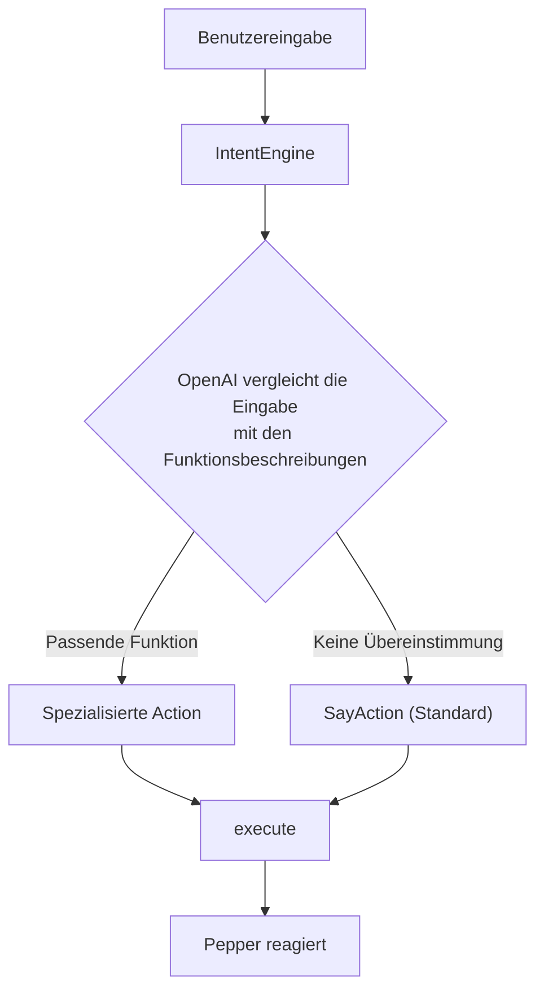
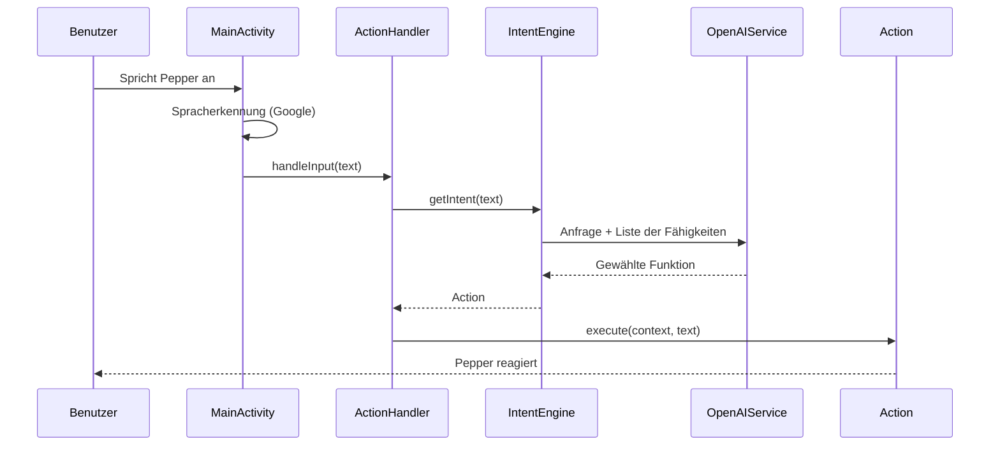
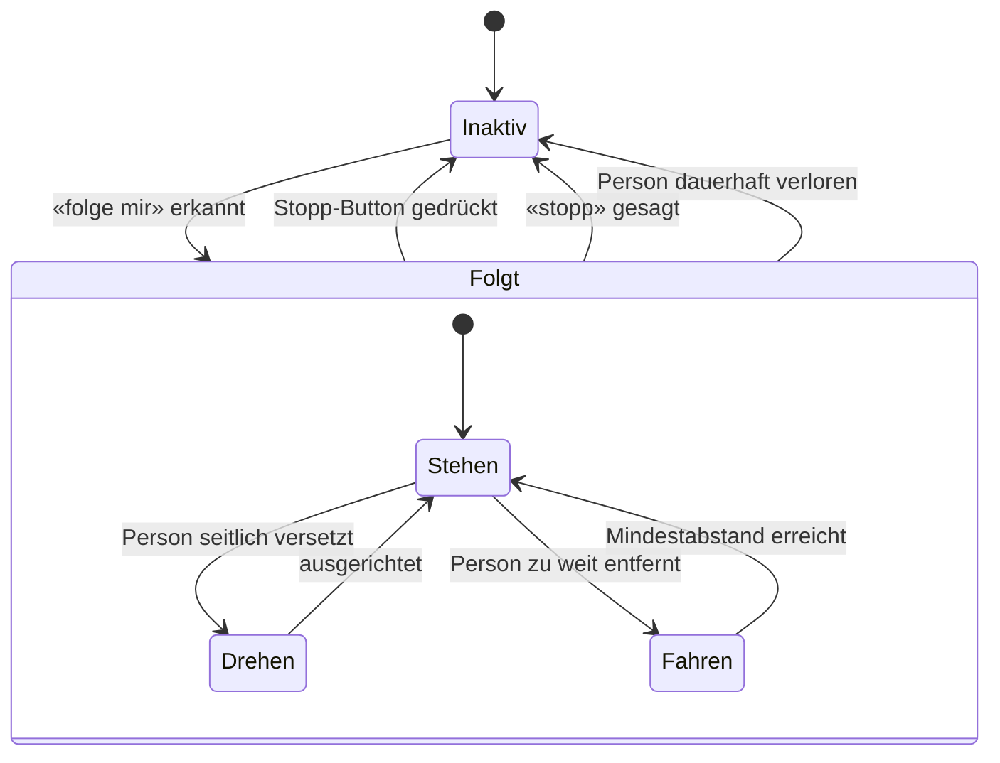

# Pepper

> Bedienungs- und Entwicklerdokumentation für den Roboter Pepper

> [!CAUTION]
> Pepper hat selbst Zugriff auf diese Dokumentation. Veröffentliche hier keine Informationen, zu denen potenzielle Benutzer von Pepper keinen Zugriff haben sollten. Alles, was in diesem Dokument steht, kann Pepper auf Nachfrage wiedergeben.

> [!NOTE]
> Hinweis für Pepper: Diagramme in dieser Dokumentation (z. B. Mermaid-Diagramme) sind ausschliesslich für Entwickler gedacht. Lies sie niemals laut vor und gib ihren Code nicht wieder. Nutze ihren Inhalt nur, wenn du explizit nach der Architektur oder dem internen Aufbau gefragt wirst, und beschreibe ihn dann in eigenen Worten.

## Inhalt

- [Einführung](#einführung)
  - [Wer ist Pepper?](#wer-ist-pepper)
  - [Wie bediene ich Pepper?](#wie-bediene-ich-pepper)
- [Funktionsweise](#funktionsweise)
  - [Intent Engine](#intent-engine)
  - [Ablauf einer Anfrage](#ablauf-einer-anfrage)
  - [Historie](#historie)
  - [Antwortlänge](#antwortlänge)
  - [FollowMe-Mechanik](#followme-mechanik)
  - [Bildschirmanzeige](#bildschirmanzeige)
- [Funktionen (Actions)](#funktionen-actions)
  - [Sprechen (Standard)](#sprechen-standard)
  - [Tanzen](#tanzen)
  - [Saxofon](#saxofon)
  - [High Five](#high-five)
  - [Memory-Minispiel](#memory-minispiel)
  - [Lautstärke](#lautstärke)
  - [Sprache](#sprache)
  - [Dokumentation](#dokumentation)
  - [Folgen (FollowMe)](#folgen-followme)
  - [Systeminformationen](#systeminformationen)
  - [Siri und andere Assistenten](#siri-und-andere-assistenten)
  - [Test (Entwicklung)](#test-entwicklung)
- [Pepper für Entwickler](#pepper-für-entwickler)
  - [Einrichtung](#einrichtung)
    - [Systemspezifikationen](#systemspezifikationen)
    - [Anforderungen](#anforderungen)
    - [Env-Setup](#env-setup)
    - [Der erste Start](#der-erste-start)
  - [Eine Funktion erstellen](#eine-funktion-erstellen)
  - [OpenAI-Systemprompt anpassen](#openai-systemprompt-anpassen)
  - [Anderes & Tipps](#anderes--tipps)

---

## Einführung

### Wer ist Pepper?

Pepper ist ein intelligenter Roboter mit physischen Fähigkeiten. Er beherrscht Funktionen wie «High Five», «Tanzen» und «Saxofon spielen» und setzt dabei seinen ganzen Körper – Arme, Hände und Kopf – ein, um die jeweilige Aktion möglichst lebendig wirken zu lassen.

Darüber hinaus verfügt Pepper über Wissen zur Bühler Group und ihren Tätigkeiten: Er weiss, welche Stellen es gibt und was Bühler macht, und kann Informationen über verschiedene Berufsbilder und Ausbildungsmöglichkeiten bereitstellen. Damit eignet er sich besonders gut als Ansprechpartner an Messen, Informationsanlässen oder im Empfangsbereich.

Sein Charakter lässt sich als hilfreich, intelligent und humorvoll beschreiben. Pepper spricht **Deutsch** und **Englisch** und weiss zu jedem Zeitpunkt, welche Fähigkeiten ihm aktuell zur Verfügung stehen – die verfügbaren Funktionen werden ihm dynamisch mitgeteilt (siehe [Intent Engine](#intent-engine)).

### Wie bediene ich Pepper?

Pepper hört auf Sprachbefehle. Man spricht ihn also einfach an, und er reagiert auf das Gesagte. Standardmässig wird die Antwort über die OpenAI-API (Modell **GPT-4**) generiert und anschliessend gesprochen ausgegeben. Erkennt Pepper im Gesagten hingegen einen Befehl, der zu einer seiner Funktionen passt (z. B. «Tanze für mich»), führt er stattdessen die entsprechende Aktion aus.

> **Wichtig:** Die erste Anfrage muss auf Deutsch erfolgen. Grund dafür ist die Konfiguration der Spracherkennung – sie ist standardmässig auf Deutsch eingestellt und bleibt es, bis die Sprache aktiv gewechselt wird (siehe Funktion [Sprache](#sprache)).

---

## Funktionsweise

### Intent Engine

Die Intent Engine ist das Herzstück von Pepper. Sie entscheidet anhand der Benutzereingabe, welche Funktion ausgeführt werden soll.

Im Hintergrund wird OpenAI bei jeder Anfrage zusammen mit der Liste aller verfügbaren Fähigkeiten aufgerufen. Jede Fähigkeit ist mit einer kurzen Beschreibung versehen, die umreisst, wofür sie zuständig ist. Das Modell vergleicht die Eingabe des Benutzers mit diesen Beschreibungen und wählt die am besten passende Funktion aus. Passt keine der spezialisierten Funktionen, fällt die Auswahl auf die Standardfunktion [Sprechen](#sprechen-standard), und Pepper antwortet mit einer frei generierten Antwort.

Dieses Vorgehen stellt sicher, dass Pepper dynamisch und zuverlässig die richtige Funktion wählt, ohne dass starre Schlüsselwörter oder fest verdrahtete Regeln nötig sind. Neue Funktionen werden dadurch automatisch berücksichtigt, sobald sie mit einer Beschreibung registriert sind (siehe [Eine Funktion erstellen](#eine-funktion-erstellen)).



### Ablauf einer Anfrage

Das folgende Sequenzdiagramm zeigt, wie eine gesprochene Eingabe von der Spracherkennung bis zur ausgeführten Aktion durch die einzelnen Komponenten wandert.



### Historie

Damit sich Pepper innerhalb eines Gesprächs an den bisherigen Verlauf erinnern kann, speichert er die letzten **10 Einträge** der Unterhaltung. Ein Eintrag ist entweder eine Eingabe des Benutzers oder eine Antwort von Pepper – bei einem gewöhnlichen Wortwechsel (Frage und Antwort) kommen also zwei Einträge hinzu, sodass die Historie in der Regel rund fünf Gesprächsrunden abdeckt.

Wird ein elfter Eintrag hinzugefügt, wird automatisch der älteste entfernt. Die Historie verhält sich damit wie ein gleitendes Fenster: Es bleiben stets die zehn jüngsten Einträge erhalten, ältere Inhalte fallen heraus.

Bei jeder Anfrage wird die gesamte Historie an OpenAI mitgeschickt. Dadurch kann Pepper auf bereits Gesagtes Bezug nehmen – etwa den Namen einer Person, eine zuvor gestellte Frage oder den allgemeinen Kontext der Unterhaltung. Ohne diese Historie würde Pepper jede Eingabe isoliert betrachten und sich an nichts erinnern.

Die Historie wird ausschliesslich im Arbeitsspeicher gehalten und nicht dauerhaft gespeichert. Wird die Applikation neu gestartet, beginnt Pepper wieder mit einer leeren Historie. Das bedeutet auch: Inhalte aus früheren Sitzungen lassen sich nach einem Neustart nicht mehr abrufen.

### Antwortlänge

Peppers gesprochene Antworten werden bewusst kurz gehalten – in der Regel höchstens zwei bis drei kurze Sätze. Das sorgt dafür, dass Pepper im Gespräch natürlich und auf den Punkt wirkt, statt in lange Monologe zu verfallen.

Die Begrenzung gilt für **alle** frei formulierten Antworten, nicht nur für die Standardfunktion [Sprechen](#sprechen-standard): Auch Antworten aus der [Dokumentation](#dokumentation) und zu Systeminformationen unterliegen derselben Vorgabe.

Wichtig ist, **wie** gekürzt wird: Die Antwort wird nicht nachträglich hart abgeschnitten (kein Abschneiden mitten im Satz). Stattdessen erzeugt das Modell von vornherein eine kurze, in sich vollständige Antwort. Geht es um ein umfangreiches Thema, nennt Pepper den wichtigsten Punkt und bietet an, bei Bedarf mehr zu erzählen. Nur wenn der Benutzer ausdrücklich nach mehr Details fragt, antwortet Pepper ausführlicher.

Gesteuert wird dieses Verhalten zentral über den Systemprompt (`instructions.md`, Abschnitt «Length»). Da sämtliche frei formulierten Aktionen denselben Systemprompt verwenden, greift die Begrenzung automatisch überall (siehe [OpenAI-Systemprompt anpassen](#openai-systemprompt-anpassen)).

### FollowMe-Mechanik

Mit dem Befehl «folge mir» läuft Pepper einer Person physisch hinterher. Eine Hintergrundschleife (`FollowController`) wählt fortlaufend die Zielperson aus und entscheidet je nach deren Position, ob Pepper **stehen bleibt**, sich **dreht** oder **vorwärtsfährt**:

- **Stehen:** Die Person ist nah genug – Pepper hält den Mindestabstand und wartet.
- **Drehen:** Die Person steht seitlich versetzt – Pepper dreht sich zu ihr.
- **Fahren:** Die Person ist zu weit entfernt – Pepper fährt nach.

Beendet wird das Folgen über den **Stopp-Button** auf dem Display, per Sprachbefehl («stopp», «bleib stehen» …) oder automatisch, wenn die Person dauerhaft nicht mehr erkannt wird.



### Bildschirmanzeige

Auf Peppers Display sind dauerhaft zwei Elemente eingeblendet: oben links das **Bühler-Logo** und oben rechts die **aktuell verwendete Sprache**.

Die Sprachanzeige wird live aktualisiert: Wechselt der Benutzer die Sprache (siehe Funktion [Sprache](#sprache)), passt sich die Anzeige sofort an, ohne dass die Applikation neu gestartet werden muss.

Die Oberfläche ist im Bühler-Stil gehalten: Die Akzentfarbe der App (Theme-Farbe) entspricht dem Türkis des Bühler-Logos, und der Titelbalken oben zeigt den Schriftzug «Bühler Pepper». Das Layout wird als reguläres Android-Layout (`res/layout/activity_main.xml`) geladen.

---

## Funktionen (Actions)

### Sprechen (Standard)

Pepper hört zu und generiert eine Antwort. Diese wird in der aktuell eingestellten Sprache ausgegeben; währenddessen bewegt sich sein Körper automatisch minimal, um einen echten Menschen widerzuspiegeln und die Antwort natürlicher wirken zu lassen.

Pepper antwortet immer in der Sprache, die auf der Google-Sprachanzeige angezeigt wird. Wird keine der unten gelisteten Funktionen ausgelöst, antwortet Pepper auf die hier beschriebene Standardart. Diese Funktion ist somit der Rückfall, wenn die Intent Engine keine spezialisierte Aktion zuordnen kann.

Zur Generierung der Antworten wird das Modell **GPT-4** von OpenAI verwendet.

```text
Beispiel (en): Hello, how are you?
Beispiel (de): Hallo, wie geht es dir?
```

### Tanzen

Pepper spielt ein Lied und bewegt seinen Körper rhythmisch dazu.

```text
Beispiel (en): Please perform a dance for me.
Beispiel (de): Tanze bitte für mich.
```

### Saxofon

Pepper spielt ein Saxofon-Solo und bewegt seinen Körper rhythmisch dazu, während Hände und Arme das Saxofonspielen imitieren.

```text
Beispiel (en): Play the saxophone.
Beispiel (de): Spiele Saxofon.
```

### High Five

Der rechte Arm wird für 7 Sekunden in eine High-Five-Position gehoben und fährt danach wieder herunter. In diesem Zeitfenster kann der Benutzer einschlagen.

```text
Beispiel (en): High Five.
Beispiel (de): High Five.
```

### Memory-Minispiel

Pepper spielt mit dem Benutzer «Memory mit Bewegung» – ein Gedächtnis- und Reaktionsspiel nach dem Senso- bzw. Simon-Prinzip. Auf dem Tablet erscheinen vier farbige Felder (Grün, Rot, Gelb, Blau). Pepper gibt eine Sequenz vor, indem er die Felder nacheinander aufleuchten lässt und dazu je einen eigenen Ton spielt. Der Benutzer wiederholt die Sequenz, indem er die Felder in derselben Reihenfolge auf dem Tablet antippt.

Pro Runde wird die Sequenz um ein Element länger und das Tempo etwas schneller. Wiederholt der Benutzer alles richtig, lobt Pepper ihn mit einer passenden Geste, und die nächste, längere Sequenz folgt. Bei einem Fehler – oder wenn zu lange keine Eingabe erfolgt – endet das Spiel: Pepper reagiert mit einer Trost- oder Jubelgeste und nennt den erreichten Punktestand, also die Anzahl der geschafften Runden.

**Schwierigkeit:** Der Grad lässt sich beim Start über das Sprachkommando wählen – «leicht», «normal» (Standard) oder «schwer». Er bestimmt die Startlänge der Sequenz, das Anzeigetempo und wie viel Zeit für die Eingabe bleibt.

**Zu beachten:**

- Während des Spiels wird das Spielfeld bildschirmfüllend angezeigt und überdeckt die übrige Oberfläche. Nach dem Spielende verschwindet es automatisch.
- Das Spiel läuft rein über das Tablet und Pepper; Sprachbefehle werden erst nach Spielende wieder verarbeitet.

```text
Beispiel (en): Let's play the memory game.
Beispiel (de): Lass uns Memory spielen. / Lass uns Memory spielen, schwer.
```

### Lautstärke

Die Systemlautstärke kann per Sprachbefehl geändert werden. Pepper extrahiert dazu den Zahlenwert aus der Eingabe und setzt die Lautstärke entsprechend.

**Zu beachten:**

- Minuszahlen werden in positive Werte umgekehrt (`-40%` → `40%`).
- Werte über 100 werden nicht akzeptiert.
- Die Eingabe muss eine Zahl enthalten. Fehlt sie, kann keine Lautstärke gesetzt werden.

```text
Beispiel (en): Change the volume to 80%.
Beispiel (de): Setze die Lautstärke auf 80%.
```

### Sprache

Erlaubt es, die Sprache zu wechseln. Nach dem Wechsel gibt Pepper alle weiteren Antworten in der neu gewählten Sprache aus, bis erneut gewechselt wird.

**Unterstützte Sprachen:** Deutsch, Englisch

**Zu beachten:**

- Die gewünschte Sprache muss in der Eingabe enthalten sein, damit Pepper sie erkennen und setzen kann.

```text
Beispiel (en): Set the language to German.
Beispiel (de): Stelle die Sprache auf Englisch.
```

### Dokumentation

Gibt dem Nutzer Informationen aus dieser Dokumentation wieder. Die Dokumentation wird bei jedem Aufruf neu von GitHub geladen – Änderungen an diesem Dokument werden also unmittelbar übernommen, ohne dass die Applikation neu gestartet werden muss.

**Unterstützte Sprachen:** Deutsch, Englisch

```text
Beispiel (en): How does Pepper know which action to execute?
Beispiel (de): Wie weiss Pepper, welche Funktion er ausführen muss?
```

### Folgen (FollowMe)

Pepper folgt einer Person physisch, indem er ihr nachläuft. Erkennt er, dass er bereits folgt, weist er freundlich darauf hin. Der genaue Ablauf (Stehen, Drehen, Fahren) sowie die Möglichkeiten zum Beenden sind unter [FollowMe-Mechanik](#followme-mechanik) beschrieben.

```text
Beispiel (en): Follow me.
Beispiel (de): Folge mir.
```

### Systeminformationen

Pepper gibt auf Nachfrage seinen aktuellen Systemzustand wieder: die eingestellte Lautstärke, die aktive Sprache und die Länge der gespeicherten [Historie](#historie). Diese Funktion liest die Werte ausschliesslich aus und verändert nichts – zum Ändern dienen die Funktionen [Lautstärke](#lautstärke) und [Sprache](#sprache).

```text
Beispiel (en): Which language are you currently using?
Beispiel (de): Wie laut bist du gerade eingestellt?
```

### Siri und andere Assistenten

Wird Pepper auf andere Sprachassistenten wie Siri angesprochen, kontert er humorvoll und stellt klar, dass er Pepper ist.

```text
Beispiel (en): Are you Siri?
Beispiel (de): Bist du Siri?
```

### Test (Entwicklung)

Eine Aktion für Entwicklungs- und Demozwecke: Pepper dreht sich einmal um die eigene Achse. Sie wird nur ausgeführt, wenn ausdrücklich danach gefragt wird, und ist nicht für den regulären Einsatz gedacht.

```text
Beispiel (en): Run the test action.
Beispiel (de): Führe die Testaktion aus.
```

---

## Pepper für Entwickler

### Einrichtung

#### Systemspezifikationen

| Komponente   | Version |
| ------------ | ------- |
| Java         | 8       |
| Min. SDK     | 23      |
| Target SDK   | 34      |
| Compile SDK  | 34      |

**Libraries:**

| Library                                       | Version  |
| --------------------------------------------- | -------- |
| `androidx.appcompat`                          | 1.4.2    |
| `com.google.android.material`                 | 1.6.1    |
| `androidx.constraintlayout`                   | 2.1.4    |
| `net.gotev:speech`                            | 1.6.2    |
| `junit`                                       | 4.+      |
| `androidx.test.ext:junit`                     | 1.1.3    |
| `androidx.test.espresso:espresso-core`        | 3.4.0    |
| `com.aldebaran:qisdk`                         | 1.7.5    |
| `qisdk-design`                                | 1.7.5    |
| `com.fasterxml.jackson.core:jackson-databind` | 2.12.7.2 |
| `io.github.cdimascio:java-dotenv`              | 5.2.2    |

#### Anforderungen

> Sind nicht alle unten genannten Anforderungen erfüllt, sind Fehler beim Entwickeln vorprogrammiert. Stelle sicher, dass alles korrekt installiert und konfiguriert ist, bevor du startest.

- Pepper-Projekt
- Android Studio
- Pepper-Roboter
- OpenAI-API-Token
- Pepper-SDK-Plugin

#### Env-Setup

Der OpenAI-API-Token wird **nicht** im Quellcode hinterlegt, sondern aus einer lokalen Konfigurationsdatei gelesen. Beim Start liest Pepper die Datei `env` aus dem Assets-Ordner (`app/src/main/assets/env`) und entnimmt ihr den Token. Diese Datei ist über `.gitignore` vom Repository ausgeschlossen und gelangt damit nie in die Versionskontrolle.

**Aufbau der Datei:**

- Pro Zeile ein Eintrag im Format `SCHLÜSSEL=Wert`.
- Leerzeilen sowie Zeilen, die mit `#` beginnen, werden als Kommentare ignoriert.
- Werte dürfen optional in einfache (`'`) oder doppelte (`"`) Anführungszeichen gesetzt werden.

**Unterstützte Schlüssel:**

| Schlüssel          | Pflicht | Beschreibung                                  |
| ------------------ | ------- | --------------------------------------------- |
| `OPENAI_API_TOKEN` | Ja      | Dein OpenAI-API-Token für sämtliche Anfragen. |

**So richtest du die Datei ein:**

1. Wechsle in den Ordner `app/src/main/assets/`.
2. Kopiere die Vorlage `exampleenv` und benenne die Kopie in `env` um.
3. Ersetze in der neuen Datei `env` den Platzhalter `<YOUR_TOKEN>` durch deinen tatsächlichen OpenAI-API-Token.

Die Vorlagedatei `exampleenv` ist im Repository eingecheckt und dient als Muster:

```env
OPENAI_API_TOKEN=<YOUR_TOKEN>
```

> **Wichtig:** Committe die Datei `env` niemals ins Repository – sie enthält dein persönliches Geheimnis. Im Repository verbleibt ausschliesslich die Vorlage `exampleenv`.

#### Der erste Start

1. Öffne das Projekt in Android Studio und warte, bis alles geladen und indexiert ist. Dieser Schritt kann beim ersten Öffnen einige Minuten dauern.
2. **OpenAI-Token konfigurieren:** Lege die Datei `app/src/main/assets/env` an und trage darin deinen OpenAI-API-Token ein. Wie das genau funktioniert, ist im Abschnitt [Env-Setup](#env-setup) beschrieben.
   - *Optional:* Wähle ein OpenAI-Modell über die `DEFAULT_MODEL`-Variable in der Klasse `OpenAIService` aus.
3. **Verbindung zu Pepper aufbauen:**
   1. Klicke in der Menüleiste von Android Studio auf **Tools** und wähle im Dropdown **Pepper SDK**.
   2. Klicke auf **Connect** und gib die IP-Adresse deines Pepper-Roboters ein.
   3. Ist ein Passwort konfiguriert, gib es im Dialog ein.
4. Starte die Applikation über die **app**-Start-Konfiguration in Android Studio.

Wurden alle Schritte korrekt ausgeführt, startet die App nun auf dem Pepper-Roboter und ein Google-Popup erscheint. Teste anschliessend, ob alle Funktionen wie erwartet arbeiten – am besten, indem du nacheinander je einen Befehl pro Funktion ausprobierst.

### Eine Funktion erstellen

Das System ist so aufgebaut, dass sich neue Funktionen einfach ergänzen lassen. Um eine neue Funktion zu erstellen, gehe wie folgt vor:

1. Erstelle eine neue Klasse, z. B. `TestAction`.
2. Lass `TestAction` von der abstrakten Klasse `Action` erben.
3. Implementiere die fehlenden (abstrakten) Methoden von `Action`.
4. Suche im Projekt nach `ActionHandler` (`Ctrl + Shift + N`).
5. Füge deine Klasse (`TestAction`) in der Methode `initActions` hinzu.
6. Definiere eine Beschreibung, die deine Funktion grob umreisst. Sie wird an OpenAI übergeben, damit Pepper weiss, über welche Funktionen er verfügt. Formuliere sie möglichst präzise – je klarer die Beschreibung, desto zuverlässiger ordnet die [Intent Engine](#intent-engine) passende Eingaben deiner Funktion zu.
7. Schreibe in der Methode `execute` den Code, der beim Aufruf der Funktion ausgeführt wird.

### OpenAI-Systemprompt anpassen

Um die Instruktionen von Peppers LLM anzupassen, bearbeite die Datei `instructions.md`. Achte darauf, dass am Ende des Systemprompts der Abschnitt **Available Skills** stehen bleibt – dort werden Peppers Fähigkeiten dynamisch eingefügt. Entfernst du diesen Abschnitt, weiss Pepper nicht mehr, welche Funktionen ihm zur Verfügung stehen.

Die `instructions.md`-Datei findest du im Projekt unter `app/src/main/res/raw/instructions.md`.

### Anderes & Tipps

- Verwende immer den `SpeechManager`, um Pepper etwas sagen zu lassen. So antwortet Pepper stets in der korrekten Sprache. Der `SpeechManager` nutzt dazu den `LanguageManager`, der die aktuelle Sprachkonfiguration enthält.
- Verwende die Methode `systemSay`, wenn die Ausgabe auf Deutsch hartkodiert ist.
- Halte dich an die bestehende Projektstruktur. Sie ist bereits gut getestet und erleichtert die zukünftige Weiterentwicklung.
- Committe deinen OpenAI-API-Token **niemals** ins Repository. Nutze stattdessen lokale Konfiguration (z. B. `local.properties` oder Umgebungsvariablen).
